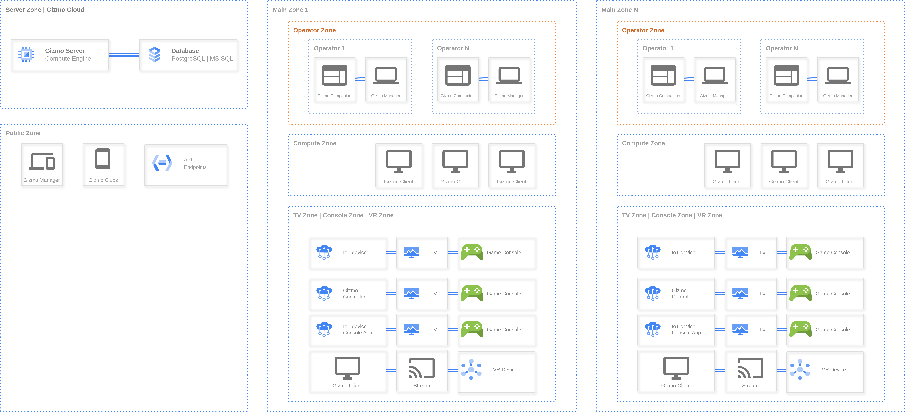

**Gizmo Server** - основной компонент системы **Gizmo**.

## Архитектура Gizmo

{width=7048px height=3208px}

### Gizmo Server

Gizmo Server может быть предоставлен в двух версиях:

-  Облачная версия (SaaS-решение)

-  Локальная версия (Self-hosted решение)

Локальная версия (Self-hosted решение) может быть предоставлена в следующих вариантах:

-  Gizmo Server для ОС Windows

-  Gizmo Server для ОС Linux

-  Gizmo Server для Docker

### База данных

Для Локальной версии (Self-hosted решение) могут быть использованы следующие версии баз данных:

-  Postgres (версии 15 и выше)

-  Microsoft SQL Server (версии 2017 и выше)

:::info 

Для Локальной версии База данных может быть установлена и располагаться как вместе с Gizmo Server (на одном сервере), так и отдельно от него (в том числе и во внешней сети).

:::

:::info 

Для Облачной версии используется База данных Postgres.

:::

### Минимальные системные требования сервера для локальной версии

[tabs]

[tab:Gizmo Server]

**Windows**

Процессор: Intel Core i3 8th gen

Память: 8 Гб DDR4

Диск: 1 Гб SSD

**Linux**

Процессор: Intel Core i3 8th gen

Память: 4 Гб DDR4

Диск: 1 Гб SSD

**Docker** (установленный на Linux)

Процессор: Intel Core i3 8th gen

Память: 2 Гб DDR4

Диск: 1 Гб SSD

[/tab]

[tab:База данных]

**Windows**

Процессор: Intel Core i3 8th gen

Память: 8 Гб DDR4

Диск: 30 Гб SSD NVMe

**Debian**

Процессор: Intel Core i3 8th gen

Память: 8 Гб DDR4

Диск: 30 Гб SSD NVMe

**Docker** (установленный на Linux)

Процессор: Intel Core i3 8th gen

Память: 4 Гб DDR4

Диск: 30 Гб SSD NVMe

[/tab]

[tab:Gizmo Server + База данных]

**Windows**

Процессор: Intel Core i3 8th gen

Память: 16 Гб DDR4

Диск: 40 Гб SSD NVMe

**Debian**

Процессор: Intel Core i3 8th gen

Память: 8 Гб DDR4

Диск: 40 Гб SSD NVMe

**Docker** (установленный на Linux)

Процессор: Intel Core i3 8th gen

Память: 4-8 Гб DDR4 (при загрузке в 50+ подключенных клиентов рекомендуется 8 Гб)

Диск: 40 Гб SSD NVMe

[/tab]

[/tabs]