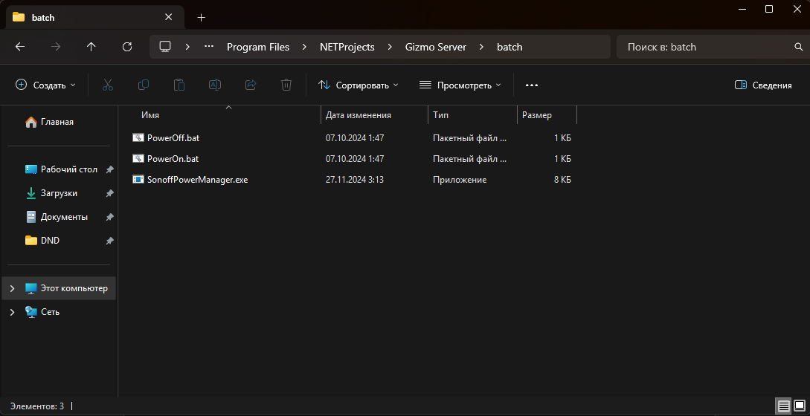
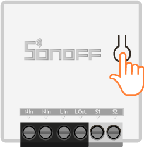
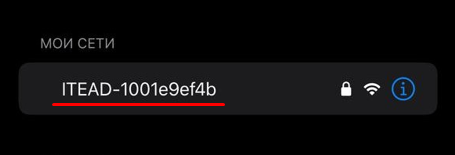
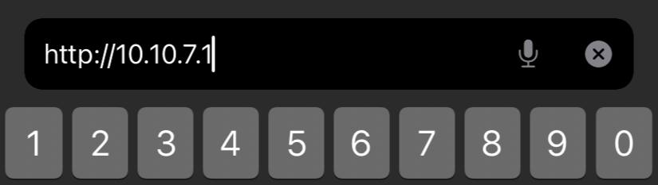
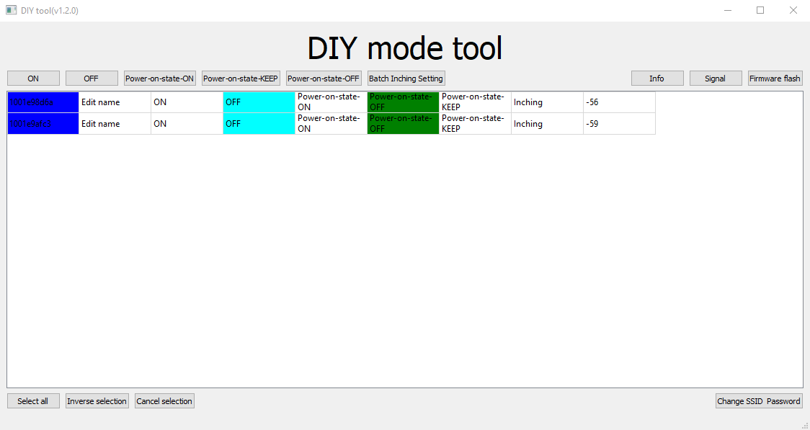
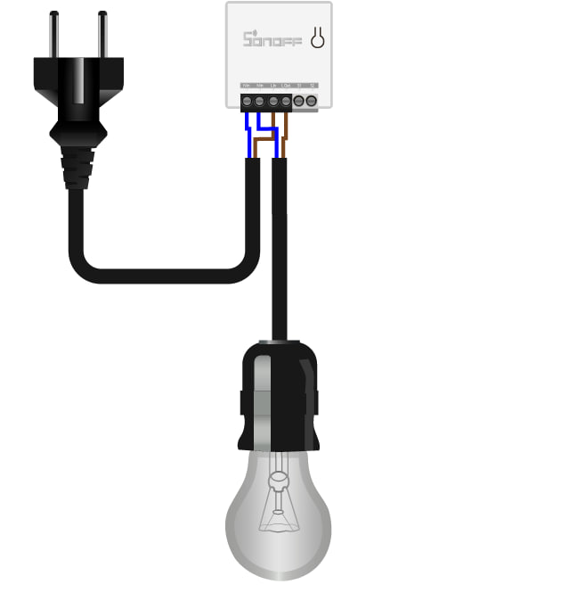

<html>

<html>
<head>
<meta charset="UTF-8">
<meta name="viewport" content="width=device-width, initial-scale=1.0">
<style>
  :root {
    --gz-primary: #526ed3;
    --gz-primary-light: #6c86e2;
    --gz-navy-900: #0e1524;
    --gz-navy-800: #17213c;
  }

  html,
  body {
    height: 100%;
    margin: 0;
    padding: 0;
    background: #1a1e33;
    font-family: 'Segoe UI', system-ui, -apple-system, Roboto, Arial, sans-serif;
  }

  @media (prefers-color-scheme: light) {
    html,
    body {
      background: #ffffff;
    }
  }

  * {
    box-sizing: border-box;
  }

  /* border-top другой толщины, чем остальные стороны border, в углу,
     где сходятся два разных border-width, браузер "митрит" стык — на
     скруглённом углу это может дать кривой заусенец/полоску ровно в
     месте перехода 3px -> 1px. Меняем акцент на inset box-shadow: он
     не участвует в геометрии border вообще, всегда чисто обрезается
     по border-radius, разной толщины сторон тут просто не существует. */
  .gx-hero {
    position: relative;
    display: flex;
    flex-direction: column;
    justify-content: center;
    width: 100%;
    height: 100%;
    padding: 34px 38px;
    border-radius: 20px;
    overflow: hidden;
    color: #ffffff;
    border: 1px solid rgba(255,255,255,0.08);
    background: linear-gradient(135deg, var(--gz-navy-900) 0%, var(--gz-navy-800) 60%, #1c2c57 100%);
    box-shadow: inset 0 3px 0 0 var(--gz-primary);
  }

  .gx-debug {
    position: absolute;
    bottom: 8px;
    right: 12px;
    font-family: Consolas, Monaco, monospace;
    font-size: 10px;
    color: rgba(255,255,255,0.32);
    pointer-events: none;
  }

  .gx-kicker {
    display: flex;
    align-items: center;
    gap: 8px;
    margin: 0 0 14px 0;
    color: rgba(255,255,255,0.72);
    font-size: 13px;
    line-height: 1.3;
    font-weight: 600;
    letter-spacing: 0.04em;
    text-transform: uppercase;
  }

  .gx-kicker svg {
    flex: none;
    width: 16px;
    height: 16px;
    color: var(--gz-primary-light);
  }

  .gx-title {
    max-width: 920px;
    margin: 0;
    color: #ffffff;
    font-size: clamp(24px, 3.4vw, 32px);
    line-height: 1.3;
    font-weight: 700;
    letter-spacing: -0.015em;
  }

  .gx-title .gx-accent {
    color: #9db4f0;
  }

  .gx-tags {
    display: flex;
    flex-wrap: wrap;
    gap: 8px;
    margin-top: 20px;
  }

  .gx-tag {
    display: inline-flex;
    align-items: center;
    gap: 6px;
    min-height: 28px;
    padding: 5px 12px;
    border-radius: 999px;
    border: 1px solid rgba(255,255,255,0.16);
    background: rgba(255,255,255,0.08);
    color: #d7deea;
    font-size: 13px;
    line-height: 1;
    font-weight: 500;
  }

  .gx-tag::before {
    content: "";
    width: 5px;
    height: 5px;
    border-radius: 999px;
    background: currentColor;
    opacity: 0.7;
  }

  .gx-tag.medium {
    border-color: rgba(250, 204, 21, 0.4);
    background: rgba(250, 204, 21, 0.12);
    color: #fde68a;
  }

  @media (max-width: 640px) {
    .gx-hero {
      padding: 24px;
    }
  }
</style>
</head>

<body>
  <section class="gx-hero">
    <p class="gx-kicker">
      <svg viewBox="0 0 24 24" fill="none" stroke="currentColor" stroke-width="2" stroke-linecap="round" stroke-linejoin="round"><path d="M9 2v4"/><path d="M15 2v4"/><path d="M6 10h12v3a6 6 0 0 1-12 0z"/><path d="M8 22h8"/><path d="M12 16v6"/></svg>
      В этом блоке вы узнаете
    </p>

    <h1 class="gx-title">
      Как подключить умную розетку Sonoff, перевести её в DIY-режим и настроить управление питанием через <span class="gx-accent">Gizmo</span>
    </h1>

    <div class="gx-tags">
      <span class="gx-tag">10–20 минут</span>
      <span class="gx-tag medium">Сложность: средняя</span>
      <span class="gx-tag">Требует доступа к сетевому оборудованию</span>
    </div>

    <span class="gx-debug" id="gx-debug"></span>
  </section>

<script>
(function () {
  var LIGHT_BG = '#ffffff';
  var DARK_BG = '#1a1e33';

  // debugInfo копит подробности последней попытки — почему не сработало.
  var debugInfo = '';

  function readParentTheme() {
    try {
      var doc = window.parent.document;
      var root = doc.querySelector('#custom-style');
      if (!root) {
        debugInfo = 'нет #custom-style в родителе';
        return null;
      }
      var t = root.getAttribute('data-theme');
      if (t === 'light' || t === 'dark') {
        debugInfo = 'ok';
        return t;
      }
      debugInfo = 'нет data-theme (' + t + ')';
      return null;
    } catch (e) {
      debugInfo = (e && e.name) ? e.name : 'ошибка доступа';
      return null;
    }
  }

  function systemTheme() {
    try {
      return window.matchMedia('(prefers-color-scheme: dark)').matches ? 'dark' : 'light';
    } catch (e) {}
    return 'dark';
  }

  function applyBg() {
    var fromGramax = readParentTheme();
    var theme = fromGramax || systemTheme();
    var bg = theme === 'light' ? LIGHT_BG : DARK_BG;

    document.documentElement.style.backgroundColor = bg;
    document.body.style.backgroundColor = bg;

    var dbg = document.getElementById('gx-debug');
    if (dbg) {
      dbg.textContent = 'тема: ' + theme + ' • источник: ' + (fromGramax ? 'gramax' : 'system (' + debugInfo + ')');
    }
  }

  applyBg();

  try {
    var root = window.parent.document.querySelector('#custom-style');
    if (root && window.MutationObserver) {
      new MutationObserver(applyBg).observe(root, { attributes: true, attributeFilter: ['data-theme'] });
    }
  } catch (e) {}

  try {
    window.matchMedia('(prefers-color-scheme: dark)').addEventListener('change', applyBg);
  } catch (e) {}
})();
</script>
</body>
</html>

</html>


## **Что такое умная розетка?**

**Реле, или умная розетка, -- это устройство, которое позволяет удаленно включать и выключать питание подключённых к ней устройств. В нашем случае её можно интегрировать с Gizmo, чтобы через приложение управлять экраном, например, игровой консоли, избавляя администратора от необходимости делать это вручную.**

> [!NOTE]
> 
> **Подключить можно любое реле Sonoff, поддерживающее режим DIY. Их список указан в** [**официальной документации производителя**](https://help.sonoff.tech/docs/puU2rU4w)**. Вы также можете подключить любое другое реле, поддерживающее API-запросы, но в таком случае процесс установки и написания скрипта будет отличаться.**

## Подготовка

Для начала необходимо установить требующиеся инструменты на сервер. Скачайте архив по [этой ссылке](https://disk.yandex.ru/d/FMKZVq4Zla1E1A) и распакуйте его.

`PowerOn.bat`, `PowerOff.bat` и `SonoffPowerManager.exe` перенесите по пути `C:\Program Files\NETProjects\Gizmo Server\batch`. В вашем случае путь может отличаться. Если в папке назначения уже есть файлы с таким именем, замените их.

`tool_01DIY85(3.3.0).exe` оставьте в любом удобном месте на ПК.

{width=1089px height=560px}

## Перевод реле в режим DIY

> [!WARNING]
> 
> Если устройство ранее было подключено к приложению eWeLink, перед продолжением инструкции обязательно удалите его из списка устройств в приложении для полного сброса настроек.
>
> Или сбросьте по [этой инструкции](http://tauri.localhost/github.com/GAMP/Gizmo_Documentation/Test/-/ru/about/nastroyka-rele-ot-sonoff?#%D1%81%D0%B1%D1%80%D0%BE%D1%81-%D1%80%D0%B5%D0%BB%D0%B5-%D0%B4%D0%BE-%D0%B7%D0%B0%D0%B2%D0%BE%D0%B4%D1%81%D0%BA%D0%B8%D1%85-%D0%BD%D0%B0%D1%81%D1%82%D1%80%D0%BE%D0%B5%D0%BA).

-  **Включите питание реле**

-  **Удерживайте кнопку сопряжения более 5 секунд**

{width=246px height=250px}


-  **Индикатор на устройстве будет непрерывно мигать.**


-  **Откройте настройки Wi-Fi на телефоне или пк. В поиске вы найдете точку доступа с именем ITEAD-XXXXXXXXXX. Подключитесь к ней, используя пароль  по умолчанию -** `12345678`**.**

   {width=455px height=155px}


-  **Откройте любой браузер на подключённом устройстве и введите** [**http://10.10.7.1/**](http://10.10.7.1/) **прямо в адресную строку браузера.**

{width=825px height=233px}


> [!WARNING]
> 
> Если у вас не переходит по ссылке <http://10.10.7.1/> -- это означает, что реле ранее уже было подключено к Wi‑Fi точке или приложению eWeLink и его необходимо сбросить до заводских настроек. Инструкция по сбросу реле находится в конце статьи.

> [!NOTE]
> 
> **SSID Wi‑Fi** -- это имя вашей сети, которое отображается в списке доступных подключений. Узнать его можно в настройках роутера или в списке сетей на устройстве.
>
> К данной локальной сети обязательно на протяжении всей работы, в том числе после завершения настройки, должен быть доступ у сервера, на котором вы проводите настройку, иначе ничего работать не будет. Для передачи запросов между подсетями настройте маршрутизацию на роутере. Убедитесь, что устройства имеют корректные шлюзы и правила в брандмауэре разрешают трафик.


Отлично! Теперь реле переведено в режим DIY. Осталось написать логику работы. Запустите `tool_01DIY85(3.3.0).exe` и дождитесь отображения умной розетки в списке устройств. Слева, в выделенном синим цветом поле, отобразится *deviceid* устройства. Сохраните его, так как эта информация понадобится далее. Здесь же можно проверить работоспособность реле, используя `on` / `off`. Если устройство переключает питание подключенного экрана консоли -- вы сделали все правильно.

{width=1124px height=597px}

> [!NOTE]
> 
> Если в списке устройств ничего не отображается, повторите все этапы настройки и убедитесь, что ваше устройство подключено к той же сети, что и реле.


## <highlight color="purple">Настройка скриптов</highlight>

Ниже находится конфигуратор `PowerOn.bat` и `PowerOff.bat`. Заполните данные реле, скачайте оба файла и поместите их в папку `C:\Program Files\NETProjects\Gizmo Server\batch` рядом с `SonoffPowerManager.exe`.

<html>

<html>
<head>
<meta charset="UTF-8">
<meta name="viewport" content="width=device-width, initial-scale=1.0">

<style>
  :root {
    --gz-primary: #526ed3;
    --gz-primary-light: #6c86e2;
    --gz-navy-900: #0e1524;
    --gz-navy-800: #17213c;
  }

  html,
  body {
    height: 100%;
    margin: 0;
    padding: 0;
    background: #1a1e33;
    font-family: 'Segoe UI', system-ui, -apple-system, Roboto, Arial, sans-serif;
    color: #ffffff;
  }

  @media (prefers-color-scheme: light) {
    html,
    body {
      background: #ffffff;
    }
  }

  * {
    box-sizing: border-box;
  }

  .cfg {
    width: 100%;
    height: 100%;
    min-height: 460px;
    overflow: hidden;
    border-radius: 20px;
    border: 1px solid rgba(255,255,255,0.08);
    background: linear-gradient(135deg, var(--gz-navy-900) 0%, var(--gz-navy-800) 60%, #1c2c57 100%);
    box-shadow: inset 0 3px 0 0 var(--gz-primary);
  }

  .cfg-inner {
    height: 100%;
    display: grid;
    grid-template-rows: auto auto 1fr;
  }

  .cfg-head {
    padding: 26px 28px 16px;
  }

  .cfg-title {
    margin: 0;
    font-size: 26px;
    line-height: 1.2;
    font-weight: 700;
    letter-spacing: -0.015em;
  }

  .cfg-sub {
    max-width: 760px;
    margin: 10px 0 0;
    color: rgba(255,255,255,0.7);
    font-size: 15px;
    line-height: 1.5;
  }

  .cfg-progress {
    display: grid;
    grid-template-columns: repeat(5, 1fr);
    gap: 8px;
    padding: 0 28px 16px;
  }

  .cfg-progress span {
    height: 4px;
    border-radius: 999px;
    background: rgba(255,255,255,0.14);
    overflow: hidden;
  }

  .cfg-progress span::before {
    content: "";
    display: block;
    width: 0;
    height: 100%;
    border-radius: inherit;
    background: linear-gradient(90deg, var(--gz-primary), var(--gz-primary-light));
    transition: width .25s ease;
  }

  .cfg-progress span.active::before {
    width: 100%;
  }

  .cfg-stage {
    position: relative;
    margin: 0 28px 28px;
    min-height: 0;
  }

  .cfg-panel {
    position: relative;
    height: 100%;
    min-height: 280px;
    overflow: hidden;
    border-radius: 16px;
    border: 1px solid rgba(255,255,255,0.10);
    background:
      radial-gradient(circle at 100% 0%, rgba(82,110,211,0.16), transparent 36%),
      rgba(8,16,32,0.5);
    box-shadow: inset 0 1px 0 rgba(255,255,255,0.06);
  }

  .cfg-view {
    position: absolute;
    inset: 0;
    display: none;
    grid-template-rows: 1fr auto;
    gap: 18px;
    padding: 24px;
    opacity: 0;
    transform: translateY(8px);
  }

  .cfg-view.active {
    display: grid;
    animation: viewIn .22s ease forwards;
  }

  @keyframes viewIn {
    from {
      opacity: 0;
      transform: translateY(8px);
    }

    to {
      opacity: 1;
      transform: translateY(0);
    }
  }

  .cfg-question {
    margin: 0;
    color: #ffffff;
    font-size: 22px;
    line-height: 1.25;
    font-weight: 700;
    letter-spacing: -0.01em;
  }

  .cfg-text {
    max-width: 680px;
    margin: 10px 0 0;
    color: rgba(255,255,255,0.68);
    font-size: 15px;
    line-height: 1.55;
  }

  .cfg-mini {
    margin-top: 18px;
    display: flex;
    flex-wrap: wrap;
    gap: 8px;
  }

  .cfg-chip {
    display: inline-flex;
    align-items: center;
    height: 28px;
    padding: 0 11px;
    border-radius: 999px;
    background: rgba(255,255,255,0.08);
    border: 1px solid rgba(255,255,255,0.10);
    color: rgba(255,255,255,0.78);
    font-size: 13px;
    font-weight: 500;
  }

  .cfg-actions {
    display: flex;
    align-items: center;
    justify-content: space-between;
    gap: 12px;
  }

  .cfg-actions.right {
    justify-content: flex-end;
  }

  .cfg-btn {
    height: 42px;
    min-width: 118px;
    padding: 0 18px;
    border: 0;
    border-radius: 12px;
    background: var(--gz-primary);
    color: #ffffff;
    font-size: 15px;
    font-weight: 700;
    cursor: pointer;
    transition: transform .14s ease, background .14s ease, opacity .14s ease;
  }

  .cfg-btn:hover {
    transform: translateY(-1px);
    background: var(--gz-primary-light);
  }

  .cfg-btn.secondary {
    background: rgba(255,255,255,0.10);
    color: rgba(255,255,255,0.78);
  }

  .cfg-btn.secondary:hover {
    background: rgba(255,255,255,0.16);
  }

  .cfg-slider-box {
    margin-top: 32px;
    display: grid;
    grid-template-columns: 1fr 70px;
    gap: 18px;
    align-items: center;
  }

  .cfg-slider {
    width: 100%;
    accent-color: var(--gz-primary);
  }

  .cfg-count {
    display: flex;
    align-items: center;
    justify-content: center;
    height: 54px;
    border-radius: 14px;
    background: linear-gradient(135deg, var(--gz-primary), var(--gz-primary-light));
    color: #ffffff;
    font-size: 28px;
    font-weight: 800;
  }

  .cfg-form {
    display: grid;
    grid-template-columns: repeat(2, minmax(0, 1fr));
    gap: 12px;
    margin-top: 18px;
    max-width: 760px;
  }

  .cfg-field label {
    display: block;
    margin-bottom: 7px;
    color: rgba(255,255,255,0.66);
    font-size: 13px;
    font-weight: 600;
  }

  .cfg-input {
    width: 100%;
    height: 41px;
    padding: 0 14px;
    border-radius: 12px;
    border: 1px solid rgba(255,255,255,0.10);
    background: rgba(3,10,24,0.5);
    color: #ffffff;
    outline: none;
    font-size: 15px;
  }

  .cfg-input:focus {
    border-color: rgba(108,134,226,0.72);
    box-shadow: 0 0 0 3px rgba(108,134,226,0.16);
  }

  .cfg-path {
    display: inline-flex;
    max-width: 100%;
    margin-top: 16px;
    padding: 10px 12px;
    border-radius: 10px;
    background: rgba(3,10,24,0.55);
    color: #d7e2ff;
    font-family: Consolas, Monaco, monospace;
    font-size: 13px;
    overflow-x: auto;
  }

  .cfg-downloads {
    display: flex;
    flex-wrap: wrap;
    gap: 10px;
    margin-top: 20px;
  }

  @media (max-width: 720px) {
    .cfg {
      min-height: 560px;
    }

    .cfg-head {
      padding: 20px 20px 14px;
    }

    .cfg-progress {
      padding: 0 20px 14px;
    }

    .cfg-stage {
      margin: 0 20px 20px;
    }

    .cfg-panel {
      min-height: 370px;
    }

    .cfg-view {
      padding: 20px;
    }

    .cfg-form {
      grid-template-columns: 1fr;
      gap: 10px;
    }

    .cfg-question {
      font-size: 20px;
    }

    .cfg-slider-box {
      grid-template-columns: 1fr;
    }

    .cfg-count {
      width: 70px;
    }
  }
</style>
</head>

<body>
<script>
(function () {
  var LIGHT_BG = '#ffffff';
  var DARK_BG = '#1a1e33';

  function readParentTheme() {
    try {
      var root = window.parent.document.querySelector('#custom-style');
      var t = root && root.getAttribute('data-theme');
      if (t === 'light' || t === 'dark') return t;
    } catch (e) {}
    return null;
  }

  function systemTheme() {
    try {
      return window.matchMedia('(prefers-color-scheme: dark)').matches ? 'dark' : 'light';
    } catch (e) {}
    return 'dark';
  }

  function applyBg() {
    var theme = readParentTheme() || systemTheme();
    var bg = theme === 'light' ? LIGHT_BG : DARK_BG;
    document.documentElement.style.backgroundColor = bg;
    document.body.style.backgroundColor = bg;
  }

  applyBg();

  try {
    var root = window.parent.document.querySelector('#custom-style');
    if (root && window.MutationObserver) {
      new MutationObserver(applyBg).observe(root, { attributes: true, attributeFilter: ['data-theme'] });
    }
  } catch (e) {}

  try {
    window.matchMedia('(prefers-color-scheme: dark)').addEventListener('change', applyBg);
  } catch (e) {}
})();
</script>
<div class="cfg">
  <div class="cfg-inner">
    <div class="cfg-head">
      <h2 class="cfg-title">Конфигуратор скрипта</h2>
    </div>

    <div class="cfg-progress" id="progress">
      <span></span>
      <span></span>
      <span></span>
      <span></span>
      <span></span>
    </div>

    <div class="cfg-stage">
      <div class="cfg-panel">
        <section class="cfg-view active" data-view="start">
          <div>
            <h3 class="cfg-question">Начнём с настройки</h3>
            <p class="cfg-text">Просто ответьте на несколько вопросов - а мы автоматически создадим нужные скрипты</p>
          </div>

          <div class="cfg-actions right">
            <button class="cfg-btn" type="button" id="startBtn">Начать</button>
          </div>
        </section>

        <section class="cfg-view" data-view="count">
          <div>
            <h3 class="cfg-question">Сколько реле нужно подключить?</h3>
            <p class="cfg-text">Выберите количество устройств Sonoff.</p>

            <div class="cfg-slider-box">
              <input class="cfg-slider" id="relayCount" type="range" min="1" max="10" value="1">
              <div class="cfg-count" id="relayCountLabel">1</div>
            </div>
          </div>

          <div class="cfg-actions">
            <button class="cfg-btn secondary" type="button" data-back>Назад</button>
            <button class="cfg-btn" type="button" id="countNext">Продолжить</button>
          </div>
        </section>

        <section class="cfg-view" data-view="relay">
          <div>
            <h3 class="cfg-question" id="relayTitle">Реле 1 из 1</h3>
            <p class="cfg-text">Укажите данные этого реле.</p>

            <div class="cfg-form">
              <div class="cfg-field">
                <label>Номер конечной точки Gizmo</label>
                <input class="cfg-input" id="endpoint" value="101" inputmode="numeric">
              </div>

              <div class="cfg-field">
                <label>IP-адрес реле</label>
                <input class="cfg-input" id="ip" value="192.168.63.101">
              </div>

              <div class="cfg-field">
                <label>Порт</label>
                <input class="cfg-input" id="port" value="8081" inputmode="numeric">
              </div>

              <div class="cfg-field">
                <label>deviceid</label>
                <input class="cfg-input" id="deviceid" value="1001ee63f1">
              </div>
            </div>
          </div>

          <div class="cfg-actions">
            <button class="cfg-btn secondary" type="button" data-back>Назад</button>
            <button class="cfg-btn" type="button" id="relayNext">Продолжить</button>
          </div>
        </section>

        <section class="cfg-view" data-view="done">
          <div>
            <h3 class="cfg-question">Готово</h3>
            <p class="cfg-text">Скачайте оба файла и поместите их в папку batch на сервере Gizmo.</p>

            <div class="cfg-downloads">
              <button class="cfg-btn" type="button" id="downloadOn">PowerOn.bat</button>
              <button class="cfg-btn" type="button" id="downloadOff">PowerOff.bat</button>
            </div>

            <div class="cfg-path">C:\Program Files\NETProjects\Gizmo Server\batch</div>
          </div>

          <div class="cfg-actions">
            <button class="cfg-btn secondary" type="button" data-back>Назад</button>
            <button class="cfg-btn secondary" type="button" id="restart">Сначала</button>
          </div>
        </section>
      </div>
    </div>
  </div>
</div>

<script>
(function () {
  var view = 'start';
  var count = 1;
  var currentRelay = 0;

  var relays = [
    {
      endpoint: '101',
      ip: '192.168.63.101',
      port: '8081',
      deviceid: '1001ee63f1'
    }
  ];

  var views = document.querySelectorAll('.cfg-view');
  var progress = document.querySelectorAll('#progress span');
  var relayCount = document.getElementById('relayCount');
  var relayCountLabel = document.getElementById('relayCountLabel');
  var relayTitle = document.getElementById('relayTitle');
  var endpoint = document.getElementById('endpoint');
  var ip = document.getElementById('ip');
  var port = document.getElementById('port');
  var deviceid = document.getElementById('deviceid');

  function setProgress(index) {
    progress.forEach(function (bar, i) {
      if (i <= index) bar.classList.add('active');
      else bar.classList.remove('active');
    });
  }

  function show(next) {
    view = next;

    views.forEach(function (v) {
      if (v.getAttribute('data-view') === next) v.classList.add('active');
      else v.classList.remove('active');
    });

    if (next === 'start') setProgress(-1);
    if (next === 'count') setProgress(0);
    if (next === 'relay') setProgress(Math.min(1 + currentRelay, 3));
    if (next === 'done') setProgress(4);
  }

  function ensureRelays() {
    while (relays.length < count) {
      var n = relays.length + 1;

      relays.push({
        endpoint: String(100 + n),
        ip: '192.168.63.' + String(100 + n),
        port: '8081',
        deviceid: '1001ee63f' + String(n)
      });
    }

    relays = relays.slice(0, count);
  }

  function loadRelay() {
    var r = relays[currentRelay];

    relayTitle.textContent = 'Реле ' + (currentRelay + 1) + ' из ' + count;
    endpoint.value = r.endpoint;
    ip.value = r.ip;
    port.value = r.port;
    deviceid.value = r.deviceid;
  }

  function saveRelay() {
    relays[currentRelay] = {
      endpoint: endpoint.value.trim(),
      ip: ip.value.trim(),
      port: port.value.trim() || '8081',
      deviceid: deviceid.value.trim()
    };
  }

  function bat(power) {
    var amp = String.fromCharCode(38);
    var lines = [];

    lines.push('@echo off');
    lines.push('');
    lines.push('set WORKING_DIRECTORY="%~dp0');

    relays.forEach(function (r, i) {
      lines.push('set host' + (i + 1) + '=' + r.ip + ':' + r.port);
    });

    lines.push('');

    relays.forEach(function (r, i) {
      lines.push('set deviceid' + (i + 1) + '=' + r.deviceid);
    });

    lines.push('');
    lines.push('@echo off');

    relays.forEach(function (r, i) {
      lines.push('if %1==' + r.endpoint + ' set host=%host' + (i + 1) + '% ' + amp + ' set deviceid=%deviceid' + (i + 1) + '%');
    });

    lines.push('');
    lines.push('%WORKING_DIRECTORY%SonoffPowerManager.exe" %deviceid% %host% ' + power);

    return lines.join('\r\n');
  }

  function download(filename, text) {
    var blob = new Blob([text], { type: 'application/bat;charset=utf-8' });
    var url = URL.createObjectURL(blob);
    var a = document.createElement('a');

    a.href = url;
    a.download = filename;

    document.body.appendChild(a);
    a.click();
    a.remove();

    setTimeout(function () {
      URL.revokeObjectURL(url);
    }, 500);
  }

  document.getElementById('startBtn').onclick = function () {
    show('count');
  };

  relayCount.oninput = function () {
    count = Number(relayCount.value);
    relayCountLabel.textContent = String(count);
  };

  document.getElementById('countNext').onclick = function () {
    count = Number(relayCount.value);
    ensureRelays();
    currentRelay = 0;
    loadRelay();
    show('relay');
  };

  document.getElementById('relayNext').onclick = function () {
    saveRelay();

    if (currentRelay < count - 1) {
      currentRelay++;
      loadRelay();
      show('relay');
    } else {
      show('done');
    }
  };

  document.querySelectorAll('[data-back]').forEach(function (btn) {
    btn.onclick = function () {
      if (view === 'count') {
        show('start');
      } else if (view === 'relay') {
        saveRelay();

        if (currentRelay > 0) {
          currentRelay--;
          loadRelay();
          show('relay');
        } else {
          show('count');
        }
      } else if (view === 'done') {
        currentRelay = Math.max(0, count - 1);
        loadRelay();
        show('relay');
      }
    };
  });

  document.getElementById('downloadOn').onclick = function () {
    download('PowerOn.bat', bat('1'));
  };

  document.getElementById('downloadOff').onclick = function () {
    download('PowerOff.bat', bat('0'));
  };

  document.getElementById('restart').onclick = function () {
    currentRelay = 0;
    show('start');
  };
})();
</script>
</body>


</html>

</html>

## Ручная настройка скриптов

Этот раздел можно использовать, если нужно проверить или изменить скрипты вручную.

При нажатии в GizmoManager кнопки <highlight color="purple">включить</highlight> запускается скрипт `PowerOn.bat`, а при нажатии <highlight color="purple">*выключить*</highlight> -- `PowerOff.bat`. Скрипты запускают приложение `SonoffPowerManager.exe` с параметрами из `.bat` файла. Приложение принимает эти данные и отправляет запрос к реле на включение или выключение питания.

> [!TIP]
> 
> В теории, вы можете написать в скрипт всё что угодно и даже настроить запуск при включении или выключении ПК, а не только конечных точек. Однако в этой статье мы сосредоточимся исключительно на создании логики для умной розетки.

Откройте `PowerOn.bat`, нажав по нему правой кнопкой мыши -> **Изменить**. Важно именно изменить его, а не дважды нажать, иначе скрипт просто запустится. Использовать можно любой удобный текстовый редактор.

```bat
@echo off

set WORKING_DIRECTORY="%~dp0
set host1=192.168.63.101:8081

set deviceid1=1001ee63f1

@echo off
if %1==101 set host=%host1% & set deviceid=%deviceid1%

%WORKING_DIRECTORY%SonoffPowerManager.exe" %deviceid% %host% 1
```

Необходимо заменить следующие значения:

```text
set host1=192.168.63.101:8081 - замените локальный IP реле на ваш

set deviceid1=1001ee63f1 - замените deviceid реле, который вы скопировали из tool_01DIY85(3.3.0).exe

if %1==101 - значение после if %1== замените на номер конечной точки (консоли) в Gizmo
```

> [!NOTE]
> 
> IP-адрес реле можно узнать через настройки маршрутизатора.

Теперь откройте файл `PowerOff.bat`. Вы можете скопировать весь код из `PowerOn.bat` и вставить сюда, чтобы не изменять значения вручную. Единственное, что нужно скорректировать, -- заменить *1* на *0* в самом конце скрипта.

```bat
@echo off

set WORKING_DIRECTORY="%~dp0
set host1=192.168.63.101:8081

set deviceid1=1001ee63f1

@echo off
if %1==101 set host=%host1% & set deviceid=%deviceid1%

%WORKING_DIRECTORY%SonoffPowerManager.exe" %deviceid% %host% 0
```

## Если умных розеток несколько

Давайте рассмотрим пример, на котором подключено две умных розетки. В таком случае скрипт немного изменится.

```bat
@echo off

set WORKING_DIRECTORY="%~dp0
set host1=192.168.63.101:8081
set host2=192.168.63.102:8081

set deviceid1=1001ee63f1
set deviceid2=1001ee63f2

@echo off
if %1==101 set host=%host1% & set deviceid=%deviceid1%
if %1==102 set host=%host2% & set deviceid=%deviceid2%

%WORKING_DIRECTORY%SonoffPowerManager.exe" %deviceid% %host% 1
```

Менять нужно все те же значения, но уже для обоих реле. Если вы добавите еще умных розеток, все дублированные строки кода соответственно будут добавляться по одному шаблону.

```bat
@echo off

set WORKING_DIRECTORY="%~dp0
set host1=192.168.63.101:8081
set host2=192.168.63.102:8081
set host3=192.168.63.103:8081
set host4=192.168.63.104:8081

set deviceid1=1001ee63f1
set deviceid2=1001ee63f2
set deviceid3=1001ee63f3
set deviceid4=1001ee63f4

@echo off
if %1==101 set host=%host1% & set deviceid=%deviceid1%
if %1==102 set host=%host2% & set deviceid=%deviceid2%
if %1==103 set host=%host3% & set deviceid=%deviceid3%
if %1==104 set host=%host4% & set deviceid=%deviceid4%

%WORKING_DIRECTORY%SonoffPowerManager.exe" %deviceid% %host% 1
```

## Пример схемы подключения реле

{width=639px height=674px}

## Сброс реле до заводских настроек

1. Вам необходимо установить приложение eWeLink.

2. Выполните длительное нажатие кнопки в течение 5 секунд для перехода в режим совместимого сопряжения.

3. В приложении нажмите **Добавить** -> снизу **Больше опций** -> **Совместимое сопряжение** -> **Далее**.

4. Введите SSID и пароль от Wi‑Fi точки и нажмите **Далее**.

5. После того, как реле обнаружится, оно должно добавиться в приложение и подключиться к Wi‑Fi точке.

6. Удалите только что подключенное устройство в приложении eWeLink, после чего реле сбросится до заводских настроек.