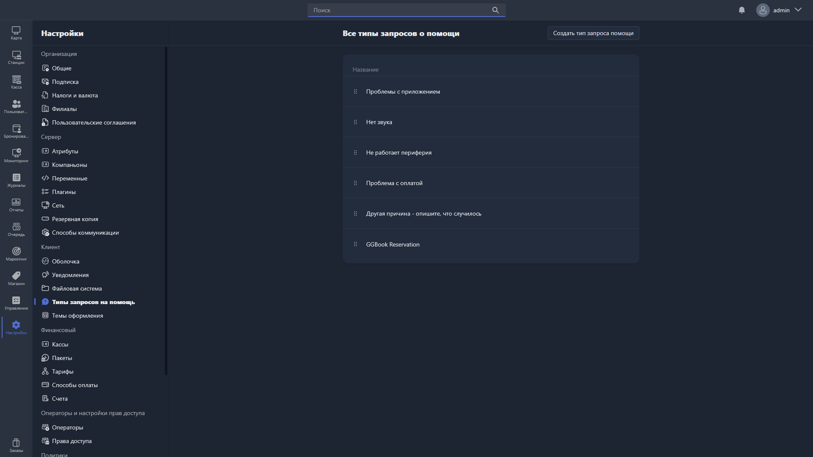

{width=1919px height=1079px}

Здесь настраиваются типы запросов о помощи, которые пользователь может отправить оператору через интерфейс Gizmo Client.

В списке отображаются все созданные типы запросов. Порядок их отображения можно изменить, перетаскивая элементы за иконку **::** слева от названия.

Чтобы создать новый тип запроса, нажмите <cmd text="Создать тип запроса помощи"/> в правом углу страницы.

## Создание типа запроса

При создании нового типа запроса нужно заполнить поле:

-  **Название** -- наименование типа запроса, которое будет отображаться пользователю в Gizmo Client. Поле обязательно для заполнения.