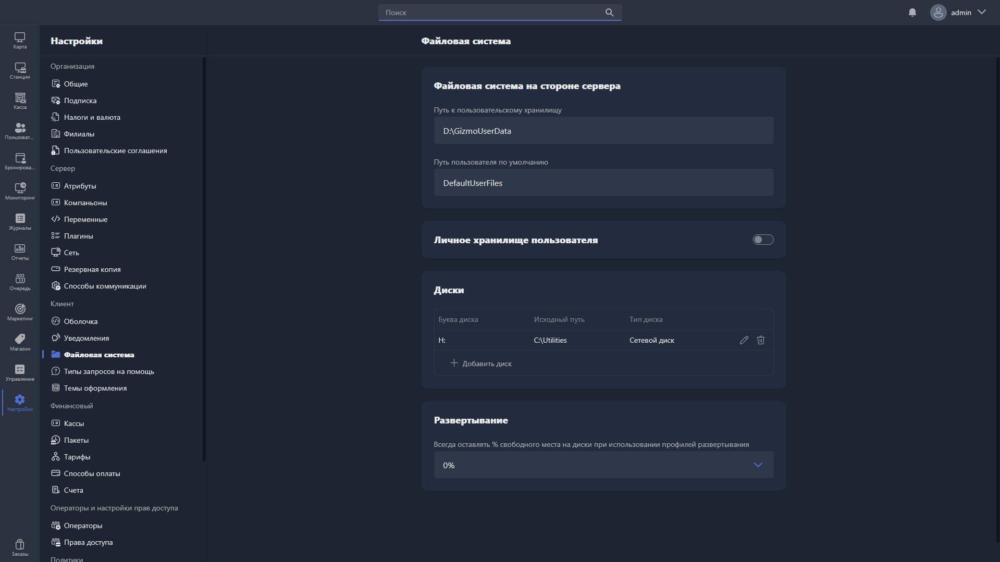

{width=1919px height=1079px}

В этом разделе настраивается файловая система на стороне сервера, личное хранилище пользователей, а также виртуальные диски и параметры развёртывания файлов на хостах.

## Файловая система на стороне сервера

-  **Путь к пользовательскому хранилищу** -- путь к директории на сервере, в которой хранятся личные файлы пользователей.

-  **Путь пользователя по умолчанию** -- путь к директории, которая используется как папка по умолчанию для новых пользователей при первом входе.

## Личное хранилище пользователя

При включении этой опции каждый пользователь получает личное хранилище файлов, доступное ему при входе на любой хост.

## Диски

Здесь настраиваются виртуальные диски, которые монтируются на хостах.

Для каждого диска указываются параметры:

-  **Буква диска** -- буква, под которой диск отображается в системе на хосте.

-  **Исходный путь** -- путь к директории на сервере, которая будет смонтирована как диск.

-  **Тип диска** -- тип монтирования виртуального диска.

Чтобы добавить диск, нажмите <cmd text="+ Добавить диск"/>. Чтобы удалить -- используйте иконку корзины напротив записи.

## Развёртывание

**Всегда оставлять % свободного места на диске при использовании профилей развёртывания** -- минимальный процент свободного места на диске хоста, который Gizmo должен оставлять при развёртывании файлов. Если после развёртывания свободного места останется меньше указанного значения, операция будет прервана.