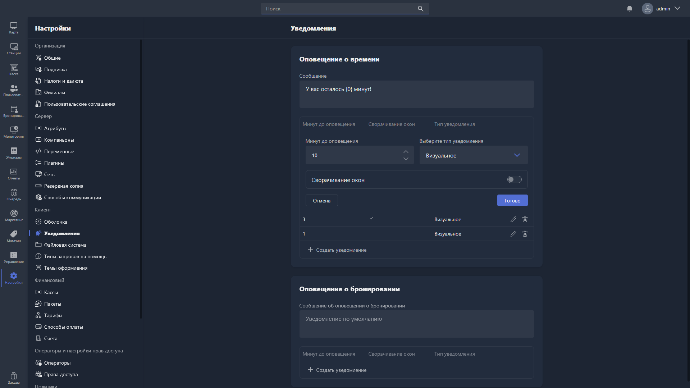

{width=1919px height=1079px}

В этом разделе настраиваются оповещения клиентов для Gizmo Client:

-  оповещение о времени;

-  оповещение о бронировании.

## Оповещение о времени

**Оповещение о времени** -- оповещения, которые показываются или озвучиваются клиенту по истечении оплаченного времени.

Для каждого оповещения настраиваются параметры:

-  **Сообщение** -- текст сообщения, которое отображается клиенту (можно использовать переменную времени). Если поле не заполнено, используется уведомление по умолчанию.

-  **Минут до оповещения** -- за сколько минут до истечения времени будет показано уведомление.

-  **Сворачивание окон** -- при включении все открытые окна на хосте сворачиваются в момент показа уведомления.

-  **Тип уведомления** -- способ оповещения пользователя: визуальное, звуковое или визуальное и звуковое.

Чтобы добавить новое оповещение, нажмите <cmd text="Создать уведомление"/>. Чтобы отредактировать или удалить существующее -- используйте иконки карандаша и корзины напротив записи.

## Оповещение о бронировании

**Оповещение о бронировании** -- уведомления, которые получает пользователь в Gizmo Client при наступлении забронированного времени на текущем хосте.

Для каждого оповещения настраиваются параметры:

-  **Сообщение об оповещении о бронировании** -- текст уведомления о бронировании (можно использовать переменную времени). Если поле не заполнено, используется уведомление по умолчанию.

-  **Минут до оповещения** -- за сколько минут до начала бронирования будет показано уведомление.

-  **Сворачивание окон** -- при включении все открытые окна на хосте сворачиваются в момент показа уведомления.

-  **Тип уведомления** -- способ оповещения пользователя: визуальное, звуковое или визуальное и звуковое.

Чтобы добавить новое оповещение, нажмите <cmd text="Создать уведомление"/>. Чтобы отредактировать или удалить существующее -- используйте иконки карандаша и корзины напротив записи.