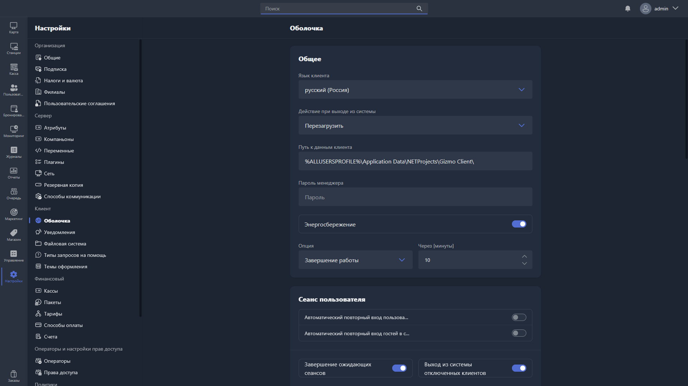

{width=1919px height=1079px}

В этом разделе настраивается оболочка Gizmo Client:

-  общие настройки;

-  сеанс пользователя;

-  регистрация пользователя;

-  системные;

-  настройки приложения;

-  льготный период пополнения;

-  политика паролей.

> [!WARNING]
> 
> Для применения настроек этого раздела требуется перезагрузка Gizmo Client.

## Общее

Блок «Общее» содержит ключевые настройки оболочки Gizmo Client:

-  язык клиента;

-  действие при выходе из системы;

-  путь к данным клиента;

-  пароль менеджера;

-  энергосбережение.

### Язык клиента

**Язык клиента** -- язык оболочки Gizmo Client.

### Действие при выходе из системы

**Действие при выходе из системы** -- действие, которое будет выполнено после завершения пользовательского сеанса.

Доступны варианты:

-  без действий;

-  перезагрузка;

-  закрытие всех программ;

-  выключение;

-  завершение сеанса;

-  переход в режим ожидания;

-  переход в режим администратора.

### Путь к данным клиента

**Путь к данным клиента** -- путь, по которому на компьютере с установленным Gizmo Client хранятся метаданные Gizmo Client.

Значение по умолчанию -- `%PROGRAMDATA%\NETProjects\Gizmo Client\`.

### Пароль менеджера

**Пароль менеджера** -- пароль, введя который в специальном скрытом окне Gizmo Client, можно войти в режим обслуживания. В этом режиме доступны действия:

-  свернуть оболочку Gizmo Client;

-  деактивировать Gizmo Client;

-  удалить Gizmo Client.

> [!TIP]
> 
> Подробнее о режиме обслуживания Gizmo Client -- в разделе «Gizmo Client -- Режим обслуживания».

Пароль менеджера по умолчанию -- `password`.

### Энергосбережение

**Энергосбережение** -- опция, отвечающая за поведение компьютера с установленным Gizmo Client при простое.

Включив эту опцию, можно задать параметры энергосбережения:

-  опция;

-  через [минуты].

**Через [минуты]** -- время простоя в минутах, после которого будет выполнено выбранное действие. Допустимое значение -- от 1.

**Опция** -- действие, которое будет выполнено по истечении указанного времени. Доступны варианты:

-  **Завершение работы**;

-  **Спящий режим**.

## Сеанс пользователя

Блок «Сеанс пользователя» содержит настройки, отвечающие за поведение Gizmo Client во время активной клиентской сессии.

Доступны опции:

-  автоматический повторный вход пользователей;

-  автоматический повторный вход гостей в систему;

-  завершение ожидающих сеансов;

-  выход из системы отключенных клиентов;

-  время ожидания.

**Автоматический повторный вход пользователей** -- автоматический вход клиентов из пользовательских групп в Gizmo Client после аварийной перезагрузки компьютера с установленным Gizmo Client.

**Автоматический повторный вход гостей в систему** -- автоматический вход клиентов из гостевых групп в Gizmo Client после аварийной перезагрузки компьютера с установленным Gizmo Client.

**Завершение ожидающих сеансов** -- автоматическое завершение сеанса клиента в Gizmo Server и Gizmo Manager при потере соединения между Gizmo Server и Gizmo Client.

**Выход из системы отключенных клиентов** -- автоматическое завершение сеанса клиента в Gizmo Client при потере соединения между Gizmo Server и Gizmo Client.

**Время ожидания [Секунды]** -- если сетевое соединение между Gizmo Server и Gizmo Client разорвано и включена одна из опций выше («Выход из системы отключенных клиентов» или «Завершение ожидающих сеансов»), это время ожидания разрыва соединения (в секундах), после которого будет выполнено завершение сессии клиента: в Gizmo Client (при активной опции «Выход из системы отключенных клиентов») и в Gizmo Server и Gizmo Manager (при активной опции «Завершение ожидающих сеансов»).

По умолчанию значение этого параметра -- 180 секунд.

> [!WARNING]
> 
> Для применения опций «Время ожидания», «Выход из системы отключенных клиентов» и «Завершение ожидающих сеансов» требуется перезагрузка Gizmo Client.

## Регистрация пользователя

Блок «Регистрация пользователя» содержит настройки, связанные с экраном регистрации. Доступны опции:

-  регистрация;

-  подтверждение регистрации;

-  восстановление пароля;

-  длина и тип символов для кода подтверждения.

### Регистрация

Доступны опции:

-  регистрация клиента;

-  веб-портал регистрации.

**Регистрация клиента** -- при включении клиенту в Gizmo Client становится доступен экран самостоятельной регистрации.

**Веб-портал регистрации** -- при включении клиенту на веб-портале становится доступен экран самостоятельной регистрации.

### Подтверждение регистрации

Доступно включение опции «Подтверждение регистрации»: при регистрации клиента в Gizmo Client будет запрошена верификация email или телефона.

Выбор метода подтверждения (email или телефон) становится доступен сразу после включения этой опции.

> [!WARNING]
> 
> Не забудьте настроить «Способы коммуникации» для выбранного метода верификации.

### Восстановление пароля

Доступно включение опции «Восстановление пароля»: на экране регистрации клиента в Gizmo Client становится доступен экран восстановления пароля.

Выбор метода восстановления (email или телефон) становится доступен сразу после включения этой опции.

> [!WARNING]
> 
> Не забудьте настроить «Способы коммуникации» для выбранного метода верификации.

### Длина и тип символов для кода подтверждения

Опции отвечают за длину и состав кодов подтверждения, которые используются при восстановлении пароля клиента в Gizmo Client.

Максимальная длина кода восстановления -- 6 символов.

Состав кода восстановления:

-  заглавные буквы;

-  цифры;

-  заглавные буквы и цифры.

## Системные

Блок «Системные» содержит настройки системного поведения Gizmo Client:

-  автоматическое обновление оболочки;

-  автоматическое понижение версии оболочки;

-  выполнять пакетные файлы на хостах.

**Автоматическое обновление оболочки** -- если при обновлении Gizmo Server требуется обновление Gizmo Client, при включении этой опции оно происходит автоматически.

**Автоматическое понижение версии оболочки** -- если при откате Gizmo Server на более старую версию требуется даунгрейд Gizmo Client, при включении этой опции он происходит автоматически.

**Выполнять пакетные файлы на хостах** -- опция, отвечающая за возможность запуска bat-скриптов на компьютере с запущенным Gizmo Client.

## Настройки приложения

Блок «Настройки приложения» содержит настройки, связанные с запуском приложений через Gizmo Client:

-  ограничить одновременный запуск нескольких приложений.

**Ограничить одновременный запуск нескольких приложений** -- управляет возможностью одновременного запуска клиентом нескольких приложений. При включённой опции запуск двух и более приложений одновременно невозможен.

## Льготный период пополнения

**Льготный период пополнения** -- при включении клиенту с активной сессией, у которого закончилось время, показывается таймер обратного отсчёта с сообщением о необходимости пополнить баланс или купить время. Если за отведённое время клиент успевает пополнить баланс, сессия продолжается; если нет -- происходит разлогин.

**Льготный период пополнения** (значение) -- параметр появляется при включении опции выше и задаёт время в минутах для льготного периода пополнения.

## Политика паролей

Блок «Политика паролей» задаёт требования, применяемые при создании или изменении пароля клиента в Gizmo Client:

-  минимальная длина пароля;

-  максимальная длина пароля;

-  пароль должен содержать.

**Минимальная длина пароля** -- минимальное количество символов пароля.

**Максимальная длина пароля** -- максимальное количество символов пароля.

**Пароль должен содержать** -- обязательные группы символов:

-  строчные буквы;

-  прописные буквы;

-  цифры.

Допускается включение нескольких из этих требований одновременно.