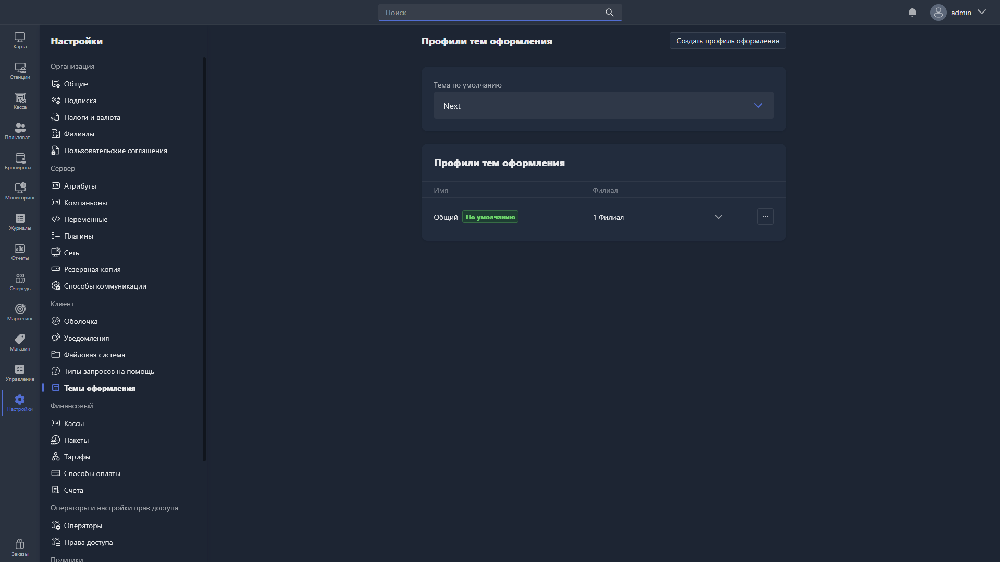

{width=1919px height=1079px}

В этом разделе настраиваются профили темы оформления интерфейса Gizmo Client -- с их помощью можно задать разный внешний вид клиента для разных групп станций.

**Стандартная тема оформления** -- базовая тема Gizmo Client, которая применяется по умолчанию. Выбирается из списка уже созданных профилей.

Ниже -- таблица со всеми созданными профилями оформления:

| Столбец | Что означает                                                          |
|---------|-----------------------------------------------------------------------|
| Имя     | Название профиля. Профиль по умолчанию отмечен меткой «По умолчанию». |
| Филиал  | Филиал или филиалы, к которым привязан профиль.                       |

Чтобы управлять профилем, нажмите **«...»** напротив нужной записи -- откроется меню с действиями:

-  <cmd text="Редактировать"/> -- открывает карточку профиля для редактирования.

-  <cmd text="Установить значение по умолчанию"/> -- назначает выбранный профиль профилем по умолчанию.

Чтобы создать новый профиль, нажмите <cmd text="Создать профиль оформления"/> в правом верхнем углу страницы. Его настройки описываются [здесь](./skin-profile.md).