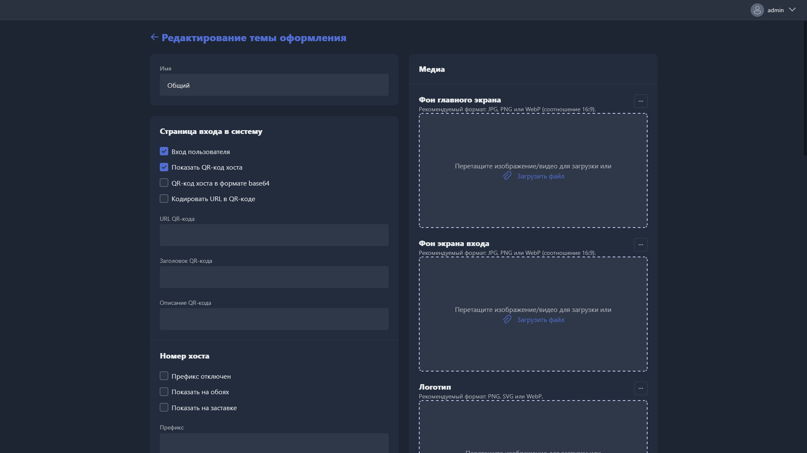

{width=1919px height=1079px}

**Карточка профиля темы оформления открывается при создании нового профиля или редактировании существующего.**

**Имя** -- название профиля темы оформления.

## Страница входа в систему

В этом подразделе настраивается внешний вид и поведение экрана входа в Gizmo Client.

-  **Вход пользователя** -- при включении на экране входа отображается форма авторизации пользователя.

-  **Показать QR-код хоста** -- при включении на экране входа отображается QR-код хоста.

-  **QR-код хоста base64** -- при включении QR-код хоста кодируется в формате base64.

-  **URL для генерации QR-кода** -- при включении QR-код генерируется на основе указанного URL.

-  **URL QR-кода** -- URL, который будет закодирован в QR-коде.

-  **Заголовок QR-кода** -- текст заголовка, отображаемый рядом с QR-кодом.

-  **Описание QR-кода** -- текст описания, отображаемый рядом с QR-кодом.

## Номер хоста

В этом подразделе настраивается отображение номера хоста в интерфейсе Gizmo Client.

-  **Префикс отключен** -- при включении префикс перед номером хоста не отображается.

-  **Показать на обоях** -- при включении номер хоста отображается на фоновом изображении (обоях) рабочего стола.

-  **Показать на заставке** -- при включении номер хоста отображается на заставке экрана входа.

-  **Префикс** -- текст, который добавляется перед номером хоста.

-  **Позиционирование на обоях** -- направление перемещения номера хоста по экрану обоев (например, по часовой стрелке).

-  **Позиционирование на заставке** -- направление перемещения номера хоста по экрану заставки.

-  **Фиксированная позиция** -- фиксированное положение номера хоста на экране (например, сверху справа). Используется, если анимация перемещения не требуется.

-  **Время ожидания между позициями** -- интервал в секундах между сменой позиции номера хоста при анимации.

-  **Продолжительность анимации** -- длительность анимации перехода между позициями в секундах.

## Медиа

В этом подразделе загружаются медиафайлы, используемые в интерфейсе Gizmo Client.

-  **Фоновые медиа** -- фоновое изображение или видео, отображаемое в интерфейсе клиента. Рекомендуемый формат: JPG, PNG или MP4.

-  **Фоновое медиа для входа в систему** -- фоновое изображение или видео для экрана входа. Рекомендуемый формат: JPG, PNG или MP4.

-  **Лого** -- логотип, отображаемый в интерфейсе клиента. Рекомендуемый формат: PNG или SVG.

Для загрузки файла перетащите его в соответствующую область или нажмите <cmd text="Загрузить файл"/>.

## Ротатор входа в систему

При включении этой опции на экране входа отображаются медиафайлы из указанной папки, сменяющие друг друга с заданным интервалом.

-  **Поворачивать каждые \[секунды\]** -- интервал в секундах между сменой медиафайлов.

-  **Папка для мультимедиа** -- путь к папке с медиафайлами для ротатора.

## Главная страница

При включении этой опции в Gizmo Client отображается главная страница.

-  **Кол-во иконок быстрого запуска** -- количество приложений, отображаемых в блоке быстрого запуска на главной странице.

-  **Максимальное кол-во элементов в строке** -- максимальное количество элементов в одной строке на главной странице.

## Страница магазина

При включении этой опции в Gizmo Client отображается страница магазина.

-  **Информация о товаре** -- при включении в карточке товара отображается подробная информация о нём.

-  **Максимальное кол-во элементов в строке** -- максимальное количество товаров в одной строке на странице магазина.

-  **Макс. популярных товаров** -- максимальное количество товаров, отображаемых в блоке популярных товаров.

## Страница приложений

-  **Детали приложения** -- при включении в карточке приложения отображается подробная информация о нём.

-  **Максимальное кол-во элементов в строке** -- максимальное количество приложений в одной строке на странице приложений.

-  **Максимальное кол-во популярных приложений** -- максимальное количество приложений, отображаемых в блоке популярных.

-  **Опция сортировки** -- порядок сортировки приложений на странице (например, по популярности).

## Каналы

При включении этой опции в Gizmo Client отображается раздел каналов.

-  **Каналы меняются каждые** -- интервал в секундах между автоматической сменой каналов.

## Другое

-  **ID интеграции** -- идентификатор для интеграции с внешними сервисами.

-  **Пользовательский CSS** -- поле для ввода пользовательских CSS-стилей, позволяющих кастомизировать внешний вид интерфейса Gizmo Client. Стили можно ввести вручную или загрузить из файла, нажав <cmd text="Загрузить файл CSS"/>.

**Чтобы удалить профиль темы оформления, нажмите** <cmd text="Удалить"/> **в правом нижнем углу страницы.**