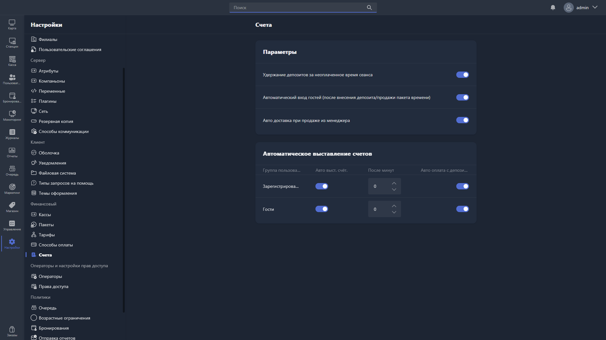

{width=1919px height=1079px}

В этом разделе настраиваются параметры выставления и оплаты счетов в Gizmo.

## Параметры

-  **Удержание депозитов за неоплаченное время сеанса** -- при включении сумма за неоплаченное время сеанса автоматически списывается с депозита пользователя при закрытии баланса.

-  **Автоматический вход гостей (после внесения депозита/продажи пакета времени)** -- при включении гостевой пользователь автоматически входит в систему на хосте сразу после пополнения депозита или покупки пакета времени.

-  **Авто доставка при продаже из менеджера** -- при включении товары и пакеты времени, проданные через Gizmo Manager, считаются доставленными автоматически, без подтверждения оператором.

## Автоматическое выставление счетов

Здесь настраивается автоматическое выставление и оплата счетов для каждой группы пользователей.

Таблица содержит столбцы:

-  **Группа пользователей** -- группа, для которой применяются настройки.

-  **Авто выст. счёт.** -- при включении счёт выставляется пользователю автоматически по окончании сеанса.

-  **После минут** -- количество минут после завершения сеанса, по истечении которых счёт выставляется автоматически.

-  **Авто оплата с депозитов** -- при включении выставленный счёт автоматически оплачивается с депозита пользователя.