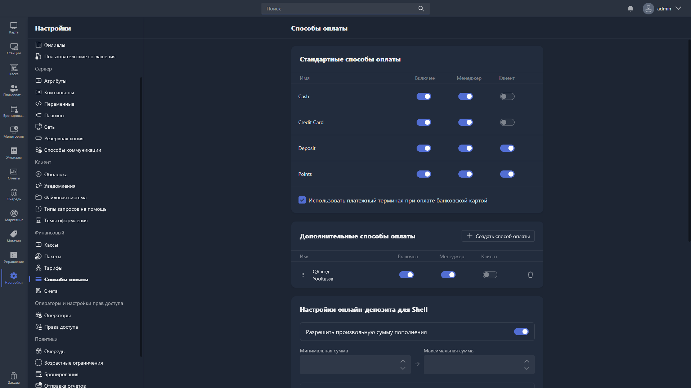

{width=1919px height=1079px}

В этом разделе настраиваются способы оплаты, доступные в Gizmo Manager и Gizmo Client.

## Стандартные способы оплаты

Стандартные способы оплаты встроены в систему и не могут быть удалены. Для каждого из них можно настроить доступность:

-  **Включён** -- общий статус способа оплаты в системе.

-  **Менеджер** -- доступность способа оплаты в Gizmo Manager.

-  **Клиент** -- доступность способа оплаты в Gizmo Client.

Доступные стандартные способы оплаты:

-  **Cash** -- наличные.

-  **Credit Card** -- банковская карта.

-  **Deposit** -- оплата с депозита пользователя.

-  **Points** -- оплата баллами лояльности.

**Использовать платёжный терминал при оплате банковской картой** -- при включении оплата картой проводится через подключённый платёжный терминал. Доступны два режима работы терминала:

-  **Не в сети** -- терминал работает в офлайн-режиме.

-  **В сети** -- терминал работает в онлайн-режиме.

## Дополнительные способы оплаты

Здесь настраиваются пользовательские способы оплаты -- например, интеграции с платёжными системами (YooKassa, Tinkoff и другими).

Таблица показывает все созданные дополнительные способы оплаты. Для каждого доступны те же настройки, что и для стандартных: **Включён**, **Менеджер**, **Клиент**. Порядок отображения можно изменить перетаскиванием за иконку **::**, а для удаления способа оплаты нажмите иконку корзины.

Чтобы создать новый способ оплаты, нажмите [cmd:+ Создать способ оплаты] -- поля для заполнения описаны в статье [«Карточка способа оплаты»](./payment-method-card.md).

## Настройки онлайн-депозита для Shell

Здесь настраивается пополнение депозита пользователем через интерфейс Gizmo Client.

-  **Разрешить произвольную сумму пополнения** -- при включении пользователь может самостоятельно ввести любую сумму пополнения в пределах установленных лимитов.

-  **Минимальная сумма** -- минимальная сумма, которую пользователь может пополнить за один раз.

-  **Максимальная сумма** -- максимальная сумма, которую пользователь может пополнить за один раз.

-  **Шаблоны** -- фиксированные суммы пополнения, отображаемые пользователю в виде кнопок быстрого выбора. Чтобы добавить шаблон, нажмите [cmd:+ Добавить шаблон], укажите сумму и нажмите [cmd:Готово].

## Другое

-  **URL для успешного платежа** -- адрес страницы, на которую перенаправляется пользователь после успешной оплаты онлайн.

-  **URL для неуспешных платежей** -- адрес страницы, на которую перенаправляется пользователь в случае неудачной оплаты онлайн.