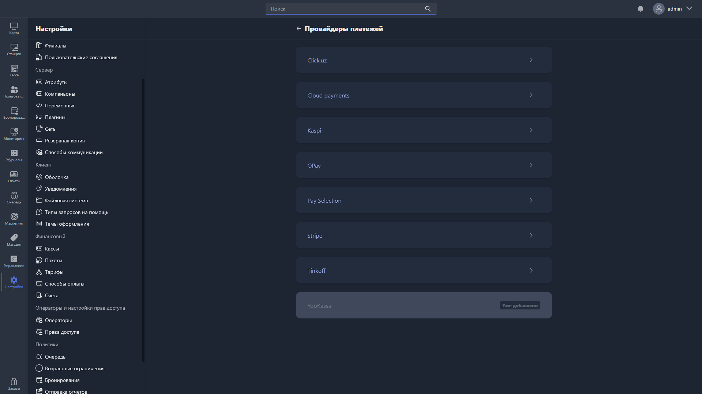
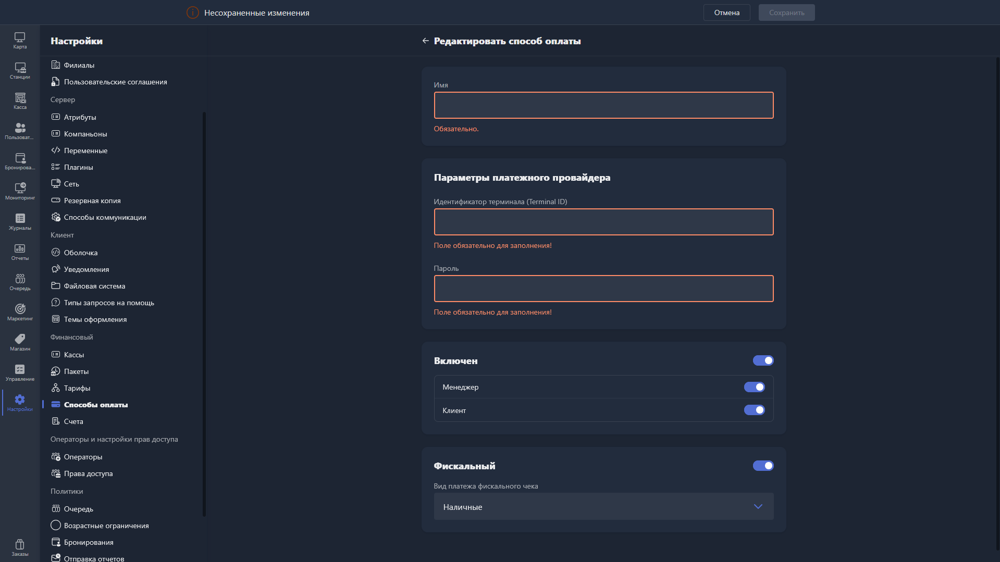

Карточка способа оплаты открывается при создании нового дополнительного способа оплаты. Ее тип зависит от выбранного варианта при нажатии кнопки <cmd text="Создать способ оплаты"/>

<tabs>

<tab name="Не в сети">

{width=1919px height=1079px}

</tab>

<tab name="В сети">

{width=1919px height=1079px}

{width=1919px height=1079px}

</tab>

</tabs>

-  **Имя** -- название способа оплаты, отображаемое в интерфейсе. Поле обязательно для заполнения.

-  **Включён** -- общий статус способа оплаты. При включении становятся доступны дополнительные настройки:

   -  **Менеджер** -- доступность способа оплаты в Gizmo Manager.

   -  **Клиент** -- доступность способа оплаты в Gizmo Client.

-  **Фискальный** -- при включении способ оплаты учитывается при фискализации чеков. В поле «Вид платежа фискального чека» выбирается тип платежа для отражения в чеке (например, наличные).

Эти поля соответствуют созданию способа оплаты типа **«Не в сети»** -- для приёма платежей без интеграции с внешней платёжной системой.

Чтобы создать онлайн-способ оплаты (**«В сети»**), выберите соответствующий вариант при создании -- откроется страница «Провайдеры платежей» со списком доступных интеграций:

-  [Click.uz](http://Click.uz)

-  Cloud Payments

-  Kaspi

-  OPay

-  Pay Selection

-  Stripe

-  Tinkoff

-  YooKassa

Провайдеры, которые уже добавлены в систему, отмечены меткой «Уже добавлено» и недоступны для повторного выбора. Чтобы подключить нового провайдера, нажмите на его карточку и следуйте инструкциям по настройке интеграции.