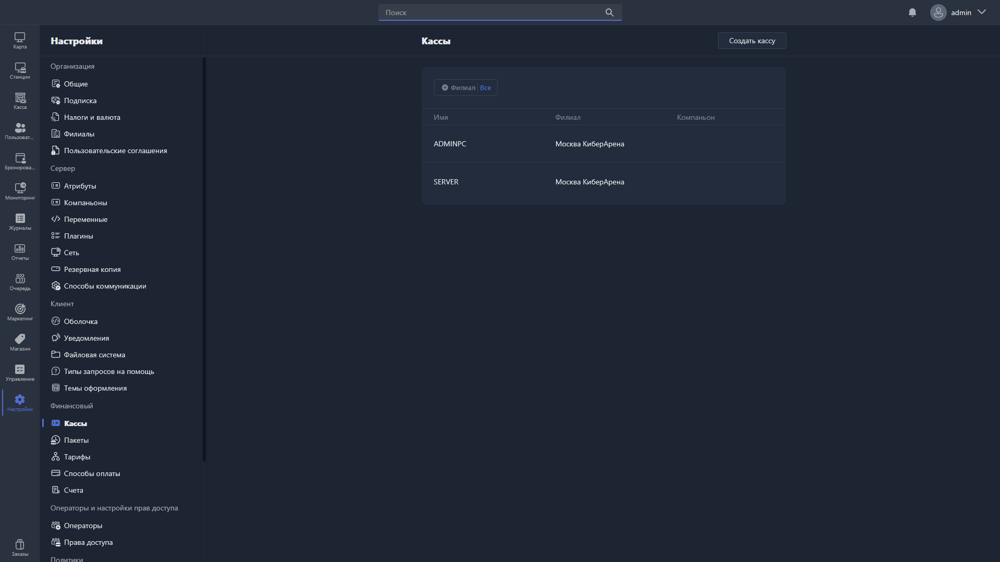

{width=1919px height=1079px}

Здесь настраиваются кассы, используемые в Gizmo Manager при проведении финансовых операций.

В таблице отображаются все созданные кассы. Список можно отфильтровать по филиалу, нажав на фильтр «Филиал».

Таблица содержит столбцы:

-  **Имя** -- название кассы.

-  **Филиал** -- филиал, к которому привязана касса.

-  **Компаньон** -- Gizmo Companion, связанный с этой кассой.

Чтобы создать новую кассу, нажмите [cmd:Создать кассу] в правом углу страницы.

Чтобы отредактировать существующую, нажмите на соответствующую строку в таблице -- откроется [карточка кассы](./register-card.md).