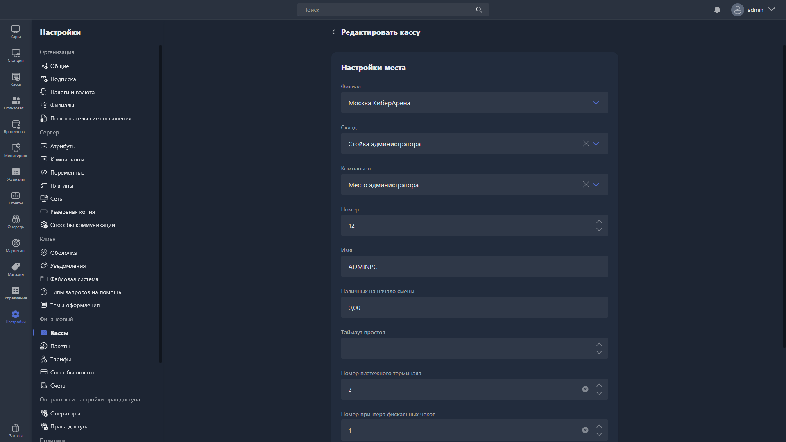

{width=1919px height=1079px}

Карточка кассы открывается при создании новой кассы или редактировании существующей.

## Настройки места

-  **Филиал** -- филиал, к которому привязана касса. Поле обязательно для заполнения.

-  **Склад** -- склад, связанный с этой кассой. Используется для учёта товаров при продажах.

-  **Компаньон** -- Gizmo Companion, который будет работать с этой кассой.

-  **Номер** -- порядковый номер кассы.

-  **Имя** -- название кассы. Поле обязательно для заполнения.

-  **Наличных на начало смены** -- сумма наличных денег, с которой открывается смена на этой кассе.

-  **Таймаут простоя** -- время бездействия в секундах, после которого касса переходит в режим ожидания.

-  **Номер платёжного терминала** -- идентификационный номер платёжного терминала, подключённого к этой кассе.

-  **Номер принтера фискальных чеков** -- идентификационный номер фискального принтера, подключённого к этой кассе.

-  **Номер принтера чеков** -- идентификационный номер принтера чеков, подключённого к этой кассе.

-  **Номер QR-дисплея** -- идентификационный номер QR-дисплея, подключённого к этой кассе.

-  **Оператор по умолчанию** -- оператор, назначаемый этой кассе по умолчанию. Значение по умолчанию -- «Не указано».

## Назначение кассы по умолчанию

В нижней части карточки расположены два переключателя:

-  **Касса по умолчанию для филиала** -- касса используется по умолчанию в пределах своего филиала.

-  **Глобальная касса по умолчанию** -- касса используется по умолчанию во всей системе.