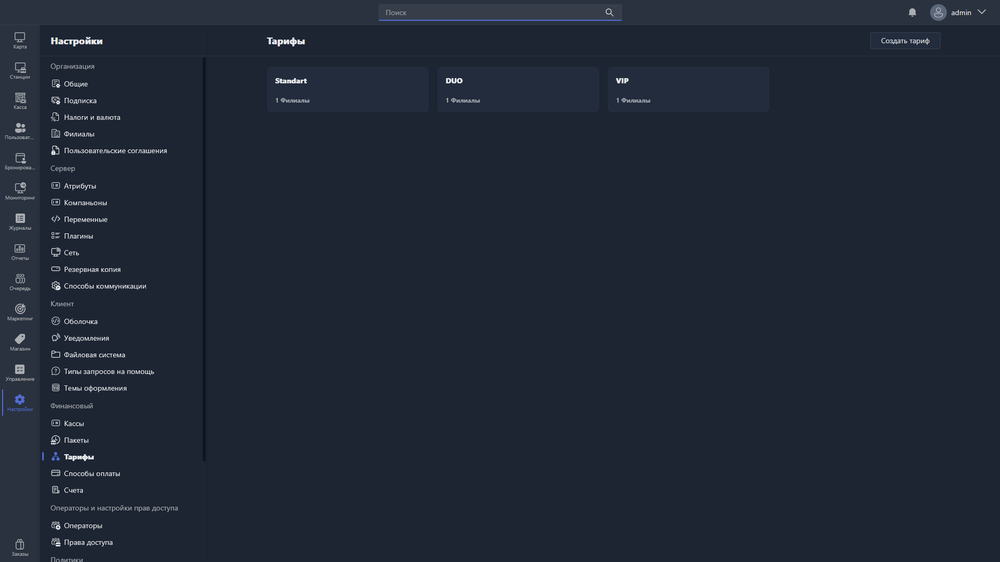

{width=1919px height=1079px}

В этом разделе настраиваются профили тарификации -- правила начисления оплаты за время, проведённое пользователем на хосте.

Все созданные тарифы отображаются в виде карточек: на каждой -- название профиля и количество привязанных филиалов.

Чтобы создать новый тариф, нажмите <cmd text="Создать тариф"/> в правом углу страницы.

Чтобы отредактировать существующий тариф, нажмите на его карточку -- откроется [карточка тарифа](./tariff-card.md).