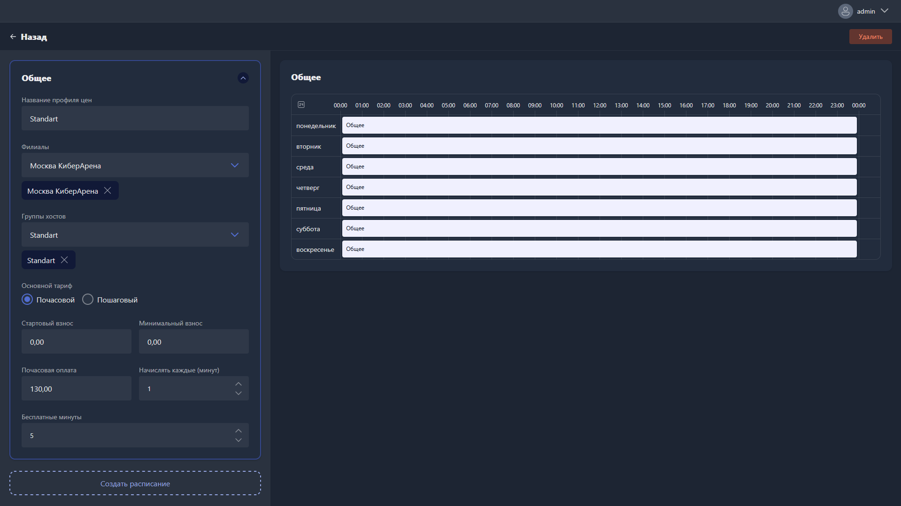

{width=1919px height=1079px}

Карточка тарифа открывается при создании нового тарифа или редактировании существующего.

Карточка состоит из двух частей: панели настроек слева и календарного графика справа.

## Общее

Блок «Общее» содержит базовые настройки тарифного профиля, которые действуют по умолчанию в периоды, не охваченные расписаниями.

-  **Название профиля цен** -- наименование тарифного профиля.

-  **Филиалы** -- филиалы, в которых применяется тариф. Можно выбрать несколько.

-  **Группы хостов** -- группы хостов, к которым применяется тариф. Можно выбрать несколько.

-  **Основной тариф** -- тип тарификации:

   -  **Почасовой** -- оплата начисляется пропорционально времени использования хоста.

   -  **Пошаговый** -- оплата начисляется по заданным шагам с индивидуальными правилами для каждого интервала.

### Почасовой тариф

-  **Стартовый взнос** -- фиксированная сумма, списываемая при начале сеанса.

-  **Минимальный взнос** -- минимальная сумма, которая будет списана за сеанс вне зависимости от его продолжительности.

-  **Почасовая оплата** -- стоимость одного часа использования хоста.

-  **Начислять каждые (минут)** -- интервал в минутах, с которым производится начисление оплаты.

-  **Бесплатные минуты** -- количество минут в начале сеанса, за которые оплата не начисляется.

### Пошаговый тариф

Пошаговый тариф позволяет задать разные правила начисления для последовательных временных интервалов одного сеанса.

Для каждого шага настраиваются параметры:

-  **Минута шага** -- с какой минуты сеанса начинает действовать этот шаг.

-  **Действие** -- тип действия при наступлении шага (например, «Начислить»).

-  **Начисление** -- сумма, начисляемая при наступлении шага.

-  **Почасовая оплата** -- почасовая ставка, действующая в рамках этого шага.

Чтобы добавить новый шаг, нажмите <cmd text="+ Создать шаг"/>. Чтобы удалить шаг, нажмите <cmd text="Удалить"/> внутри его карточки.

## Расписания

Расписания позволяют задавать тарифные условия, отличные от основных, для конкретных временных интервалов в течение недели.

Чтобы создать расписание, нажмите <cmd text="Создать расписание"/> в нижней части панели -- оно появится в панели слева отдельным блоком и на календарном графике справа.

Каждое расписание содержит те же параметры тарификации, что и блок «Общее» (почасовой или пошаговый тариф), и может быть удалено кнопкой с иконкой корзины.

## Календарный график

Календарный график отображает недельное расписание тарифа: строки соответствуют дням недели, столбцы -- часам суток (с 00:00 до 24:00).

-  Серые блоки подписаны «Общее» -- в эти периоды действует базовый тариф из одноимённого блока.

-  Цветные блоки соответствуют созданным расписаниям -- в эти периоды действуют их тарифные условия.

Чтобы назначить расписание на определённый интервал, выделите нужный период на графике: зажмите левую кнопку мыши и проведите по шкале времени в строке нужного дня.

Чтобы удалить тариф, нажмите <cmd text="Удалить"/> в правом верхнем углу страницы.