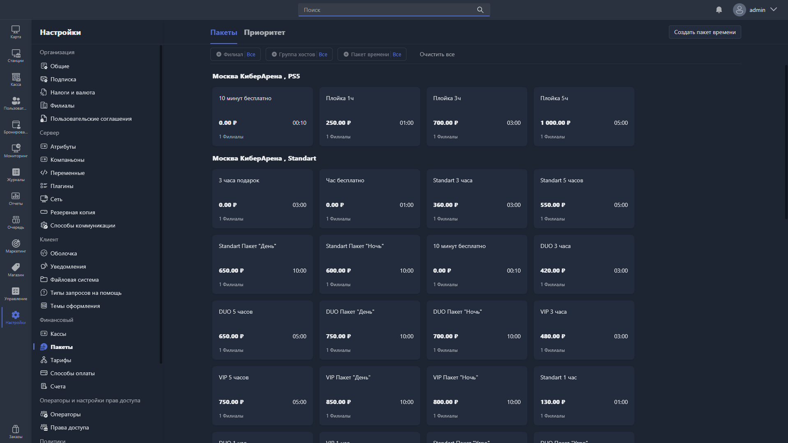

{width=1919px height=1079px}

В этом разделе настраиваются пакеты времени -- предоплаченные временные предложения, которые пользователи могут приобрести в Gizmo Client или через Gizmo Manager.

Раздел содержит две вкладки: «Пакеты» и «Приоритет».

## Вкладка «Пакеты»

Показывает все созданные пакеты времени в виде карточек, сгруппированных по филиалу и группе хостов.

Список можно отфильтровать:

-  **Филиал** -- фильтр по филиалу.

-  **Группа хостов** -- фильтр по группе хостов.

-  **Пакет времени** -- фильтр по конкретному пакету.

Чтобы сбросить все фильтры, нажмите <cmd text="Очистить все"/>.

Каждая карточка пакета показывает название, стоимость, продолжительность (в формате ЧЧ:ММ) и количество филиалов, в которых пакет доступен.

Чтобы создать новый пакет, нажмите <cmd text="Создать пакет времени"/> в правом углу страницы. Чтобы отредактировать существующий -- нажмите на его карточку.

## Вкладка «Приоритет»

Показывает все пакеты времени в виде таблицы с указанием продолжительности. Здесь можно задать порядок их отображения -- перетащите нужный элемент за иконку «::» в требуемую позицию.