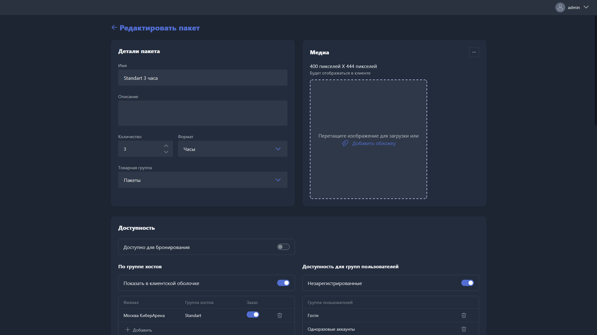

{width=1919px height=1079px}

Карточка пакета времени открывается при создании нового пакета или редактировании существующего.

## Детали пакета

-  **Имя** -- название пакета времени, которое отображается в Gizmo Client и Gizmo Manager.

-  **Описание** -- текстовое описание пакета.

-  **Количество** -- объём времени в пакете.

-  **Формат** -- единица измерения времени в пакете (например, минуты).

-  **Товарная группа** -- группа товаров, к которой относится пакет. Используется для организации пакетов в каталоге.

## Медиа

Обложка пакета отображается в интерфейсе Gizmo Client. Рекомендуемый размер -- 400 × 444 пикселя.

Чтобы загрузить обложку, перетащите изображение в область загрузки или нажмите <cmd text="Добавить обложку"/>.

## Доступность

**Доступно для бронирования** -- при включении пакет времени можно использовать при создании бронирования.

### По группе хостов

**Показать в клиентской оболочке** -- при включении пакет отображается в Gizmo Client для всех групп хостов из списка ниже.

В таблице указывается, в каких филиалах и группах хостов доступен пакет, а также возможность его заказа пользователем:

-  **Филиал** -- филиал, в котором доступен пакет.

-  **Группа хостов** -- группа хостов, для которой доступен пакет.

-  **Заказ** -- при включении пользователь может самостоятельно заказать пакет в Gizmo Client.

Чтобы добавить новую запись, нажмите <cmd text="+ Добавить"/>. Чтобы удалить -- нажмите иконку корзины напротив строки.

### Доступность для групп пользователей

**Незарегистрированные** -- при включении пакет доступен незарегистрированным (гостевым) пользователям.

В таблице указываются группы пользователей, которым доступен пакет. Чтобы добавить группу, нажмите <cmd text="+ Добавить"/>, чтобы удалить -- иконку корзины.

### Доступность в филиалах

Таблица отображает список филиалов с возможностью включить или отключить доступность пакета в каждом из них.

## Диапазон использования

Здесь задаётся период, в течение которого приобретённый пакет может быть использован.

-  **Диапазон дат** -- при включении использование пакета ограничено указанным диапазоном дат (дата начала -- дата конца).

-  **Диапазон времени** -- при включении использование пакета ограничено определёнными временными периодами. Периоды добавляются кнопкой <cmd text="+"/>.

## Расписание продаж

Здесь задаётся период, в течение которого пакет доступен для покупки.

-  **Диапазон дат** -- при включении продажа пакета ограничена указанным диапазоном дат (дата начала -- дата конца).

-  **Диапазон времени** -- при включении продажа пакета ограничена определёнными временными периодами. Периоды добавляются кнопкой <cmd text="+"/>.

## Срок службы пакета

Здесь настраивается срок действия приобретённого пакета.

-  **Срок действия истекает после** -- при включении пакет становится недействительным по истечении указанного количества времени. Задаётся количество и формат (например, дни).

-  **Срок действия истекает в** -- при включении пакет становится недействительным в указанное время суток.

-  **Срок действия истекает при выходе из системы** -- при включении пакет аннулируется сразу после завершения сеанса пользователя.

-  **Срок действия истекает с момента** -- определяет точку отсчёта для параметров «Срок действия истекает после» и «Срок действия истекает в»:

   -  **С момента покупки** -- срок отсчитывается с момента приобретения пакета.

   -  **От использования** -- срок отсчитывается с момента первого использования пакета.

## Ценообразование

-  **Цена** -- стоимость пакета времени в денежных единицах.

-  **Выбор** -- определяет условие оплаты пакета: деньгами, баллами или и тем и другим. Значение «И» означает, что при покупке списываются и деньги, и баллы одновременно.

-  **Баллы** -- стоимость пакета в баллах лояльности.

-  **Налог** -- налоговая ставка, применяемая при продаже пакета. Ставки настраиваются в разделе [«Налоги и валюта»](./../../organization/taxes-and-currency.md).

## Награда

**Баллы** -- количество баллов лояльности, которые начисляются пользователю при покупке пакета.

## Склад

-  **Штрихкод** -- штрихкод пакета для быстрого поиска и продажи через сканер.

-  **Складской учёт** -- при включении расход пакета учитывается в складском учёте. Становятся доступны дополнительные параметры:

   -  **Запретить продажу закончившегося** -- при включении пакет нельзя продать, если его остаток на складе равен нулю.

   -  **Уведомление о наличии остатков** -- при включении система отправляет уведомление при снижении остатка пакета до порогового значения.

Чтобы удалить пакет, нажмите <cmd text="Удалить"/> в правом нижнем углу страницы.