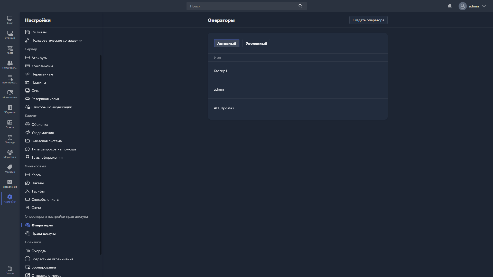

{width=1919px height=1079px}

Здесь управляются учётные записи операторов -- сотрудников, работающих в Gizmo Manager.

Список операторов разделён на две вкладки:

-  **Активный** -- операторы, которые в данный момент работают в системе.

-  **Уволенный** -- операторы, которые были уволены и лишены доступа к системе.

В таблице отображается имя каждого оператора. Чтобы отредактировать оператора, нажмите на соответствующую строку -- откроется [карточка оператора](./operators-card.md).

Чтобы создать нового оператора, нажмите <cmd text="Создать оператора"/> в правом углу страницы.