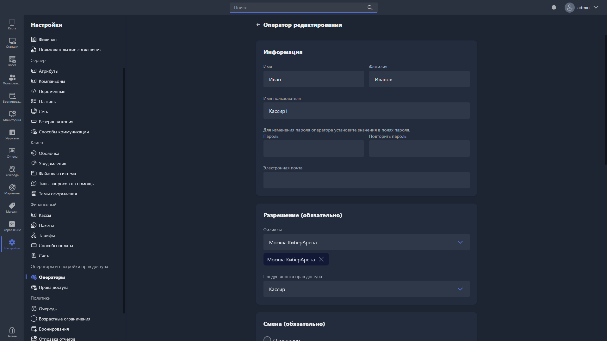

{width=1919px height=1079px}

Карточка оператора открывается при создании нового оператора или редактировании существующего.

## Информация

-  **Имя** -- имя оператора.

-  **Фамилия** -- фамилия оператора.

-  **Имя пользователя** -- логин оператора для входа в Gizmo Manager. Поле обязательно для заполнения.

-  **Пароль** и **Повторить пароль** -- чтобы изменить пароль оператора, заполните оба поля. Если оставить их пустыми, пароль останется прежним.

-  **Электронная почта** -- email оператора.

## Разрешение (обязательно)

-  **Филиалы** -- филиалы, в которых оператор имеет доступ к работе. Можно выбрать несколько. Поле обязательно для заполнения.

-  **Предустановка прав доступа** -- набор прав, определяющий, какие действия доступны оператору в системе. Выбирается из заранее настроенных предустановок -- см. [«Права доступа»](./../permissions/_index.md).

## Смена (обязательно)

Определяет требования к открытию смены для этого оператора:

-  **Отключено** -- смена не используется, оператор может работать без открытия смены.

-  **Необязательно** -- оператор может работать как со сменой, так и без неё.

-  **Обязательно** -- оператор обязан открыть смену перед началом работы.

## Адрес (необязательно)

-  **Страна/регион** -- страна или регион проживания оператора.

-  **Почтовый индекс** -- почтовый индекс.

-  **Город** -- город проживания.

-  **Адрес** -- адрес проживания.

-  **Телефон** -- контактный телефон оператора с выбором кода страны.

## Детали (необязательно)

-  **Изображение** -- фотография или аватар оператора. Чтобы выбрать, нажмите <cmd text="Выбрать изображение"/>.

-  **Мобильный телефон** -- мобильный телефон оператора с выбором кода страны.

-  **Пол** -- пол оператора.

-  **Дата рождения** -- дата рождения оператора.

Чтобы уволить оператора, нажмите <cmd text="Уволить"/> в правом нижнем углу страницы -- он потеряет доступ к системе и переместится на вкладку «Уволенный» в списке операторов.