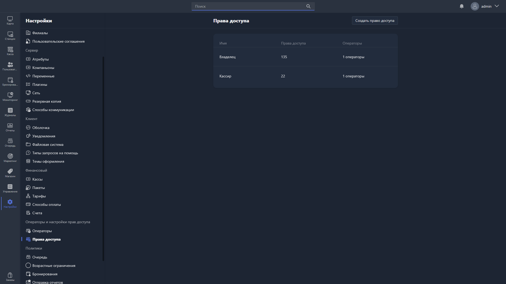

{width=1919px height=1079px}

Здесь настраиваются предустановки прав доступа -- наборы разрешений, которые назначаются операторам.

В таблице отображаются все созданные предустановки:

-  **Имя** -- название предустановки.

-  **Права доступа** -- общее количество включённых разрешений.

-  **Операторы** -- количество операторов, которым назначена предустановка.

Чтобы создать новую предустановку, нажмите <cmd text="Создать право доступа"/> в правом углу страницы.

Чтобы отредактировать существующую, нажмите на соответствующую строку в таблице -- откроется [карточка прав доступа](./permission-card.md).