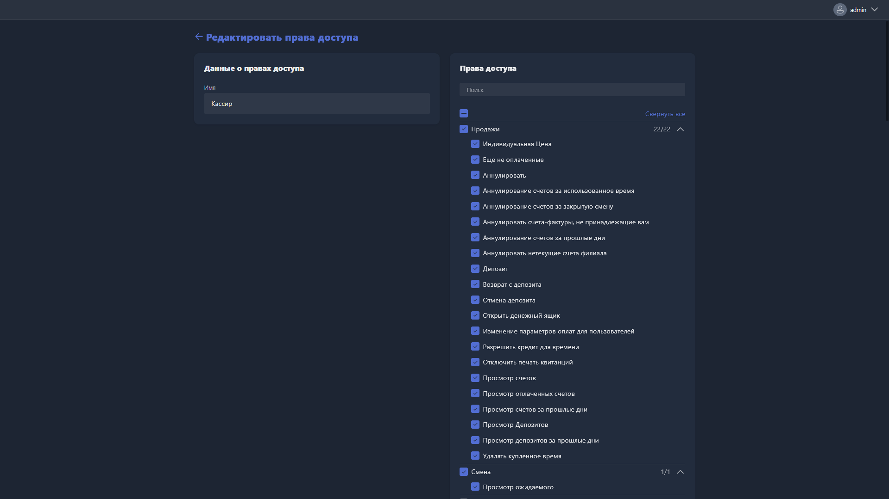

{width=1919px height=1079px}

Карточка прав доступа открывается при создании новой предустановки или редактировании существующей.

**Имя** -- название предустановки прав доступа.

## Права доступа

Права доступа сгруппированы по категориям. Для каждой категории отображается количество включённых разрешений (например, 19/22). Категорию можно свернуть или развернуть, нажав на стрелку справа от её названия. Кнопка <cmd text="Свернуть все"/> сворачивает все категории одновременно.

Чтобы быстро найти нужное разрешение, используйте поле «Поиск».

> [!NOTE]
> 
> Некоторые разрешения зависят от других: если родительское разрешение не включено, дочерние недоступны для выбора и отображаются серым цветом.

Ниже описаны все доступные категории и входящие в них разрешения.

### Продажи

-  **Индивидуальная цена** -- установка произвольной цены при продаже.

-  **Ещё не оплаченные** -- работа со счетами, ожидающими оплаты.

-  **Аннулировать** -- аннулирование счетов.

-  **Аннулирование счетов за использованное время** -- аннулирование счетов за уже использованное время.

-  **Аннулирование счетов за закрытую смену** -- аннулирование счетов, созданных в закрытой смене.

-  **Аннулировать счета-фактуры, не принадлежащие вам** -- аннулирование счетов других операторов.

-  **Аннулирование счетов за прошлые дни** -- аннулирование счетов за предыдущие дни.

-  **Аннулировать нетекущие счета филиала** -- аннулирование счетов других филиалов.

-  **Депозит** -- внесение средств на депозит пользователя.

-  **Возврат с депозита** -- возврат средств на депозит пользователя.

-  **Отмена депозита** -- отмена операции пополнения депозита.

-  **Открыть денежный ящик** -- открытие кассового ящика.

-  **Изменение параметров оплат для пользователей** -- изменение способов и условий оплаты.

-  **Разрешить кредит для времени** -- предоставление пользователю времени в кредит.

-  **Отключить печать квитанций** -- возможность не печатать квитанцию при продаже.

-  **Просмотр счетов** -- просмотр списка счетов.

-  **Просмотр оплаченных счетов** -- просмотр оплаченных счетов.

-  **Просмотр счетов за прошлые дни** -- просмотр счетов за предыдущие дни.

-  **Просмотр депозитов** -- просмотр депозитных операций.

-  **Просмотр депозитов за прошлые дни** -- просмотр депозитных операций за предыдущие дни.

-  **Удалять купленное время** -- удаление приобретённых пакетов времени.

### Смена

-  **Просмотр ожидаемого** -- просмотр ожидаемых показателей смены.

### Остатки

-  **Создание** -- создание товарных позиций.

-  **Редактирование** -- редактирование товарных позиций.

-  **Удаление** -- удаление товарных позиций.

-  **Просмотр транзакций** -- просмотр складских транзакций.

-  **Просмотр транзакций за прошлый день** -- просмотр транзакций за предыдущий день.

-  **Учёт** -- проведение операций учёта остатков.

-  **Учёт в текущем филиале** -- учёт остатков в своём филиале.

-  **Учёт глобально** -- учёт остатков во всех филиалах.

-  **Просмотр ожидаемого количества** -- просмотр ожидаемых остатков.

-  **Уровень запасов** -- просмотр уровня запасов.

-  **Уровень запасов в текущем филиале** -- просмотр уровня запасов своего филиала.

-  **Уровень запасов глобально** -- просмотр уровня запасов всех филиалов.

-  **Поступление** -- регистрация поступления товара.

-  **Поступление в текущем филиале** -- регистрация поступления в своём филиале.

-  **Поступление глобально** -- регистрация поступления во всех филиалах.

-  **Перенос** -- перенос товаров между позициями.

-  **Перенос в текущем филиале** -- перенос в рамках своего филиала.

-  **Перенос глобально** -- перенос между всеми филиалами.

-  **Корректировка в текущем филиале** -- корректировка остатков в своём филиале.

-  **Корректировка глобально** -- корректировка остатков во всех филиалах.

-  **Продажа по розничной цене** -- продажа товаров по розничной цене.

-  **Продажа по себестоимости** -- продажа товаров по себестоимости.

-  **Списание** -- списание товаров со склада.

### Мониторинг

Разрешения для доступа к модулю мониторинга хостов.

### Отчёты

Разрешения для доступа к модулю отчётов.

### Настройки

Разрешения для доступа к разделу настроек Gizmo Manager.

### Приложения

-  **Создание** -- создание приложений.

-  **Редактирование** -- редактирование приложений.

-  **Удаление** -- удаление приложений.

### Маркетинг

Разрешения для доступа к маркетинговым инструментам.

### Пользователь

-  **Список** -- просмотр списка пользователей.

-  **Сбросить пароль** -- сброс пароля пользователя.

-  **Разбанить пользователя** -- снятие блокировки с пользователя.

-  **Забанить пользователя** -- блокировка пользователя.

-  **Пользователи, вошедшие в систему** -- просмотр активных сессий.

-  **Создать** -- создание новых пользователей.

-  **Удалить** -- удаление пользователей.

-  **Постоянное удаление** -- безвозвратное удаление пользователей.

-  **Переименовать** -- изменение имени пользователя.

-  **Изменить группу пользователей** -- перемещение пользователя в другую группу.

-  **Редактировать** -- редактирование профиля пользователя.

-  **Просмотр статистики** -- просмотр статистики пользователя.

### Журнал

-  **Очистить** -- очистка журнала событий.

### Очередь ожидания

-  **Управление очередью ожидания** -- управление списком ожидания хостов.

### Терминал

-  **Просмотр транзакций** -- просмотр финансовых транзакций терминала.

-  **Просмотр транзакций за прошлый день** -- просмотр транзакций за предыдущий день.

-  **Внесение средств** -- внесение наличных в кассу.

-  **Изъятие средств** -- изъятие наличных из кассы.

### Управление

-  **Задачи доступа** -- управление задачами на хостах.

-  **Управление процессами** -- просмотр и завершение процессов на хостах.

-  **Управление файлами** -- управление файлами на хостах.

-  **Управление техническим обслуживанием** -- перевод хостов в режим обслуживания.

-  **Безопасность** -- управление профилями безопасности на хостах.

-  **Блокировка ввода** -- блокировка клавиатуры и мыши на хостах.

-  **Перезагрузить клиентский модуль** -- перезапуск Gizmo Client на хостах.

-  **Включение хостов** -- удалённое включение хостов.

-  **Просмотр удалённого управления** -- просмотр экранов хостов без управления.

-  **Удалённое управление** -- полное удалённое управление хостами.

### Бронирования

-  **Создание** -- создание бронирований.

-  **Создавать бронирования без платежей** -- создание бронирований без привязки оплаты.

-  **Бронирования для гостей** -- создание бронирований для незарегистрированных пользователей.

### Группа пользователей

-  **Создание** -- создание групп пользователей.

-  **Редактирование** -- редактирование групп пользователей.

-  **Удаление** -- удаление групп пользователей.

### Схемы

-  **Создание** -- создание схем расположения хостов.

-  **Редактирование** -- редактирование схем.

-  **Удаление** -- удаление схем.

### Хосты

-  **Создание** -- создание хостов.

-  **Редактирование** -- редактирование хостов.

-  **Удаление** -- удаление хостов.

### Группы хостов

-  **Создание** -- создание групп хостов.

-  **Редактирование** -- редактирование групп хостов.

-  **Удаление** -- удаление групп хостов.

### Контроллеры

-  **Создание** -- создание контроллеров.

-  **Редактирование** -- редактирование контроллеров.

-  **Удаление** -- удаление контроллеров.

### Профили безопасности

-  **Создание** -- создание профилей безопасности.

-  **Редактирование** -- редактирование профилей безопасности.

-  **Удаление** -- удаление профилей безопасности.

### Оборудование

-  **Создание** -- создание записей оборудования.

-  **Редактирование** -- редактирование оборудования.

-  **Удаление** -- удаление оборудования.

### Задачи

-  **Создание** -- создание задач для хостов.

-  **Редактирование** -- редактирование задач.

-  **Удаление** -- удаление задач.

### Клиентские задачи

-  **Создание** -- создание задач, выполняемых на клиентских хостах.

-  **Редактирование** -- редактирование клиентских задач.

-  **Удаление** -- удаление клиентских задач.

### Товары

-  **Создание** -- создание товаров в каталоге.

-  **Редактирование** -- редактирование товаров.

-  **Удаление** -- удаление товаров.

### Группы товаров

-  **Создание** -- создание групп товаров.

-  **Редактирование** -- редактирование групп товаров.

-  **Удаление** -- удаление групп товаров.