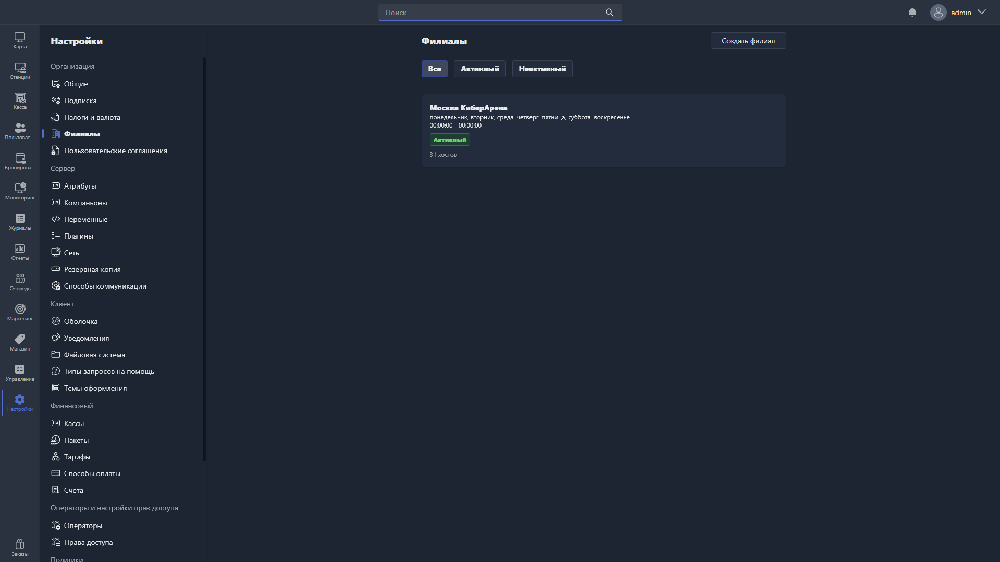

{width=1919px height=1079px}

Здесь настраиваются филиалы вашей сети.

**Мы рекомендуем размещать на одном сервере не более 15 филиалов.**

> [!NOTE]
> 
> Если для сети из более чем 15 филиалов нужна единая база пользователей, рассмотрите [единый плагин авторизации](./../../../plugins/single-auth-plugin.md) для нескольких серверов.

В этом разделе можно:

-  создать новый филиал кнопкой в правой части раздела;

-  отфильтровать филиалы по статусу (все, активные, неактивные);

-  просмотреть мини-карточки филиалов с их названием, адресом (если заполнен), временем работы, статусом и количеством хостов.

Чтобы открыть филиал для просмотра или редактирования, нажмите на [карточку филиала](./branch.md).