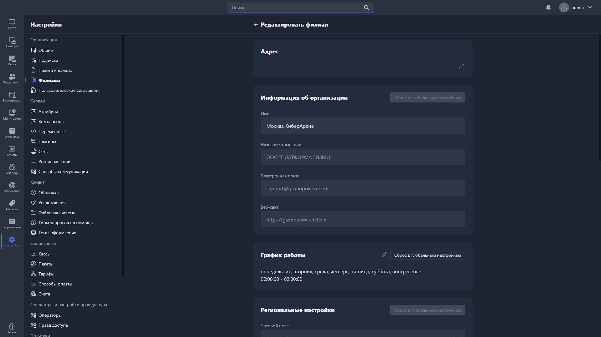

{width=1919px height=1079px}

Карточка филиала открывается при создании или редактировании филиала.

Чтобы деактивировать филиал, нажмите соответствующую кнопку внизу карточки.

В карточке филиала доступны следующие группы настроек:

-  **Адрес филиала** -- страна/регион, адрес, почтовый индекс, город, телефон.

-  **Информация об организации** -- название филиала, наименование организации, email, веб-сайт.

-  **Расписание работы**.

-  **Региональные настройки** -- часовой пояс.

-  **Настройка фискального принтера**.

-  **Настройки налогов** -- ИНН организации, страна, налоговый режим для товаров/услуг/депозита, НДС для товаров/услуг/депозита, опция «Депозит как услуга», наименование услуги депозита.

> [!NOTE]
> 
> Все группы настроек, кроме «Адреса филиала», дублируют глобальные настройки сервера -- в карточке филиала их можно переназначить. Это удобно, если настройки филиала отличаются от общих: например, филиал юридически принадлежит другой организации или имеет льготный налоговый режим из-за региональных особенностей.

Чтобы сбросить настройки филиала до глобальных, нажмите соответствующую кнопку в правом углу нужной группы настроек.

Подробное описание настроек:

-  информация об организации, расписание работы и региональные настройки -- в статье [«Общие сведения»](./../general.md);

-  настройки фискального принтера и налогов -- в статье [«Налоги и валюта»](./../taxes-and-currency.md).