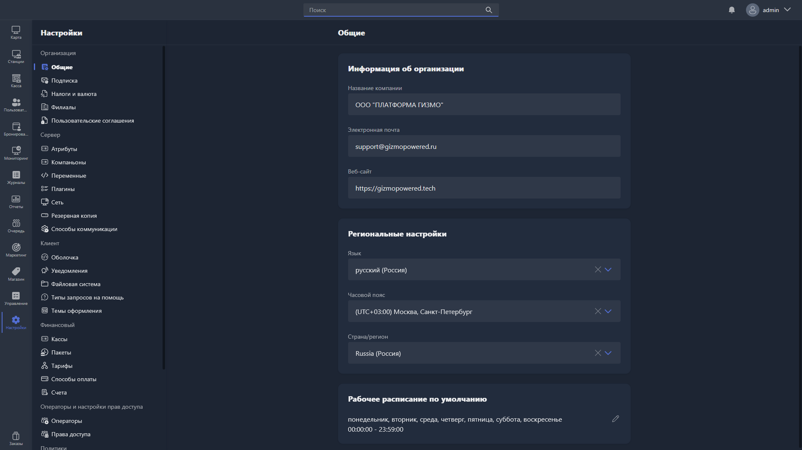

{width=1919px height=1079px}

 

В этом разделе можно заполнить основную информацию об организации, региональные настройки и рабочее расписание.

## Информация об организации

-  **Название компании** -- наименование вашей организации. Указывайте вместе с правовой формой, например ООО «Моя компания» или ИП Иванов Иван Иванович.

-  **Электронная почта** -- email вашей организации.

-  **Веб-сайт** -- сайт вашей организации.

> [!TIP]
> 
> Если название организации не помещается в поле, можно использовать короткую форму записи, например ИП Иванов И. И.

> [!WARNING]
> 
> Все три поля обязательны для заполнения, если для фискализации онлайн-платежей используется облачная касса:
>
> -  **Название компании** -- указывается в онлайн-чеке.
>
> -  **Электронная почта** -- указывается в онлайн-чеке. Если у клиента при оплате не указан номер телефона или email, чек отправляется на эту почту.
>
> -  **Веб-сайт** -- указывается в онлайн-чеке. На сайте должна быть информация о тарифах и условиях -- подойдёт и страница в социальных сетях.

## Региональные настройки

-  **Язык** -- язык интерфейса Gizmo Manager.

-  **Часовой пояс** -- ваш актуальный часовой пояс. Его используют все записи в базе данных, где есть дата и время -- например, транзакции.

-  **Страна/регион** -- страна или регион вашей организации.

## Рабочее расписание

Здесь указывается рабочее время организации -- эта информация используется при построении отчётов. Также можно указать круглосуточный режим работы.