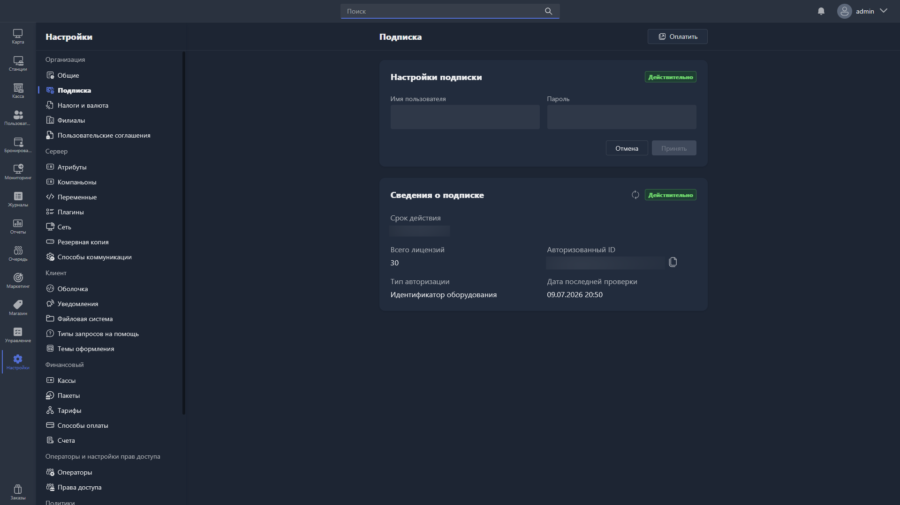

{width=1919px height=1079px}

В этом разделе отображается информация о вашей активной подписке Gizmo.

Чтобы активировать подписку, введите логин и пароль своего аккаунта на сайте Gizmo и нажмите <cmd text="Сохранить"/>.

В подразделе **«Сведения о подписке»** доступна следующая информация:

-  Срок действия подписки

-  Количество лицензий в подписке

-  Тип авторизации

-  Идентификатор

-  Дата последней проверки подписки

> [!NOTE]
> 
> Если информация о подписке отображается некорректно -- введите логин и пароль с сайта Gizmo повторно, сохраните изменения и обновите данные кнопкой в разделе «Сведения о подписке».