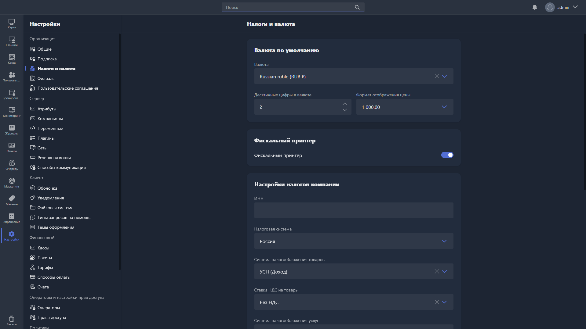

{width=1919px height=1079px}

В этом разделе настраивается налоговый режим организации и параметры валюты.

## Настройки валюты

Здесь настраивается используемая валюта и варианты её отображения. Выбранная валюта учитывается при отображении транзакций как в Gizmo Manager, так и в Gizmo Client.

Отображение валюты настраивается двумя параметрами:

-  количество символов после запятой;

-  формат отображения.

Доступные форматы отображения:

<table header="row">
<colgroup><col width="48"/><col width="260"/><col width="478"/></colgroup>
<tr>
<td>

\#

</td>
<td>

Визуальное представление

</td>
<td>

Описание

</td>
</tr>
<tr>
<td>

1

</td>
<td>

1000\.00

</td>
<td>

разделитель целой части - точка

разделитель тысячной части - отсутствует

</td>
</tr>
<tr>
<td>

2

</td>
<td>

1 000.00

</td>
<td>

разделитель целой части - точка

разделитель тысячной части - пробел

</td>
</tr>
<tr>
<td>

3

</td>
<td>

1,000.00

</td>
<td>

разделитель целой части - точка

разделитель тысячной части - запятая

</td>
</tr>
<tr>
<td>

4

</td>
<td>

1\.000,00

</td>
<td>

разделитель целой части - запятая

разделитель тысячной части - точка

</td>
</tr>
<tr>
<td>

5

</td>
<td>

1000,00

</td>
<td>

разделитель целой части - запятая

разделитель тысячной части - отсутствует

</td>
</tr>
<tr>
<td>

6

</td>
<td>

1 000,00

</td>
<td>

разделитель целой части - запятая

разделитель тысячной части - пробел

</td>
</tr>
</table>

## Фискальный принтер

**Фискальный принтер** -- переключатель типа принтера для печати чеков. Включён -- используется фискальный принтер, выключен -- обычный.

Пошаговая инструкция по настройке -- в статье [«Фискализация чеков в РФ»](./../../tutorials/nastroyka-fiskalizacii.md).

> [!WARNING]
> 
> Эта настройка глобальна для всех филиалов. При необходимости её можно отключить для конкретного филиала [в разделе «Филиалы»](./branches/_index.md).

## Настройки налогов

Здесь настраивается налоговый режим организации -- эти параметры учитываются при фискализации платежей.

<table header="row">
<colgroup><col width="250"/><col width="260"/><col width="260"/></colgroup>
<tr>
<td>

Название настройки

</td>
<td>

Описание

</td>
<td>

Варианты

</td>
</tr>
<tr>
<td>

ИНН

</td>
<td>

Налоговый идентификатор вашей организации

</td>
<td>

</td>
</tr>
<tr>
<td>

Страна

</td>
<td>

Страна регистрации вашей организации

</td>
<td>

</td>
</tr>
<tr>
<td>

Налоговая система для товаров / услуг / депозита

</td>
<td>

Налоговая система, которая будет указана  в чеке при пробитии товаров / услуг / депозита

</td>
<td>

-  Основная

-  УСН доход

-  УСН доход минус расход

-  ЕСХН

-  Патент

</td>
</tr>
<tr>
<td>

НДС для товаров / услуг / депозита

</td>
<td>

Налог на добавленную стоимость для товаров / услуг / депозита

</td>
<td>

-  Без НДС

-  0%

-  5%

-  7%

-  10%

-  20%

-  5/105%

-  7/107%

-  10/110%

-  20/120%

</td>
</tr>
<tr>
<td>

Депозит как услуга

</td>
<td>

Опция, при включении которой, операции пополнения депозита расцениваются не как авансовый платеж, а как услуга с полным расчетом

</td>
<td>

</td>
</tr>
<tr>
<td>

Название услуги депозита

</td>
<td>

Наименование, которое будет указано в чеке при пополнении депозита

</td>
<td>

</td>
</tr>
</table>

> [!NOTE]
> 
> Подробнее об особенностях работы Gizmo при разных настройках налогообложения -- в статье [«Фискализация чеков в РФ»](./../../articles/fiscalization.md).

> [!WARNING]
> 
> Эти настройки глобальны для всех филиалов. При необходимости их можно переназначить для конкретного филиала [в разделе «Филиалы»](./branches/_index.md).

## Налог на продажу времени

Здесь указывается процент налога, который учитывается при продаже поминутного тарифа. Настройка нужна для расчёта налога и учитывается:

-  [в карточке заказа](./../../usage/gizmo-manager/tochka-prodazh/zakazy/kartochka-zakaza.md);

-  [в финансовом отчёте](./../../usage/gizmo-manager/otchety/finansovyy.md).

> [!NOTE]
> 
> Эта настройка не влияет на параметры чека при включённом фискальном принтере и используется только для статистики.

## Налог на товары

Здесь можно создать налоговые ставки на товары (НДС), которые учитываются при продаже, если [в карточке продукта](./../../usage/gizmo-manager/magazin/new-article/kartochka-produkta.md) указана ассоциация с одной из этих ставок.

Чтобы добавить ставку, нажмите <cmd text="+ Добавить"/> в правом углу подраздела и заполните столбцы «Название» и «Значение» в появившейся строке. Значения указываются в процентах, формат -- `5.20`.

Чтобы удалить ставку, нажмите на иконку корзины напротив неё.

Чтобы изменить порядок ставок в списке, зажмите значок **«::»** справа от нужного значения и перетащите его на нужную позицию.

> [!NOTE]
> 
> Эта настройка не влияет на параметры чека при включённом фискальном принтере и используется только для статистики.