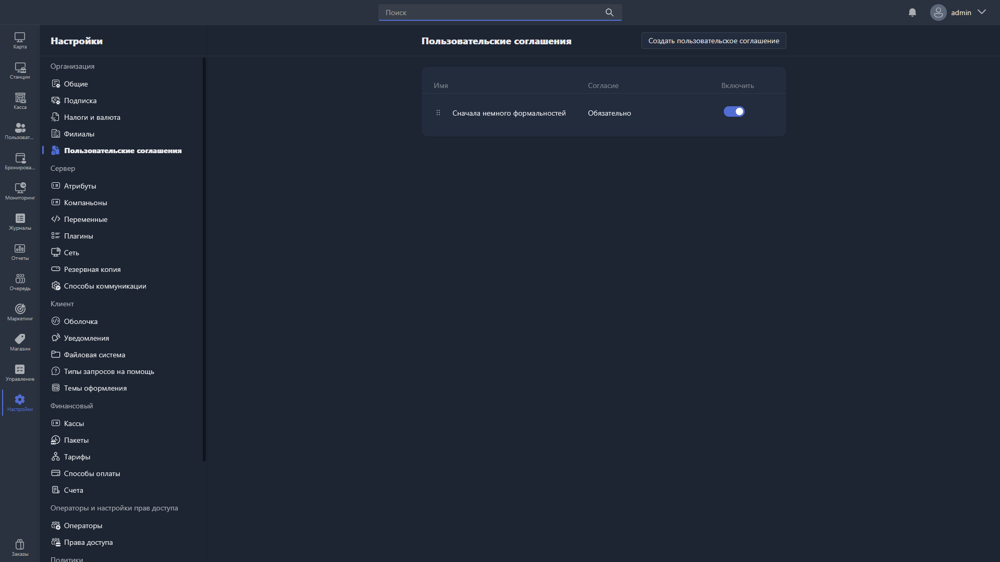

{width=1919px height=1079px}

Здесь можно создавать и настраивать пользовательские соглашения.

Как правило, для клиентов создают два и более соглашения -- например, «Правила клуба» и «Соглашение о конфиденциальности».

> [!NOTE]
> 
> Пользовательские соглашения отображаются при авторизации клиента в Gizmo Client. Правила отображения задаются в [карточке пользовательского соглашения](./user-agreement-card.md).

Чтобы создать соглашение, нажмите <cmd text="Создать пользовательское соглашение"/> в правом углу страницы.

В разделе отображается таблица с уже созданными соглашениями:

| Столбец   | Описание                                          |
|-----------|---------------------------------------------------|
| Имя       | название пользовательского соглашения             |
| Согласие  | обязательно ли согласие клиента с этим документом |
| Включить  | показывается соглашение клиенту или нет           |

С таблицей можно:

-  менять очерёдность показа соглашений -- перетаскиванием строки за значок **«:::»** слева; отдельного столбца с порядком в таблице нет;

-  включать и выключать отображение соглашения;

-  открывать карточку соглашения -- двойным кликом по строке.

> [!WARNING]
> 
> Пользовательские соглашения общие для всех филиалов: все активные соглашения отображаются во всех филиалах.