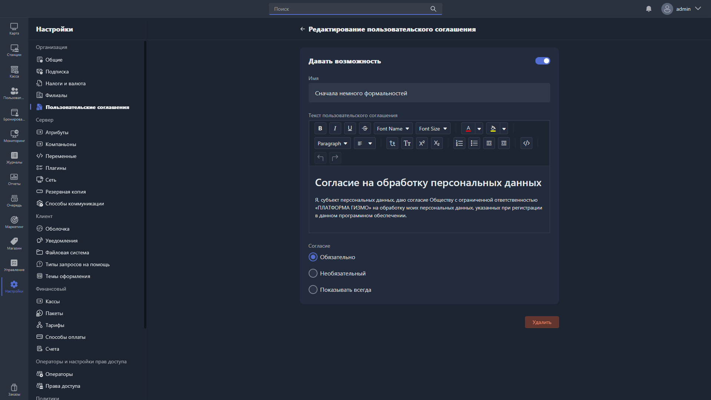

{width=1919px height=1079px}

Карточка пользовательского соглашения включает:

-  статус отображения соглашения в Gizmo Client;

-  название;

-  текст пользовательского соглашения;

-  правила отображения соглашения.

Изменить статус отображения соглашения можно тумблером **«Статус»**.

> [!TIP]
> 
> Текст пользовательского соглашения поддерживает HTML-разметку.
>
> Отформатировать текст можно в любом онлайн-редакторе, например [editorhtmlonline.com](https://editorhtmlonline.com/ru/), а затем вставить получившийся HTML-код в поле текста соглашения.

Для соглашения доступны следующие правила отображения в Gizmo Client:

-  **Обязательно** -- отображается при авторизации клиента, который не получит доступ к функциям Gizmo Client, пока не подтвердит согласие. При следующих авторизациях больше не показывается.

-  **Опционально** -- отображается при авторизации, но клиент может пропустить ознакомление и сразу получить доступ к функциям Gizmo Client. При следующих авторизациях больше не показывается.

-  **Всегда показывать** -- отображается при каждой авторизации клиента.

Чтобы удалить соглашение, нажмите <cmd text="Удалить"/> в правом нижнем углу.