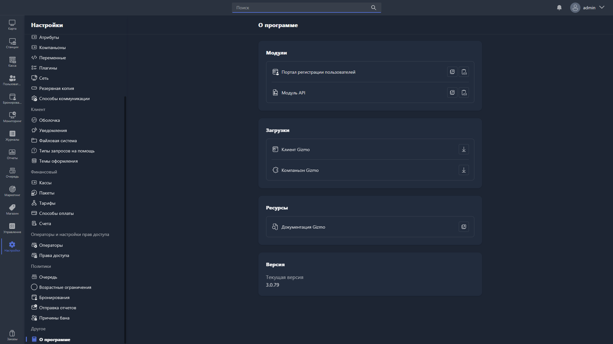

{width=1919px height=1079px}

Страница содержит общую информацию о системе Gizmo и ссылки на связанные ресурсы.

## Модули

Список дополнительных модулей системы с возможностью перехода к их настройкам или документации:

-  **Портал регистрации пользователей** -- веб-портал для самостоятельной регистрации пользователей.

-  **Модуль API** -- интерфейс для интеграции Gizmo со сторонними системами.

## Загрузки

Ссылки для скачивания компонентов системы:

-  **Клиент Gizmo** -- клиентское приложение, устанавливаемое на хосты.

-  **Компаньон Gizmo** -- приложение Gizmo Companion.

## Ресурсы

-  **Документация Gizmo** -- ссылка на официальную документацию системы.

## Версия

Отображается текущая версия установленного Gizmo Manager.
