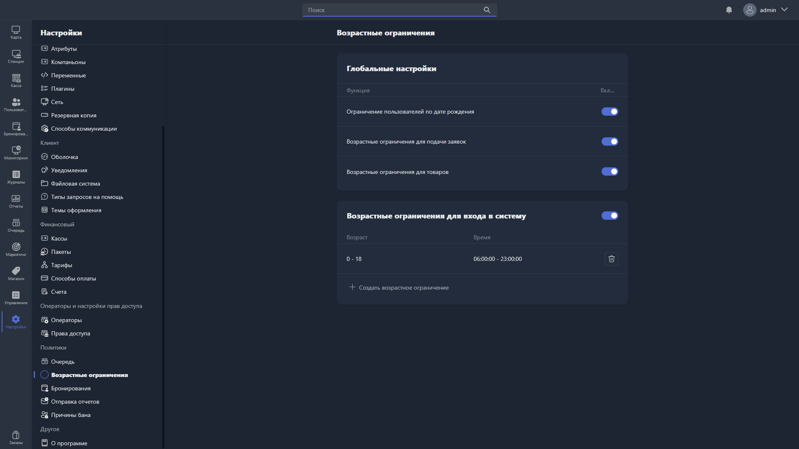

{width=1919px height=1079px}

Здесь настраиваются ограничения доступа на основе возраста пользователей.

## Глобальные настройки

-  **Ограничение пользователей по дате рождения** -- при включении система проверяет дату рождения пользователя и применяет возрастные ограничения.

-  **Возрастные ограничения для подачи заявок** -- при включении возрастные ограничения применяются на запуск приложений.

-  **Возрастные ограничения для товаров** -- при включении возрастные ограничения применяются при продаже товаров.

## Возрастные ограничения для входа в систему

При включении этой функции задаётся расписание доступа в зависимости от возраста пользователя.

В таблице отображаются созданные правила:

-  **Возраст** -- диапазон возраста, для которого действует ограничение.

-  **Время** -- временной интервал, в течение которого разрешён вход в систему.

Чтобы создать новое правило, нажмите <cmd text="+ Создать возрастное ограничение"/> и укажите:

-  **Возраст от / Возраст до** -- диапазон возраста пользователей, на которых распространяется правило.

-  **От / До** -- временной интервал, в течение которого пользователям этого возраста разрешён вход в систему.