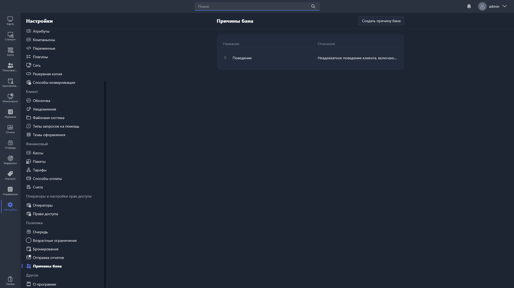

{width=1919px height=1079px}

Здесь настраиваются причины блокировки пользователей.

В таблице отображаются все созданные причины:

-  **Название** -- название причины бана.

-  **Описание** -- описание причины бана.

Чтобы создать новую причину, нажмите <cmd text="Создать причину бана"/> в правом углу страницы.

Чтобы отредактировать существующую, нажмите на соответствующую строку в таблице -- откроется [карточка причины бана](./ban-reason-card.md).