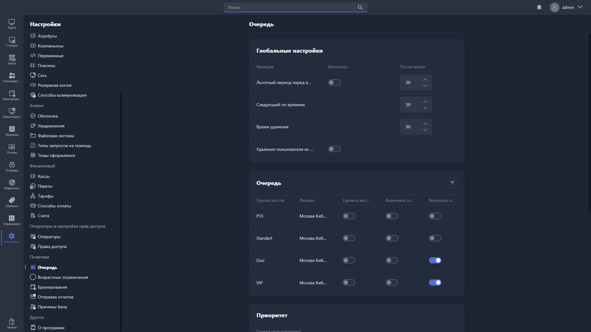

{width=1919px height=1079px}

Здесь настраивается поведение очереди ожидания -- системы, позволяющей пользователям занимать место в очереди на хост, когда все компьютеры заняты.

## Глобальные настройки

Глобальные настройки применяются ко всем группам хостов.

-  **Льготный период перед входом** -- после того как хост стал доступен, пользователь из очереди получает льготный период для входа в систему. Если он не войдёт за отведённое время, его переместят в конец очереди или удалят. Можно включить или выключить, продолжительность задаётся в минутах.

-  **Следующий по времени** -- время в минутах, в течение которого следующий пользователь в очереди получает приоритет на доступный хост.

-  **Время удаления** -- время в минутах, по истечении которого неактивный пользователь автоматически удаляется из очереди.

-  **Удаление пользователя из очереди** -- при включении пользователь автоматически удаляется из всех очередей после успешного входа на хост.

## Очередь

Здесь настраиваются параметры очереди для каждой группы хостов.

Таблица содержит столбцы:

-  **Группа хостов** -- группа хостов, для которой применяются настройки.

-  **Филиал** -- филиал, к которому относится группа хостов.

-  **Удалить вкл.** -- при включении пользователи автоматически удаляются из очереди этой группы хостов по истечении времени удаления.

-  **Включить сл.** -- при включении активируется режим «Следующий по времени» для этой группы хостов.

-  **Включить п.** -- при включении активируется льготный период перед входом для этой группы хостов.

## Приоритет

Здесь настраивается приоритет групп пользователей в очереди -- группы с более высоким приоритетом получают место в очереди раньше остальных.

Чтобы изменить порядок приоритета, перетащите нужную группу пользователей за иконку `::` на требуемую позицию: чем выше группа в списке, тем выше её приоритет.