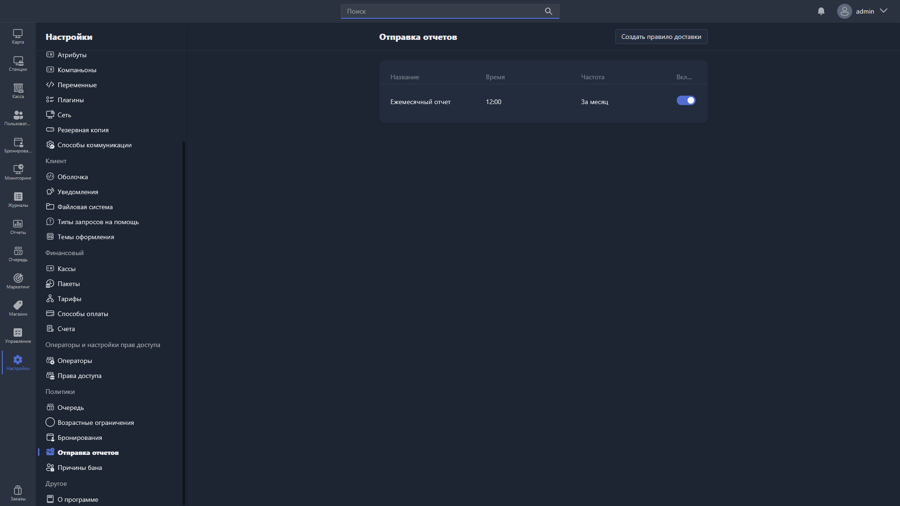

{width=1919px height=1079px}

Здесь настраиваются правила автоматической доставки отчётов.

В таблице отображаются все созданные правила:

-  **Название** -- название правила доставки.

-  **Время** -- время отправки отчётов.

-  **Частота** -- периодичность отправки.

-  **Включено** -- статус правила (активно или отключено).

Чтобы создать новое правило, нажмите <cmd text="Создать правило доставки"/> в правом углу страницы.

Чтобы отредактировать существующее, нажмите на соответствующую строку в таблице -- откроется [карточка правил доставки](./scheduler-card.md).