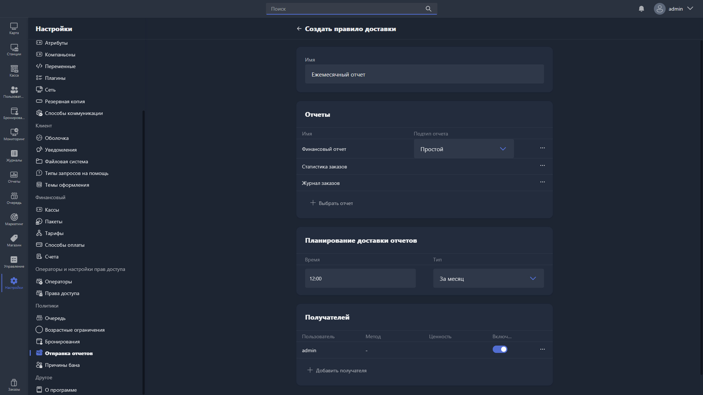

{width=1919px height=1079px}

Карточка правила доставки открывается при создании нового правила или редактировании существующего.

**Имя** -- название правила доставки. Поле обязательно для заполнения.

## Отчёты

Здесь выбираются отчёты, которые будут включены в рассылку.

Таблица содержит столбцы:

-  **Имя** -- название отчёта.

-  **Подтип отчёта** -- подтип выбранного отчёта.

Чтобы добавить отчёт, нажмите <cmd text="+ Выбрать отчёт"/>, выберите нужный отчёт из списка (поле обязательно для заполнения) и нажмите <cmd text="Сохранить"/>.

## Планирование доставки отчётов

-  **Время** -- время суток, в которое будет выполняться отправка отчётов.

-  **Тип** -- периодичность отправки. Доступные варианты: ежедневно и другие периоды.

## Получатели

Здесь настраиваются получатели рассылки.

Таблица содержит столбцы:

-  **Пользователь** -- оператор, которому отправляется отчёт.

-  **Метод** -- способ доставки.

-  **Ценность** -- адрес или идентификатор получателя (например, email).

-  **Включено** -- статус получателя (активен или отключён).

Чтобы добавить получателя, нажмите <cmd text="+ Добавить получателя"/>, выберите оператора из списка (поле обязательно для заполнения) и нажмите <cmd text="Сохранить"/>.