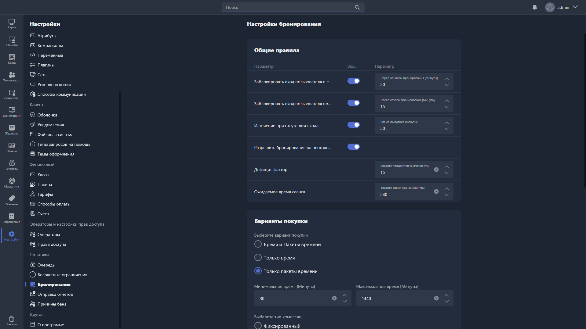

{width=1919px height=1079px}

Здесь настраиваются параметры системы бронирования хостов.

## Общие правила

-  **Заблокировать вход пользователя до начала бронирования** -- запрещает другим пользователям входить на забронированный хост за указанное количество минут до начала бронирования.

-  **Заблокировать вход пользователя после начала бронирования** -- запрещает другим пользователям входить на хост в течение указанного времени после начала бронирования.

-  **Истечение при отсутствии входа** -- Определяет количество минут опоздания пользователя, через которое бронирование будет отменено.

-  **Разрешить бронирование на несколько хостов** -- позволяет включить в одно бронирование несколько игровых мест.

-  **Дефицит-фактор** -- процентный коэффициент, учитывающий возможную нехватку ресурсов при расчёте доступности хостов для бронирования.

-  **Ожидаемое время сеанса** -- стандартная продолжительность сеанса в минутах, используемая при расчёте доступности хостов.

## Варианты покупки

**Выберите вариант покупки** -- определяет, что именно можно приобрести при бронировании:

-  **Время и пакеты времени** -- доступна покупка как времени, так и пакетов времени.

-  **Только время** -- доступна покупка только времени.

-  **Только пакеты времени** -- доступна покупка только пакетов времени.

-  **Минимальное время** -- минимальная продолжительность бронирования в минутах.

-  **Максимальное время** -- максимальная продолжительность бронирования в минутах.

**Выберите тип комиссии** -- тип комиссии, взимаемой при бронировании:

-  **Фиксированный** -- фиксированная сумма комиссии.

-  **Процент** -- комиссия в процентах от стоимости.

-  **Нет** -- комиссия не взимается.

-  **Минимальный процент оплаты** -- минимальная доля стоимости бронирования в процентах, которую пользователь должен оплатить заранее.

-  **Срок действия платежа за бронирование** -- время в минутах, в течение которого пользователь должен завершить оплату после создания бронирования.

-  **Подключение скидок** -- при включении к бронированиям применяются действующие скидки.

## Политика отмены бронирования

-  **Льготный период отмены бронирования** -- время в минутах до начала бронирования, в течение которого пользователь может отменить его без штрафных санкций.

-  **Возврат средств при отмене** -- процент от оплаченной суммы, который возвращается пользователю при отмене бронирования.

## Уведомления

-  **Время оповещения клиента о бронировании** -- за сколько минут до начала бронирования клиент получит уведомление.

-  **Время оповещения менеджера о бронировании** -- за сколько минут до начала бронирования оператор получит уведомление.