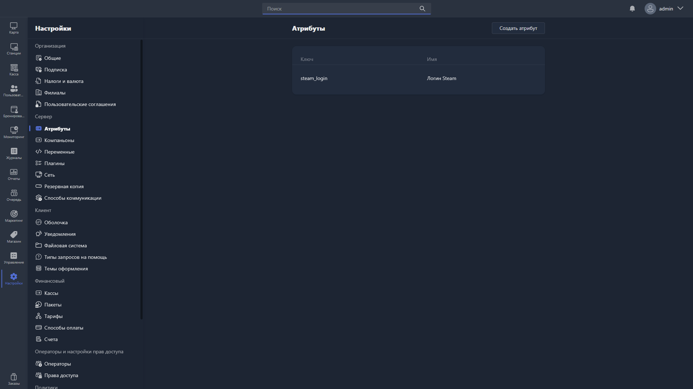

{width=1919px height=1079px}

**Атрибуты** -- дополнительные поля, которые можно добавить для объектов в Gizmo.

> [!WARNING]
> 
> Сейчас атрибуты доступны только для объекта «Пользователи». Подробнее -- в статье [«Пользовательские атрибуты»](./../../../articles/user-attributes.md).

Таблица раздела состоит из двух столбцов:

-  **Ключ** -- уникальный идентификатор атрибута (название в базе данных).

-  **Имя** -- название атрибута для отображения в Gizmo Client и Gizmo Manager.

В этом разделе отображается таблица с вашими атрибутами.

Чтобы добавить атрибут, нажмите <cmd text="Создать атрибут"/> в правом верхнем углу.

Чтобы отредактировать или удалить атрибут, дважды нажмите на него в таблице -- откроется [карточка атрибута](./attribute-card.md).