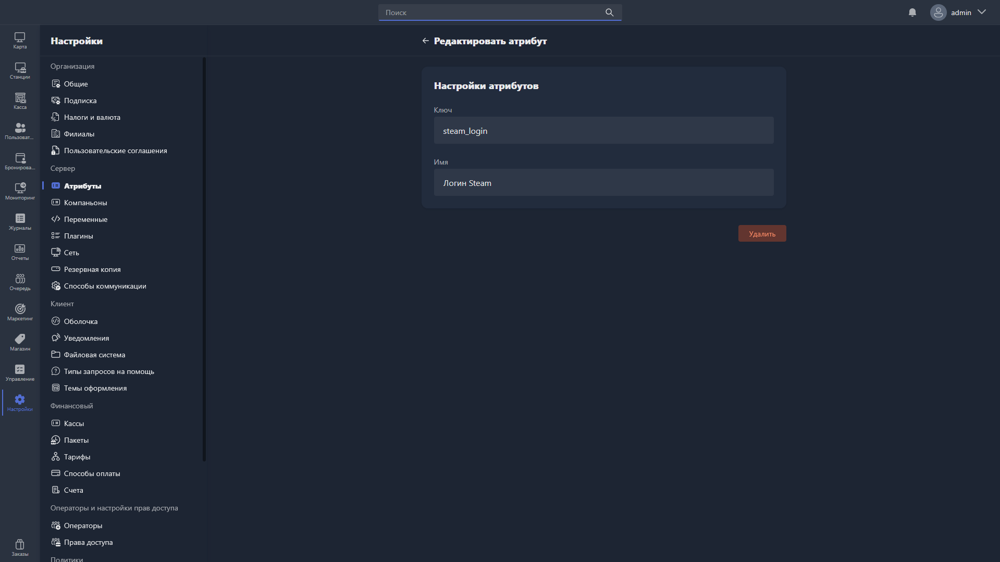

{width=1919px height=1079px}

В карточке атрибута доступны для заполнения поля:

-  **Ключ** -- уникальный идентификатор атрибута (название в базе данных).

-  **Название** -- название атрибута для отображения в Gizmo Client и Gizmo Manager.

Чтобы удалить атрибут, нажмите <cmd text="Удалить"/> в правом нижнем углу карточки.

> [!CAUTION]
> 
> При удалении атрибута удаляются все связанные с ним значения.