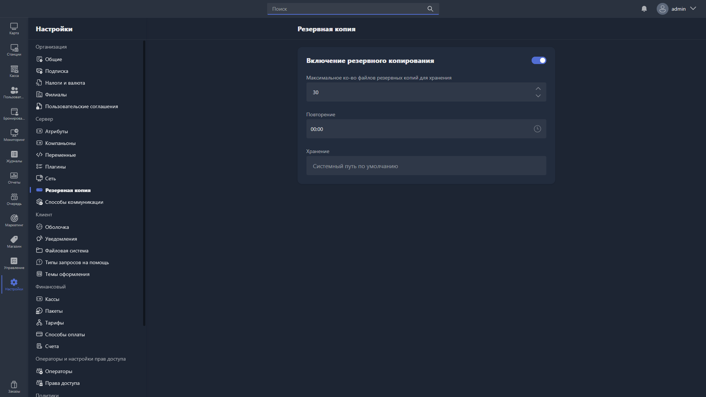

{width=1919px height=1079px}

**Резервная копия** -- копия базы данных вашего Gizmo Server. Она нужна для переноса базы данных на другой сервер или для её восстановления.

В этом разделе настраивается автоматическое резервное копирование базы данных Gizmo Server:

-  включение и выключение резервного копирования;

-  максимальное количество хранимых файлов резервных копий;

-  повторение — расписание создания копий;

-  хранение — путь, по которому копии сохраняются.

## Включение резервного копирования

По умолчанию резервное копирование отключено. Чтобы включить его, нажмите переключатель -- станут доступны дополнительные параметры. При выключении переключателя эти параметры становятся неактивными.

## Максимальное количество файлов резервных копий для хранения

**Максимальное количество файлов резервных копий для хранения** -- целое значение, которое задаёт, сколько резервных копий хранить одновременно. По умолчанию -- 10.

Например, если резервная копия создаётся ежедневно, а лимит равен 10, то после создания одиннадцатой копии Gizmo Server автоматически удалит самую старую. Так на сервере всегда будут храниться только 10 последних копий базы данных.

## Повторение

**Повторение** -- расписание резервного копирования: время, в которое будет создана резервная копия. По умолчанию -- 0:00 (в полночь).

## Хранение

**Хранение** -- путь в файловой системе, по которому будут сохраняться резервные копии.

Указывайте полный путь до нужной папки и учитывайте различия в построении путей между операционными системами.

> [!WARNING]
> 
> Убедитесь, что пользователь операционной системы, от имени которого запущен Gizmo Server, обладает правами на чтение и запись в указанную папку.

### Пути по умолчанию

<table header="row">
<tr>
<td>

Вариант установки

Gizmo Server

</td>
<td colspan="2">

Путь резервных копий по умолчанию

</td>
</tr>
<tr>
<td>

Windows

</td>
<td colspan="2">

**C:/Program Files/Gizmo Server/backup**

</td>
</tr>
<tr>
<td>

Linux

</td>
<td colspan="2">

**\\opt\\gizmo-service\\backup**

</td>
</tr>
<tr>
<td>

Docker

</td>
<td colspan="2">

**\\app\\mount\\backup**

</td>
</tr>
</table>