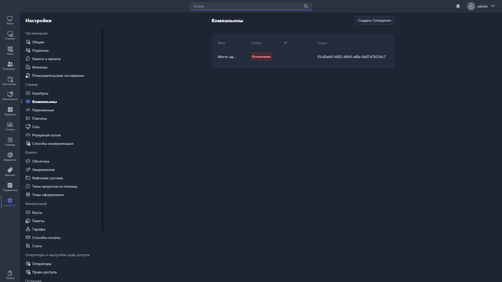

{width=1919px height=1079px}

**Компаньон** ([Gizmo Companion](./../../../about/overview/gizmo-companion.md)) -- дополнительная программа, которая обеспечивает связь Gizmo с POS-оборудованием и подключёнными устройствами, например для доступа к файлам.

В этом разделе можно посмотреть уже подключённых к серверу компаньонов и добавить нового.

Таблица подключённых компаньонов показывает:

-  **Название** -- произвольное название компаньона, заданное при создании или редактировании.

-  **Статус** -- статус подключения к серверу.

-  **IP** -- IP-адрес компаньона.

-  **Токен** -- уникальный идентификатор компаньона.

Чтобы изменить имя компаньона, скопировать его токен или удалить его, дважды нажмите на нужного компаньона в таблице -- откроется [карточка компаньона](./companion-card.md).

Чтобы подключить нового компаньона, нажмите <cmd text="Добавить компаньон"/> в правом верхнем углу -- поля для заполнения описаны в статье [«Добавление компаньона»](./add-new-companion.md).