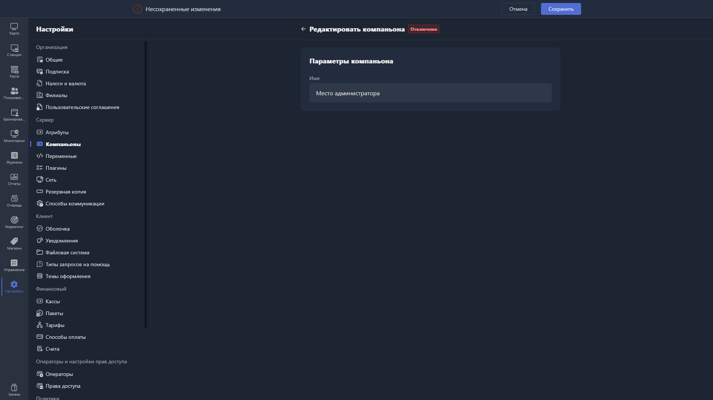

{width=1919px height=1079px}

При создании нового компаньона доступно поле:

-  **Название** -- произвольное название компаньона для отображения в Gizmo Manager.

После сохранения компаньон появится в общем списке, а в его карточке будет доступен токен для подключения.