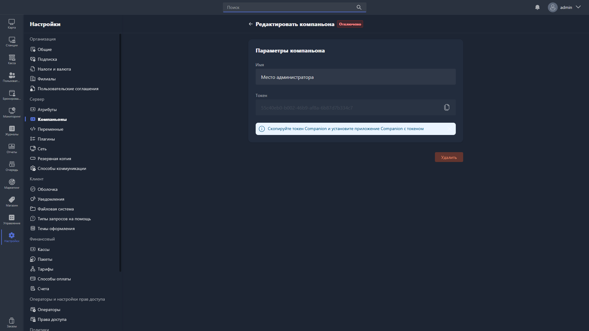

{width=1919px height=1079px}

В карточке компаньона доступно поле:

-  **Название** -- произвольное название компаньона для отображения в Gizmo Manager.

Чтобы скопировать токен компаньона, нажмите на иконку копирования в поле «Токен».

Чтобы удалить компаньона, нажмите <cmd text="Удалить"/> в правом нижнем углу карточки.