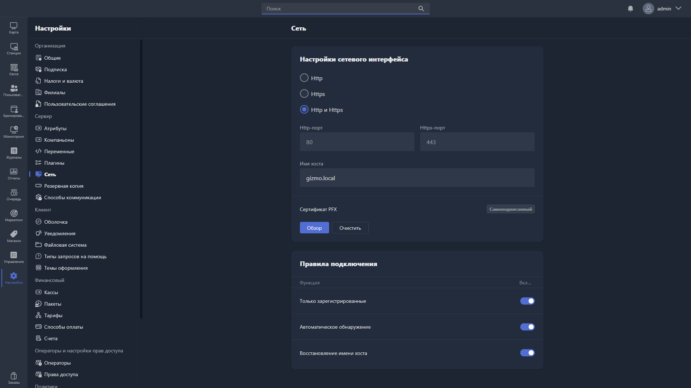

{width=1919px height=1079px}

В этом разделе настраивается сеть для Gizmo Server:

-  настройки сетевого интерфейса;

-  правила подключения.

## Настройки сетевого интерфейса

**Настройки сетевого интерфейса** -- настройки Gizmo Server, которые определяют его доступность и доступность Gizmo Manager по сети.

Доступны следующие настройки:

-  протокол и порты доступа;

-  доменное имя сервера;

-  сертификат PFX.

### Протокол и порты доступа

Gizmo Server и Gizmo Manager могут быть доступны по протоколам http, https или по обоим сразу, с отдельным портом для каждого протокола.

По умолчанию выбраны протоколы http и https, доступные по портам 80 и 443 соответственно.

> [!WARNING]
> 
> Если Gizmo Server запущен через Docker, настройки портов сервером игнорируются -- это особенность работы Docker-контейнеров.

### Доменное имя сервера

**Доменное имя сервера** -- имя, по которому ваш сервер доступен в сети.

Значение по умолчанию -- «gizmo.local» (доступ только в локальной сети).

> [!WARNING]
> 
> Если Gizmo Server запущен через Docker, Gizmo Manager и Gizmo Server будут недоступны по доменному имени, заданному по умолчанию (gizmo.local). Gizmo Server продолжит использовать порты, указанные при создании контейнера -- это особенность работы Docker-контейнеров.

> [!WARNING]
> 
> Указание доменного имени сервера обязательно для использования функций удалённого просмотра и удалённого управления.

Допустимые значения:

-  локальный IP-адрес сервера;

-  локальное доменное имя сервера;

-  глобальный IP-адрес сервера;

-  глобальное доменное имя сервера.

#### Локальный IP-адрес сервера

**Локальный IP-адрес сервера** -- адрес вашего сервера, на котором установлен Gizmo Server.

Локальный адрес должен принадлежать одной из следующих сетей:

-  10\.0.0.0/8

-  192\.168.0.0/16

-  172\.16.0.0/12

По локальному адресу вы сможете получить доступ к серверу только внутри вашей локальной сети.

#### Локальное доменное имя сервера

**Локальное доменное имя сервера** -- доменное имя для локального IP-адреса Gizmo Server, предварительно настроенное на вашем DNS-сервере -- как правило, эту роль выполняет локальный роутер.

> [!CAUTION]
> 
> Если вы указали локальное доменное имя сервера, на устройствах с Gizmo Client и устройствах, с которых будет открываться Gizmo Manager в локальной сети, в качестве DNS-сервера должен быть указан адрес вашего DNS-сервера -- того, где вы настроили соответствие доменного имени и IP-адреса (как правило -- IP-адрес вашего роутера).

#### Глобальный IP-адрес сервера

**Глобальный IP-адрес сервера** -- публичный IP-адрес, по которому доступен ваш Gizmo Server.

Если Gizmo Server установлен локально, глобальный IP-адрес сервера -- это публичный (внешний) адрес вашего роутера; в этом случае заранее позаботьтесь о пробросе портов до Gizmo Server на роутере.

Если Gizmo Server установлен на внешнем VPS или сервере облачного провайдера, глобальный IP-адрес сервера -- это адрес, по которому он доступен из интернета.

#### Глобальное доменное имя сервера

**Глобальное доменное имя сервера** -- заранее купленное доменное имя, которому в панели управления регистратора доменных имён сопоставлен глобальный IP-адрес сервера.

### Сертификат PFX

**Сертификат PFX** -- SSL-сертификат в формате PFX, необходимый для работы по протоколу https. По умолчанию используется встроенный самоподписанный сертификат.

В этом разделе можно установить собственный SSL-сертификат.

Чтобы выбрать и загрузить сертификат, нажмите <cmd text="Обзор"/>.

Чтобы вернуться к самоподписанному сертификату, нажмите <cmd text="Очистить"/>.

> [!WARNING]
> 
> Для применения нового сертификата требуется перезагрузка Gizmo Server.