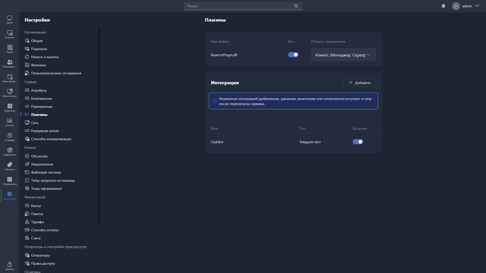

{width=1919px height=1079px}

В этом разделе отображаются подключённые сторонние плагины и интеграции.

**Плагины** -- дополнения для Gizmo, которые сторонние разработчики создают на основе открытой документации.

**Интеграции** -- подключения к сторонним сервисам.

> [!NOTE]
> 
> Подробнее о разработке и подключении плагинов -- в разделе «Для разработчиков», в группе [«Создание плагинов»](./../../../for-developers/sozdanie-plaginov/_index.md).