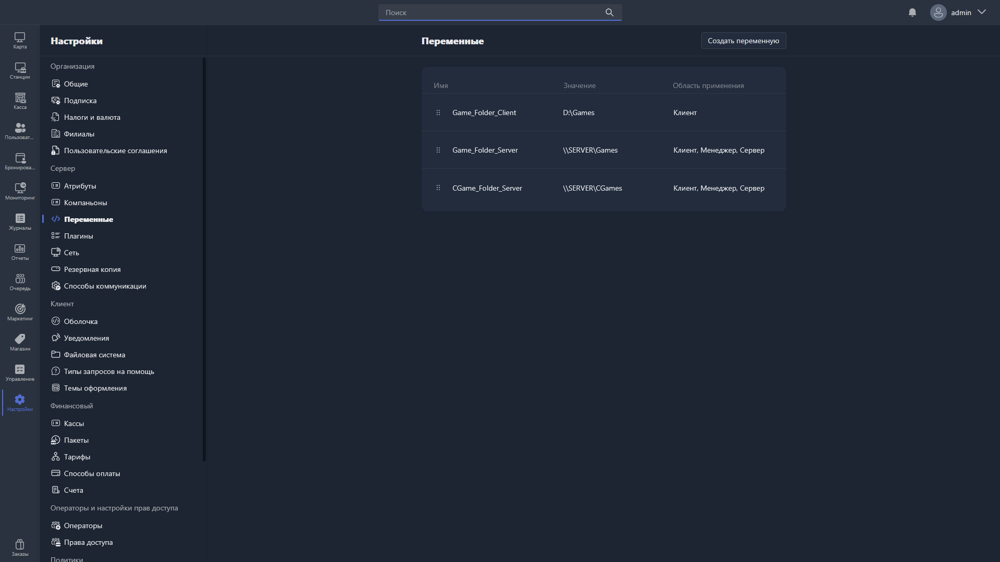

{width=1919px height=1079px}

**Переменные** -- статичные переменные окружения, которые могут использовать приложения Gizmo: Gizmo Manager, Gizmo Client и Gizmo Server.

Формат вызова переменной -- `%var%`, где `var` -- название переменной.

Чаще всего переменные используют в скриптах и приложениях -- например, для указания путей до исполняемых файлов.

> [!IMPORTANT]
> 
> Подробнее об использовании переменных для приложений -- в цикле статей «Использование переменных».

В этом разделе можно посмотреть уже добавленные переменные и создать новые.

Таблица переменных показывает:

-  **Имя** -- имя переменной, заданное при создании или редактировании.

-  **Значение** -- значение переменной.

-  **Область применения** -- где может быть вызвана переменная (Gizmo Client, Gizmo Manager, Gizmo Server).

Чтобы изменить или удалить переменную, дважды нажмите на неё в таблице -- откроется [карточка переменной](./variable-card.md).

Чтобы добавить новую переменную, нажмите <cmd text="Создать переменную"/> в правом верхнем углу -- поля для заполнения описаны в статье [«Добавление новой переменной»](./add-new-var.md).