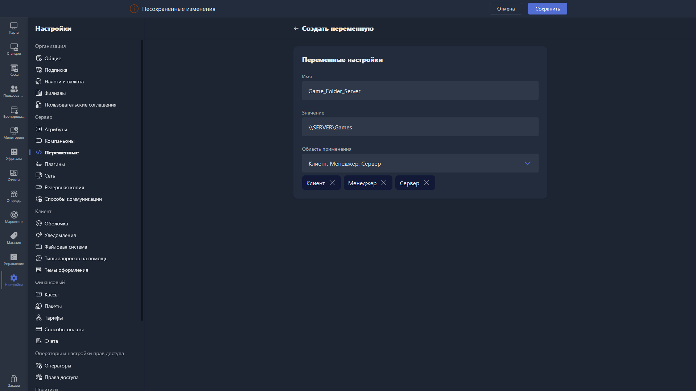

{width=1919px height=1079px}

При создании новой переменной доступны поля:

-  **Имя** -- название переменной, указывается без экранирующих символов `%`.

-  **Значение** -- значение новой переменной.

-  **Область применения** -- область, в которой может быть вызвана переменная.