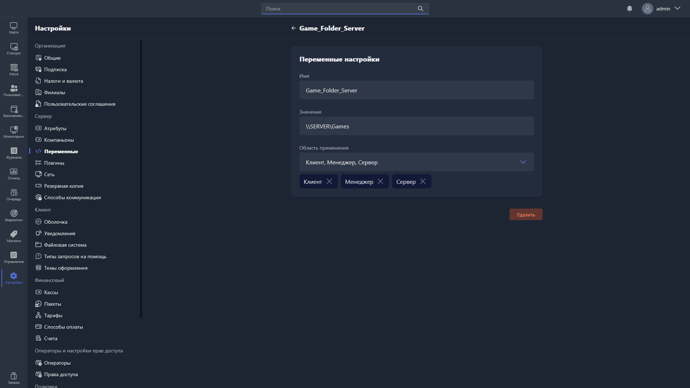

{width=1919px height=1079px}

В карточке переменной доступны для заполнения поля:

-  **Имя** -- название переменной, указывается без экранирующих символов `%`.

-  **Значение** -- значение переменной.

-  **Область применения** -- область, в которой может быть вызвана переменная.

Чтобы удалить переменную, нажмите <cmd text="Удалить"/> в правом нижнем углу карточки.