<html>

  

  

    

      <svg xmlns="http://www.w3.org/2000/svg" width="24" height="24" viewBox="0 0 24 24" fill="none" stroke="currentColor" stroke-width="2" stroke-linecap="round" stroke-linejoin="round"><path d="M6 22a2 2 0 0 1-2-2V4a2 2 0 0 1 2-2h8a2.4 2.4 0 0 1 1.704.706l3.588 3.588A2.4 2.4 0 0 1 20 8v12a2 2 0 0 1-2 2z"/><path d="M14 2v5a1 1 0 0 0 1 1h5"/></svg>
      В этом блоке вы узнаете
    

    <h2 class="gx-title">
      Устанавливаем Gizmo: от сервера до первого клиента
    </h2>
    

      60–180 минут
      /
      Высокая сложность
    

  

</html>

> <color color="#99B1E6">**Добро пожаловать! Возможно, через несколько дней в вашем клубе появятся первые клиенты, а может, вы готовитесь заранее или переходите с другой системы. В любом случае к моменту открытия всё должно функционировать так, будто клуб существует уже год -- техническая часть настроена, касса работает без сбоев, а администраторы знают, как пользоваться приложением.**</color>
>
> <color color="#99B1E6">**Здесь мы вместе пройдём весь путь до этой точки -- настроим сервер, панель администратора и клиентские места, подготовим почасовую оплату и пакеты времени, добавим товары и приложения, в общем сделаем всё так, чтобы уже завтра вы могли открыться.**</color>
>
> <color color="#99B1E6">**Мы постарались максимально всё упростить, но само руководство местами может показаться сложным. В этом случае обращайтесь в поддержку -- или доверьте настройку нам, заказав интеграцию или премиум-обслуживание.**</color>

> [!TIP]
> 
> Уже разворачивали Gizmo раньше и нужен конкретный шаг, а не вся статья целиком? Внизу страницы -- полный список статей раздела.

## Что потребуется

-  <icon code="mail" color="#3b82f6"/> **Аккаунт на нашем сайте** -- через него активируется лицензия и приходят обновления.

-  <icon code="server" color="#3b82f6"/> **Сервер под приложение** -- наше облако или собственный пк в клубе, выделенный под сервер.

-  <icon code="monitor" color="#3b82f6"/> **Компьютеры для клиентов** -- на них будет установлен Gizmo Client.

## Шаг 1. Зарегистрируйте личный кабинет

Это займёт пару минут -- создаёте аккаунт на сайте Gizmo и подтверждаете его по почте. Личный кабинет понадобится дальше, на последнем шаге, чтобы активировать лицензию, так что лучше сделать это сразу.

Подробнее -- в статье [«Личный кабинет»](./personal-account.md).

## Шаг 2. Определитесь, где будет жить сервер

Gizmo Server -- ядро всей системы, он обрабатывает операции, хранит данные о клиентах и управляет остальными компонентами. Сейчас его можно развернуть только одним способом, Self-hosted -- то есть на вашем собственном железе. Это даёт полный контроль над данными и работает уже сегодня.

> [!IMPORTANT]
> 
> Вы можете выбрать в качестве серверного даже пк оператора, не покупая отдельное устройство, но это приводит к рискам безопасности. Мы настоятельно рекомендуем приобрести отдельный пк, если в клубе больше 30 клиентских мест.

> [!NOTE]
> 
> Второй вариант, Cloud, где сервер разворачиваем и обслуживаем мы на своих мощностях вне клуба, пока в разработке и скоро появится. Если начнёте с Self-hosted, переехать в Cloud можно будет в любой момент.

Подробно об установке сервера, включая выбор ОС и базы данных -- в статье [«Self-hosted версия»](./gizmo/self-hosted/_index.md).

### Системные требования

Требования к железу зависят от того, что вы выбрали для установки -- вот они по каждому варианту.

<tabs>

<tab name="Windows">

-  **Процессор** -- Intel Core i3 8-го поколения или лучше.

-  **Память** -- 16 ГБ DDR4.

-  **Диск** -- 40 ГБ SSD NVMe.

</tab>

<tab name="Linux">

-  **Процессор** -- Intel Core i3 8-го поколения или лучше.

-  **Память** -- 8 ГБ DDR4.

-  **Диск** -- 40 ГБ SSD NVMe.

</tab>

<tab name="Docker">

-  **Процессор** -- Intel Core i3 8-го поколения или лучше.

-  **Память** -- 4--8 ГБ DDR4 (для 50+ подключённых клиентов рекомендуем 8 ГБ).

-  **Диск** -- 40 ГБ SSD NVMe.

</tab>

</tabs>

**Выбрав пк, на который будете устанавливать сервер, можно приступать к этим шагам:**

-  [Загрузите установщик](https://gizmopowered.net/downloads/v3/latest/GizmoServiceSetup.exe).

-  Запустите его и пройдите все этапы, нажимая <cmd text="Далее"/>. Мы рекомендуем **не менять** путь установки по умолчанию.

-  Откройте приложение **ConfigurationTool** через ярлык на рабочем столе, либо по пути `C:\Program Files\NETProjects\Gizmo Server\tools\configuration`.

-  Перейдите в <cmd text="Мастер настройки"/> -> <cmd text="Далее"/> -- откроется страница «Параметры базы данных». Если не уверены, что там менять, лучше не трогать -- по умолчанию всё уже настроено правильно. Нажмите <cmd text="Далее"/> ещё раз, укажите данные, которые использовали при регистрации на сайте, и снова нажмите <cmd text="Далее"/>.

*(todo: статья с разбором мастера настройки, все параметры и скриншоты)*

-  Установите службу и запустите её -- это позволит серверу всегда работать в фоне и запускаться вместе со стартом системы. [Подробнее о режимах работы сервера](./../usage/gizmo-server/run-modes.md).

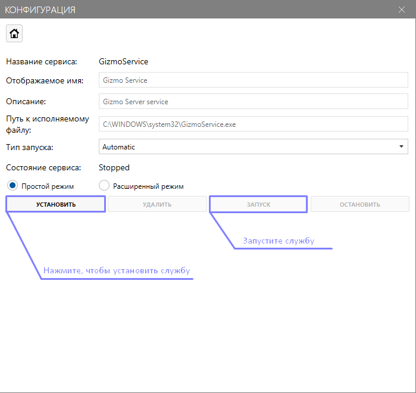{width=699px height=660px}

**Можно переходить к основным настройкам клуба!**

## Шаг 3. Настройте Gizmo Manager

Gizmo Manager -- главная панель управления клубом. Через неё ваш персонал сможет совершать продажи, следить за посадкой, работать со складом и держать под контролем всё остальное.

Настроек там много, и с непривычки в них легко потеряться -- поэтому разберём, что сделать в первую очередь.

-  На пк, где установлен сервер, откройте ссылку <https://gizmo.local/apps/manager/signin> -- по ней вы будете заходить в Gizmo Manager. Чтобы открыть эту страницу с другого пк в клубе, понадобится отдельная настройка сети.

*(todo: статья про доступ к Gizmo Manager с других пк в сети)*

-  Откроется окно входа -- используйте данные по умолчанию: **Логин** -- admin, **Пароль** -- admin.

-  Смените язык интерфейса на удобный вам. Перейдите в <cmd text="Settings"/> -> <cmd text="General"/>, в поле **Language** выберите нужный язык, нажмите <cmd text="Save"/> вверху экрана и обновите страницу.

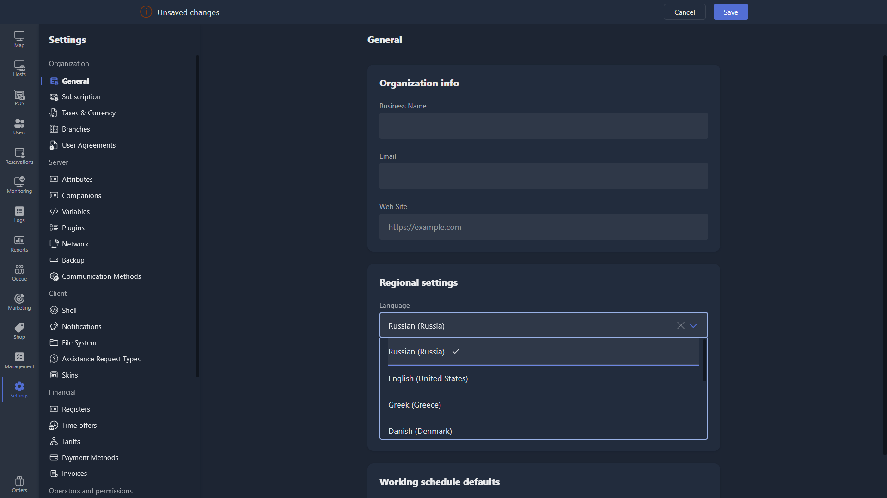{width=1919px height=1079px}

Пробежимся по интерфейсу -- на левой панели вы увидите вкладки приложения.

-  **Карта** -- интерактивная схема клуба, на которой администратор видит статус игровых мест, оформляет продажи и следит за посадкой гостей.

-  **Станции** -- раздел для настройки игровых мест, их привязки к зонам и филиалам, карты клуба, клиентской оболочки и задач на местах.

-  **Касса** -- здесь оформляются продажи пакетов времени и товаров, а также доступны журналы продаж, счетов, пополнений баланса и других финансовых операций.

-  **Пользователи** -- управление учётными записями клиентов и их группами.

-  **Бронирование** -- здесь можно забронировать любое игровое место для гостя заранее, если это разрешено в настройках.

-  **Мониторинг** -- позволяет одновременно просматривать несколько экранов клиентских пк и замечать нежелательные действия гостей.

-  **Журналы** -- здесь собраны логи ошибок приложения, пригодятся при обращении в поддержку.

-  **Отчёты** -- вся аналитика клуба в одном месте, с гибкими фильтрами и разделами.

-  **Очередь** -- автоматически выстраивает гостей на игровые места, если клуб заполнен, а желающие ещё есть.

-  **Маркетинг** -- новости и баннеры в клиентской оболочке, скидки, промокоды и система лояльности для ваших клиентов.

-  **Магазин** -- здесь создаётся и настраивается ассортимент, ведётся склад, списание и инвентаризация.

-  **Управление** -- удалённый доступ к файловой системе, терминалу и задачам на клиентских пк. Можно, незаметно для гостя, открывать файлы на его пк, запускать скрипты и завершать процессы, например закрыть зависшую игру.

-  **Настройки** -- самый обширный раздел. Здесь собраны параметры, которые вы обычно будете трогать редко, поэтому стоит сразу настроить их внимательно, чтобы потом не пришлось возвращаться.

Дальше настроим приложение под ваш клуб -- разобьём это на несколько понятных блоков.

### Заполнение данных об организации

Чтобы без проблем пользоваться всеми функциями, особенно связанными с чеками, заполните информацию о клубе.

-  Перейдите в <cmd text="Настройки"/> -> <cmd text="Общие"/> и укажите название компании, рабочую почту для служебных уведомлений, сайт или группу клуба в VK.

-  В региональных настройках укажите часовой пояс и страну, в которой работает клуб.

-  Укажите начало и конец рабочей недели и рабочие часы клуба. Если клуб работает круглосуточно, оставьте режим полного рабочего дня.

-  Не забудьте сохранить настройки кнопкой вверху экрана.

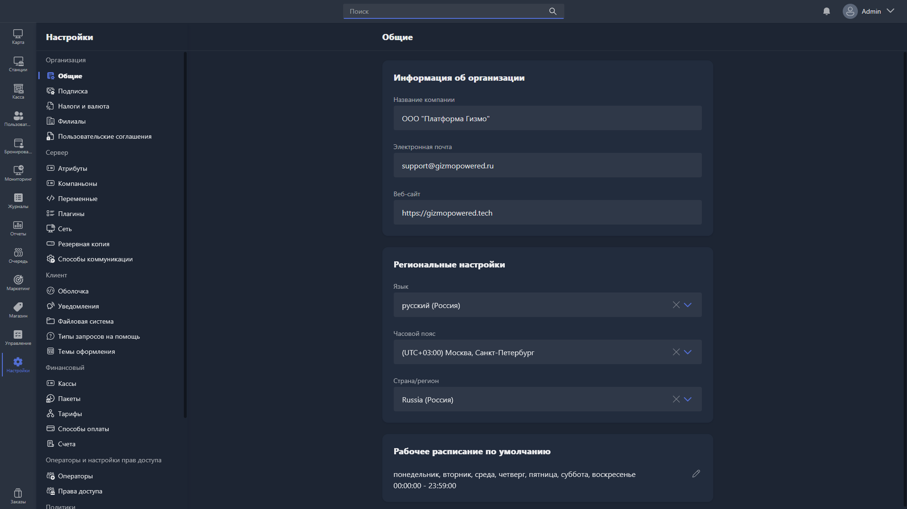{width=1919px height=1079px}

-  В разделе <cmd text="Подписка"/> проверьте, что подписка действительна, а в поле **Всего лицензий** указано столько лицензий, сколько игровых мест вы будете подключать.

-  В разделе <cmd text="Налоги и валюта"/> выберите валюту по умолчанию (например, RUB) и при необходимости поменяйте формат отображения цен.

-  В разделе <cmd text="Филиалы"/> откройте основной филиал, переименуйте его во что-то понятное и укажите адрес клуба.

-  Если у вас несколько клубов одной сети на одном Gizmo Server, добавьте остальные клубы как филиалы здесь же.

*(todo: статья про работу с несколькими клубами на одном сервере)*

> [!IMPORTANT]
> 
> Следующий пункт нужен, только если вы будете подключать к Gizmo принтер чеков (кассу) или терминал для оплаты картой. Это удобно: администратору не придётся вручную дублировать операцию на кассе или терминале, приложение сделает это само, а заодно закроет лазейку для махинаций с наличными в обход системы.

-  В разделе <cmd text="Налоги и валюта"/> откройте <cmd text="Настройка налогов компании"/> и заполните все поля. Будьте внимательны -- эти параметры используются при печати чеков.

### Игровые зоны

Игровые зоны -- это залы вашего клуба, которые отличаются ценами, оформлением и другими параметрами. Например, Standart, VIP и PS5 -- это три игровые зоны.

Прежде чем настраивать цены и пакеты времени, определитесь с зонами.

-  Перейдите в <cmd text="Станции"/> -> <cmd text="Группы станций"/>. По умолчанию там уже есть несколько групп -- их можно переименовать, удалить или создать свои.

-  Открыв группу, укажите филиал, профиль оформления, группу приложений и гостевую группу по умолчанию. Эти параметры мы ещё не разбирали -- пока оставьте значения по умолчанию, вернёмся к ним позже.

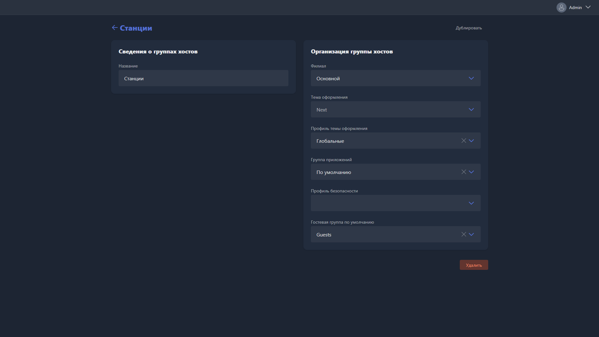{width=1919px height=1079px}

Создайте группу под каждую игровую зону клуба -- например, для зон Standart, VIP и Консоли получится три группы станций.

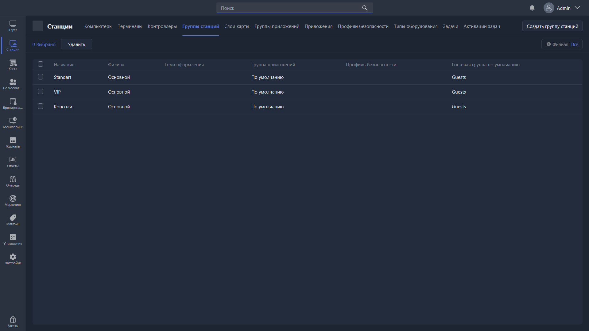{width=1919px height=1079px}

### Тарификация

Клубу нужно зарабатывать, а для этого нужна почасовая оплата.

Перейдите в <cmd text="Настройки"/> -> <cmd text="Тарифы"/>. По умолчанию там уже есть два тарифа -- «Цены для станций» и «Цены для терминалов». Можно использовать их или создать новые.

-  Откройте тариф (или создайте новый) и назовите его понятно, например Standart.

-  Укажите филиал (по умолчанию -- основной) и группу станций, для которой действует тариф. Если тариф называется Standart, привяжите его к группе станций Standart. Если одна цена действует сразу на несколько зон, выберите все нужные группы.

-  Заполните **стартовый взнос** и **минимальный взнос**. Стартовый взнос -- фиксированная сумма, которая списывается при каждом входе в систему, как клубная плата, без начисления времени. Минимальный взнос -- минимальная сумма пополнения баланса на этом тарифе. Если модель вашего клуба не требует иного, **рекомендуем оставить оба поля равными 0**.

-  Укажите стоимость часа в поле **Почасовая оплата** -- это сумма, которая будет списываться у гостя за час игры.

-  Поля **Начислять каждые (минут)** и **Бесплатные минуты** нужны, только если хотите дать гостю немного бесплатного времени в начале сессии -- например, чтобы он успел пополнить баланс. В этом случае поставьте **Начислять каждые (минут)** -- 1, а **Бесплатные минуты** -- нужное количество (например, 5 для пяти бесплатных минут).

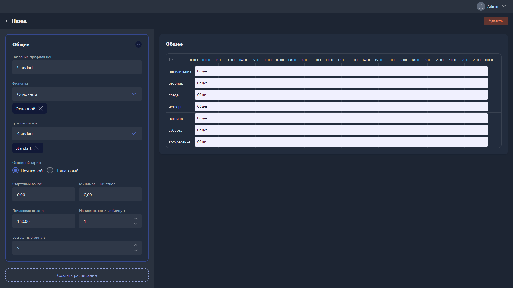{width=1919px height=1079px}

Тариф с одной ценой -- это только начало. Если в выходные или по вечерам цена должна быть другой, используйте расписания: это отрезок времени, в который тариф временно меняется, а затем возвращается к обычному.

Например, нужно, чтобы с 17:00 пятницы до 8:00 понедельника действовала цена 200 ₽ вместо обычных 150 ₽.

-  Нажмите <cmd text="Создать расписание"/> и откройте его.

-  Заполните поля так же, как в основном тарифе, но укажите нужную цену -- в примере это 200 ₽.

-  В таблице справа отметьте мышкой дни и время, когда действует это расписание.

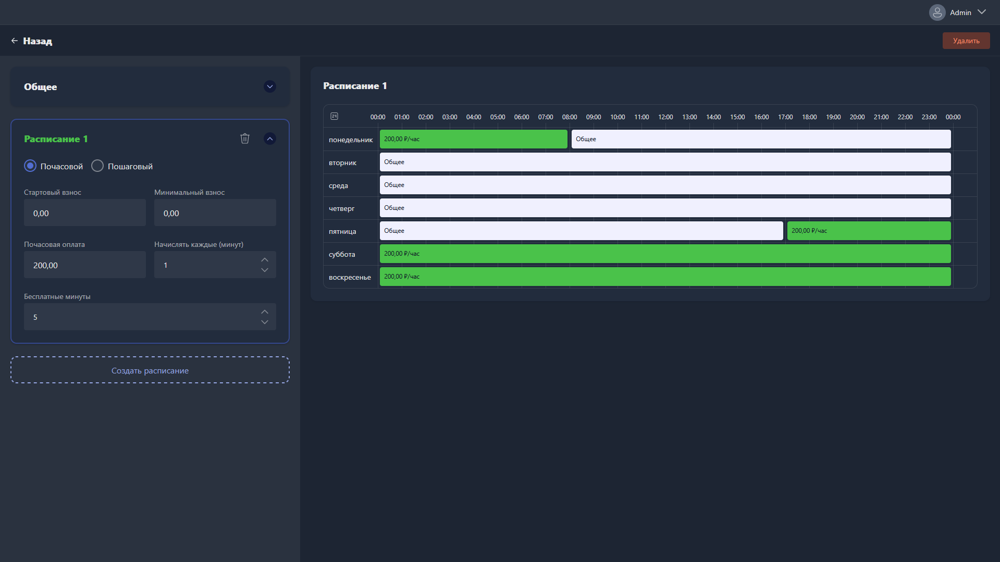{width=1919px height=1079px}

Создайте тариф для каждой игровой зоны клуба по этой же инструкции.

*(todo: статья про почасовую оплату подробнее)*

### Пакеты времени

Почасовая оплата настроена, но у неё есть более выгодный для клуба сосед -- пакеты времени. Они задерживают гостей дольше и приятнее, чем обычная почасовая оплата: гость планировал на 4 часа, увидел выгодный пакет на 5, и купил именно его.

Перейдите в <cmd text="Настройки"/> -> <cmd text="Пакеты"/> -> <cmd text="Создать пакет времени"/>. Полей здесь много, но ниже -- только то, что действительно нужно для старта.

> [!NOTE]
> 
> Часть второстепенных настроек пакета мы сознательно не разбираем -- ниже только то, что нужно для старта.

*(todo: подробный разбор всех настроек пакетов времени)*

**Детали пакета**

-  **Имя** -- выберите единый формат для всех пакетов, например «\[зона\] + длительность»: Standart 3 часа, VIP 5 часов.

-  **Товарная группа** -- категория, к которой относится пакет (настраивается в <cmd text="Магазин"/> -> <cmd text="Группы товаров"/>).

-  **Количество минут**, которое даёт пакет, и при необходимости -- описание.

**Доступность**

-  **Доступно для бронирования** -- можно ли оплатить этим пакетом бронирование пк.

-  **Показать в клиентской оболочке** -- появится ли пакет в магазине на клиентских пк.

-  В таблице ниже добавьте только те филиалы и группы станций, где пакет реально должен продаваться -- например, пакет Standart 3 часа не стоит привязывать к зоне VIP, иначе гости будут покупать его дешевле и использовать в более дорогой зоне. Чтобы пакет можно было купить прямо в клиентской оболочке, включите переключатель **«Заказ»** рядом с каждой добавленной группой.

-  **Незарегистрированные** -- включите, если пакетом смогут пользоваться и разовые (гостевые) учётные записи.

-  В таблице **Группа пользователей** отметьте, кому доступен пакет. Обычно проще дать доступ всем группам, если нет причин ограничивать.

> [!NOTE]
> 
> Группа пользователей -- это категория клиентов со своими ценами, скидками и доступами. Например, вы можете создать «Зарегистрированные» -- обычные клиенты, «Гости» -- разовые аккаунты, «VIP» -- премиум со скидкой 10%, «Staff» -- сотрудники со скидкой 100% и без ограничений системы.

*(todo: статья про группы пользователей подробнее)*

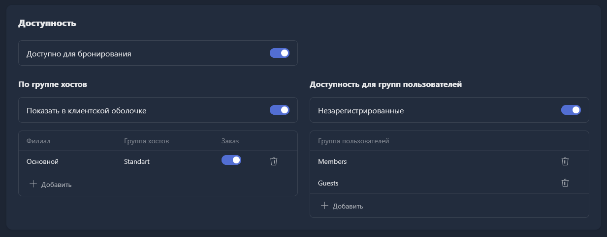{width=1233px height=483px}

**Доступность в филиалах**

Похожая настройка, но на уровне целого филиала -- определяет, в каких клубах сети пакет вообще можно использовать. По умолчанию выключена -- включите для нужных филиалов.

**Диапазон использования и расписание продаж**

Эти два поля ограничивают пакет по датам или времени.

-  **Диапазон дат** -- конкретные даты, когда пакет можно купить или использовать. Пригодится для акционных пакетов с ограниченным сроком.

-  **Диапазон времени** -- дни недели и часы, когда пакет доступен для покупки или использования. Если выключено -- ограничений нет.

Допустим, пакет «Ночь» в вашем клубе должен продаваться только с 22:00 до 3:00, а действовать -- с 23:00 до 8:00 утра.

> [!WARNING]
> 
> Скриншоты для этого примера (Расписание продаж / Диапазон использования) сейчас указывают не на те картинки -- `instalation-9.png` и `instalation-10.png` были переиспользованы ниже для другого шага (настройка Companion) и перезаписали исходные. Нужно переснять и добавить заново с новыми именами файлов.

**Срок службы пакета**

Срок службы -- условия, при которых пакет сгорает. Это мотивирует гостя доиграть пакет, а не растягивать его на потом.

Есть два момента начала отсчёта:

-  **С момента покупки** -- отсчёт стартует сразу после оплаты.

-  **От использования** -- отсчёт стартует, когда гость начинает пакет использовать.

И три типа истечения:

-  **Истекает после \[время\]** -- пакет сгорает через заданный промежуток.

-  **Истекает в \[время дня\]** -- пакет сгорает в ближайшее наступление указанного времени суток.

-  **Истекает при выходе из системы** -- пакет сгорает при перезапуске пк. Будьте аккуратны: случайный выход из аккаунта или перезагрузка тоже удалят пакет.

Самый частый вариант -- пакет сгорает через своё же количество часов после начала использования. Например, для пакета на 5 часов: **Срок действия истекает после** -- 5, формат -- часы, отсчёт -- «От использования».

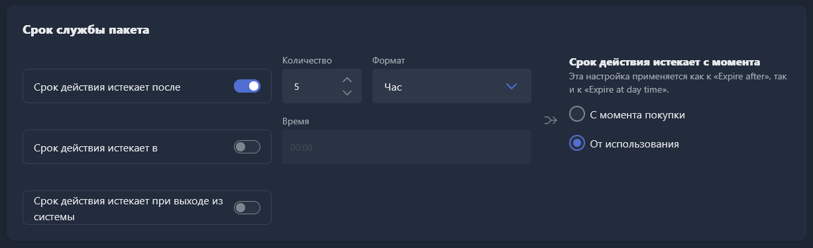{width=1227px height=375px}

**Ценообразование**

Укажите цену пакета в деньгах и, если нужно, в баллах. Если оплата возможна и деньгами, и баллами на выбор -- переключите «И» на «ИЛИ».

> [!IMPORTANT]
> 
> Баллы -- часть бонусной системы: вы начисляете клиентам баллы за покупки, а они тратят их на товары и пакеты по установленной вами цене.

*(todo: статья про бонусную систему и баллы подробнее)*

*(вопрос: на диске лежит неиспользуемый instalation-12.png между скриншотами 11 и 13 -- похоже, задумывался именно для этого блока «Ценообразование», но ссылка на него потерялась. Проверь и добавь, если так и есть.)*

На этом настройка пакетов закончена. Получился не самый лёгкий раздел, но запоминать всё сразу не нужно -- если что-то не заладится, поддержка всегда на связи.

*(todo: отдельная статья с подробным разбором пакетов времени)*

### Касса

Пакеты и тарифы настроены -- но продавать их пока не через что. Настроим точку продаж: место, где будут проходить продажи товаров и пакетов. Кассовый аппарат и терминал эквайринга можно подключить сразу или добавить позже, в любой момент -- на этот шаг они не влияют.

Если у вас несколько филиалов с разными юридическими лицами, для каждого нужны свои настройки налогов -- заполните их в <cmd text="Настройки"/> -> <cmd text="Налоги и валюта"/>.

*(todo: статья про настройку налогов для нескольких юрлиц в одной сети)*

**Настройте Gizmo Companion**

Companion -- ещё один компонент Gizmo, который превращает обычный пк в точку продаж и передаёт данные кассе. Без него продажи не заработают.

-  Перейдите в <cmd text="Настройки"/> -> <cmd text="Компаньоны"/> -> <cmd text="Создать компаньон"/>. Один компаньон -- на одну точку продаж (пк). Назовите его понятно, откройте и скопируйте токен -- он понадобится дальше.

-  В самом низу раздела <cmd text="Настройки"/> -> <cmd text="О программе"/> скачайте установщик Companion.

-  Запустите установщик **на том пк, с которого будете продавать** (обычно это пк администратора), и пройдите все шаги.

-  На этом же пк в браузере откройте [localhost:8000](http://localhost:8000) -- откроется интерфейс Companion.

-  В настройках подключения укажите **Имя хоста** (IP сервера) и **Порт** (по умолчанию 80).

*(todo: статья, как узнать IP и порт сервера)*

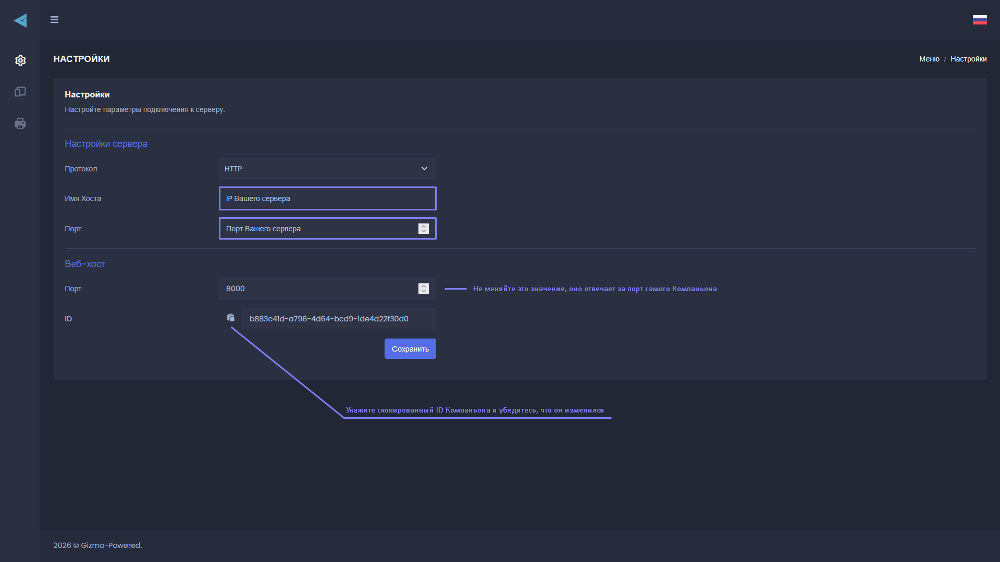{width=1919px height=1079px}

-  Вставьте скопированный токен, убедитесь, что он изменился, и сохраните.

-  Вернитесь в <cmd text="Настройки"/> -> <cmd text="Компаньоны"/> и проверьте, что статус сменился на **Подключено**. Если нет -- проверьте шаги заново.

<tabs>

<tab name="Подключаете кассу или терминал">

В Companion, на панели слева, откройте **POS устройства** и укажите COM-порты денежного ящика, сканера штрихкода и считывателя смарт-карт -- если они у вас есть и уже подключены физически. Чаще всего нужен именно сканер штрихкода: он обязателен, если продаёте товары с маркировкой «Честный знак», или просто удобен, чтобы искать товары по штрихкоду быстрее, чем вручную.

Раздел подключения самой кассы в Companion пока не трогайте -- к нему вернёмся отдельно.

Настройка Companion на этом закончена, но касса и терминал ещё не подключены технически -- это отдельный процесс, и мы помогаем с ним удалённо.

*(todo: статья-чек-лист подготовки к обращению в поддержку по подключению кассы и терминала)*

</tab>

<tab name="Работаете без кассы и терминала">

На этом настройка Companion завершена -- можно двигаться дальше.

</tab>

</tabs>

**Привяжите Companion к точке продаж**

-  Перейдите в <cmd text="Настройки"/> -> <cmd text="Кассы"/> и выберите пк, с которого будете продавать.

*(todo: статья, как определить, какая касса какому пк соответствует)*

-  Заполните поля кассы: **Филиал**, **Компаньон** (только что созданный), **Номер** (порядковый номер кассы среди всех точек продаж), **Имя** (любое удобное).

-  **Наличных на начало смены** -- оставьте 0, либо укажите сумму, если хотите, чтобы в начале смены касса считала, что в ней уже есть наличные.

-  Включите **Касса по умолчанию для филиала**, если у вас одна точка продаж в клубе.

-  Остальные поля пока не трогайте -- они нужны только для подключения кассы и терминала эквайринга.

Сохраните настройки -- касса готова.

### Продажи

Точка продаж готова -- осталось добавить то, чем можно торговать: товары и складской учёт.

#### Товары

Так продаются напитки, снеки и любые другие позиции или услуги. Перейдите в <cmd text="Магазин"/> -> <cmd text="Товары"/> -> <cmd text="Создать товар"/>.

-  Назовите товар, выберите товарную группу и, по желанию, изображение карточки.

-  Если товар -- услуга, подакцизный или маркированный товар, отметьте это в соответствующих полях. Не включайте эти параметры наугад -- это может привести к реальным проблемам с продажами.

*(todo: статья про все параметры товаров, включая маркировку и акцизы)*

-  В разделе **Доступность** укажите: показывать ли товар в клиентской оболочке, в каких филиалах он продаётся, и каким группам пользователей доступен (включите **Незарегистрированные**, чтобы товар могли покупать гости без аккаунта, и по возможности откройте доступ всем группам).

-  В **Ценообразовании** укажите цену в деньгах и, если нужно, в баллах.

-  **Расписание продаж** работает так же, как в пакетах времени (см. выше) -- если не включать, товар можно купить в любое время.

-  В разделе **Склад** включите складской учёт, если товар должен списываться со склада, и **Запретить продажу закончившегося**, если товар нельзя продавать при нулевом остатке.

*(todo: статья со всеми параметрами товаров и скриншотами)*

#### Склад

Вы создали товары -- но их нужно где-то хранить и считать остаток. Учёт помогает вовремя видеть, чего не хватает, и замечать недостачи из-за воровства или ошибок администраторов.

Перейдите в <cmd text="Магазин"/> -> <cmd text="Склады"/>. По умолчанию там два склада -- **Точка продаж** и **Склад**. Технической разницы между ними нет, это просто удобное разделение: первый -- для прилавка и всего, что видят клиенты, второй -- для подсобки или отдельных складов сети. Если не хотите вести учёт на двух складах сразу, удалите один из них.

Затем привяжите склад к кассе: <cmd text="Настройки"/> -> <cmd text="Кассы"/> -> выберите кассу пк администратора и укажите нужный склад -- так все продажи с неё будут списываться именно с него.

> [!IMPORTANT]
> 
> Если оставить оба склада, товары придётся вручную перемещать между ними -- это даёт полный контроль, но легко запутаться. Если это не нужно, проще оставить один склад.

*(todo: статья про работу со складами подробнее)*

### Операторы

Пока вы делали всё это с аккаунта администратора, у которого есть доступ вообще ко всем настройкам клуба -- держать такой доступ у рядовых сотрудников не стоит. Создадим для них отдельные аккаунты с ограниченными правами.

#### Права доступа

Откройте <cmd text="Настройки"/> -> <cmd text="Права доступа"/>. Здесь уже есть готовые наборы прав -- откройте любой, чтобы увидеть, что в него входит. Можно использовать готовые наборы или создать свои.

*(todo: статья с понятным объяснением, чем отличаются готовые права доступа)*

#### Аккаунты операторов

Права доступа готовы -- осталось создать людей, которым их назначить. Откройте <cmd text="Настройки"/> -> <cmd text="Операторы"/> -> <cmd text="Создать оператора"/>.

-  Заполните имя, фамилию, логин и пароль сотрудника -- пароль он сможет сменить сам позже.

-  В разделе **Разрешение** укажите, в какие филиалы у него есть доступ, и какой набор прав использовать -- для рядового оператора обычно подходит **Кассир**.

-  Выберите режим работы со сменой:

   -  **Отключено** -- оператор не может открывать и закрывать смену.

   -  **Необязательно** -- может открывать и закрывать смену, но продажи и другие операции доступны и без неё.

   -  **Обязательно** -- не сможет ничего продать, пока не откроет смену.

-  При желании заполните остальные контактные данные.

Теперь сотрудник сможет входить в Gizmo Manager и пользоваться тем, что вы ему разрешили. Учтите: этот аккаунт не даёт входа в клиентскую оболочку -- если хотите дать сотрудникам бесплатное или льготное время на пк, это отдельная настройка.

*(todo: статья, как дать сотрудникам скидку или бесплатное время на пк)*

### Оболочка

Стойка администратора настроена -- пора позаботиться и о том, что видят сами гости клуба: оформление оболочки, уведомления, приложения и ограничения на игровых пк.

#### Общие параметры

Откройте <cmd text="Настройки"/> -> <cmd text="Оболочка"/>.

-  Укажите язык клиента по умолчанию.

-  Выберите действие пк при выходе пользователя -- рекомендуем оставить **перезагрузку**.

-  Смените пароль менеджера и сохраните его в надёжном месте -- этим паролем можно полностью закрыть оболочку, поэтому лучше, чтобы его не узнали посторонние.

-  В самом низу включите **Льготный период пополнения** -- время, которое даётся гостю на пополнение баланса после окончания оплаченного времени, прежде чем его выкинет из системы. Это не даёт резко прервать активную игру.

Остальные параметры раздела можно менять на своё усмотрение, но лучше сначала разобраться, за что каждый отвечает.

*(todo: серия статей с разбором остальных параметров оболочки)*

**Уведомления**

Гость должен заранее знать, что время подходит к концу, а не узнавать об этом по внезапному выходу из игры. Откройте <cmd text="Настройки"/> -> <cmd text="Уведомления"/> и настройте два вида: **Оповещение о времени** (когда сессия подходит к концу) и **Оповещение о бронировании** (когда скоро начнётся бронь). У обоих одинаковая логика:

-  Впишите текст сообщения -- свой или оставьте стандартный. Чтобы подставить оставшееся время в минутах, используйте `{0}` в тексте, например «У вас осталось \{0} минут».

-  Укажите, за сколько минут до события показывать уведомление -- можно добавить сколько угодно правил.

-  Выберите тип: **визуальное** (баннер сверху экрана), **звуковое** (текст озвучивается средствами Windows -- голос может звучать не очень естественно) или оба сразу.

-  Параметр **Сворачивание окон** сворачивает все открытые у гостя приложения при срабатывании уведомления -- гостей это раздражает, включайте с осторожностью.

#### Оформление

По умолчанию в Gizmo стоит нейтральная тема оформления, рассчитанная на всех. Добавим немного индивидуальности.

-  Откройте <cmd text="Настройки"/> -> <cmd text="Темы оформления"/>, откройте тему с пометкой **«По умолчанию»**.

-  Добавьте свои изображения: **фон главного экрана** (виден после входа в оболочку) и **фон экрана входа** (виден до авторизации).

-  Сохраните настройки.

*(todo: статья про разное оформление для разных групп станций)*

#### Приложения

Оболочка выглядит по-своему -- но пока в ней нечего запускать. Чтобы гости могли открывать игры и программы, добавьте их как приложения. Тема большая, разберём только самое нужное для старта.

*(todo: статья про приложения и все их параметры)*

Каждое приложение состоит из двух частей: **карточки** (то, что видит гость -- иконка, название, категория) и **исполняемого файла** внутри неё (то, что реально запускается). Карточка создаётся один раз, а исполняемый файл -- отдельно для каждого пути запуска.

Перейдите в <cmd text="Станции"/> -> <cmd text="Приложения"/> -> <cmd text="Создать приложение"/>.

**Карточка приложения**

-  Укажите название, которое увидит гость, и добавьте обложку -- за иконками и обложками для игр из Steam удобно ходить на [steamgriddb.com](https://www.steamgriddb.com).

-  В разделе **Организация приложений** укажите группу по умолчанию и категорию.

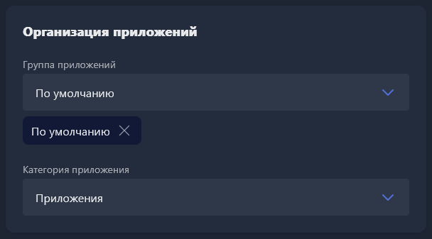{width=608px height=337px}

-  Сохраните карточку и откройте её заново -- теперь в неё можно добавить исполняемый файл.

**Исполняемый файл**

Нажмите **\+ Создать исполняемый файл** внутри карточки и заполните:

-  **Подпись** -- название ярлыка, которое увидит гость, и иконка для него (тоже можно взять с steamgriddb.com).

-  **Доступность** -- обязательно включите её для нужного филиала, иначе ярлык нигде не появится.

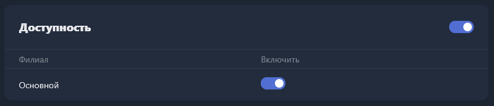{width=805px height=173px}

-  **Путь к исполняемому файлу** -- путь, по которому игра установлена на клиентских пк (не на сервере).

> [!TIP]
> 
> Как найти путь к игре, на примере Steam:
>
> 1. Найдите ярлык на рабочем столе, нажмите правой кнопкой мыши -> «Перейти к расположению файла».
>
> 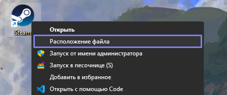{width=456px height=192px}
>
> 1. Откроется папка с игрой -- скопируйте путь из адресной строки проводника, например `C:\Program Files (x86)\Steam`.
>
> 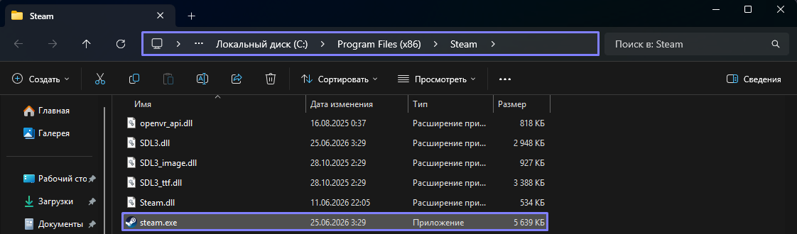{width=1122px height=330px}
>
> 1. В поля **Путь к исполняемому файлу** и **Рабочий каталог** впишите этот путь, добавив в конце название запускаемого файла: `C:\Program Files (x86)\Steam\steam.exe`.
>
> 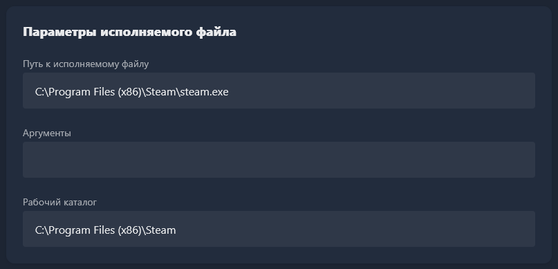{width=807px height=389px}

-  В разделе **Организация параметров запуска** рекомендуем включить **Auto Launch** и **Monitor Children**. Уточнение: Auto Launch -- это не автозапуск приложения при включении пк, а другая функция.

*(todo: точное описание, что делают Auto Launch и Monitor Children)*

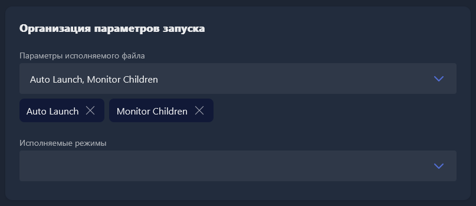{width=807px height=349px}

-  Сохраните настройки.

Готово -- приложение появится в оболочке на всех клиентских пк, где оно установлено по указанному пути. Если путь не совпадает хотя бы на одном пк, ярлык там не будет отображаться.

*(todo: полное руководство по приложениям и всем их настройкам)*

#### Безопасность

Без профиля безопасности гость может делать с игровым пк что угодно, вплоть до отключения самой оболочки -- это возможности Windows, и заблокировать их можно только ограничив доступ к соответствующим настройкам системы.

Откройте <cmd text="Станции"/> -> <cmd text="Профили безопасности"/> и создайте профиль. Параметры можно включать по своему усмотрению, но вот что мы рекомендуем большинству клубов:

-  Назовите профиль.

-  Включите **Скрыть меню «Пуск»**, **Запретить сворачивать оболочку** и **Ограничение переключения между рабочими столами**.

-  В разделе **Файловая система** отметьте все буквы дисков -- так разделы будут скрыты и заблокированы для гостя.

-  В разделе **Политики** включите все параметры безопасности одной кнопкой.

Это максимальный уровень блокировки -- он закрывает гостю почти всё за пределами оболочки. Через профили можно так же блокировать конкретные приложения, процессы и даже сайты в браузере.

*(todo: статья про все параметры профилей безопасности)*

Осталось назначить профиль всем клиентским пк, для этого перейдите в <cmd text="Станции"/> -> <cmd text="Группы станций"/> -- откройте каждую группу и привяжите к ней профиль безопасности.

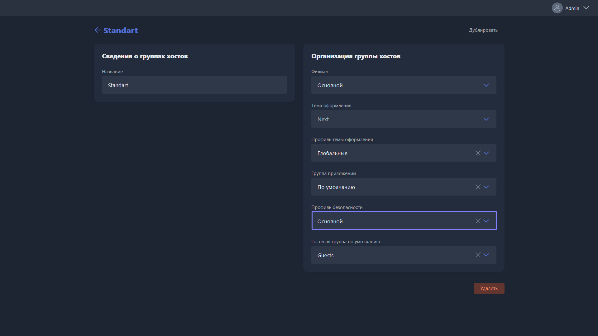{width=1919px height=1079px}

> [!TIP]
> 
> Ограничения не безвозвратны -- их всегда можно снять, отключив безопасность на пк или переведя его в режим администратора.

### Завершающие мелочи

Основные настройки готовы -- остались детали, которые стоит поправить, но не требующие долгих объяснений.

**Сеть**

-  Откройте <cmd text="Настройки"/> -> <cmd text="Сеть"/>.

-  В поле **Имя хоста** укажите `gizmo.local` или локальный IP сервера.

*(todo: статья, зачем нужен локальный IP в имени хоста и как его узнать)*

-  В правилах подключения включите **Автоматическое обнаружение** и **Восстановление имени хоста**.

**Резервное копирование**

Всё, что вы настроили, жалко потерять -- обязательно включите резервное копирование.

-  Откройте <cmd text="Настройки"/> -> <cmd text="Резервное копирование"/> и включите его.

-  Укажите максимальное количество копий -- при создании новой самая старая будет удаляться.

-  Укажите время ежедневного запуска резервного копирования.

-  Укажите путь хранения копий (по умолчанию `C:\Program Files\NETProjects\Gizmo Server\data\Backup`). Рекомендуем выбрать путь не на системном диске -- тогда копии сохранятся, даже если сломается сам системный диск.

> [!IMPORTANT]
> 
> Это по-настоящему важная настройка -- не пропускайте её.

*(todo: статья про резервное копирование и копирование в облако)*

**Счета**

-  Откройте <cmd text="Настройки"/> -> <cmd text="Счета"/> и включите все параметры в разделе **Параметры**, а также все переключатели в разделе **Автоматическое выставление счетов**.

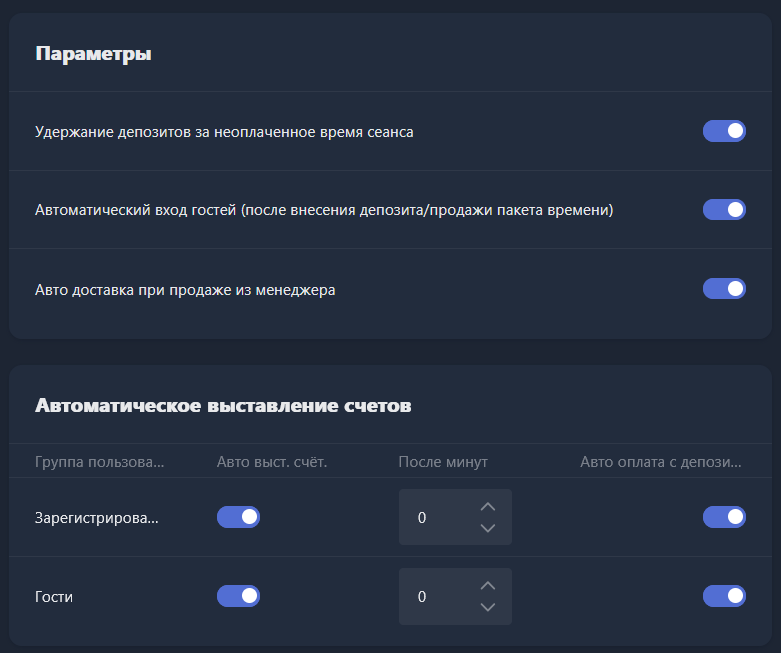{width=781px height=653px}

**Очистка сессий при выходе**

Гости часто забывают выходить из игр и лаунчеров, авторизованных на пк -- это создаёт риски и недоразумения между клубом и следующим гостем. Настройте автоматическую очистку сессий при выходе, чтобы это не было ручной работой.

*(todo: статья про настройку очистки сессий игр и лаунчеров)*

На этом основная настройка клуба готова -- переходим к игровым местам!

## Шаг 4. Подключите игровые места

Лицензии куплены (или активирован пробный период), клуб настроен, клиентские пк уже с установленной Windows и ждут своего часа -- давайте начнём!

Откройте <cmd text="Настройки"/> -> <cmd text="О программе"/> в Gizmo Manager и загрузите оттуда Gizmo Client.

> [!TIP]
> 
> Перед следующими шагами убедитесь, что в <cmd text="Настройки"/> -> <cmd text="Сеть"/> -> <cmd text="Правила подключения"/> включено автоматическое обнаружение и восстановление имени хоста (мы включали это в разделе «Завершающие мелочи» выше) -- иначе клиентские пк не подключатся автоматически.

-  Скопируйте загруженный ранее установщик на все клиентские пк, либо загрузите его по ссылке в браузере.

*(todo: добавить ссылку на скачивание Gizmo Client)*

-  Запустите установщик и пройдите все пункты, рекомендуем ничего не менять. После завершения установки оболочка запустится самостоятельно.

> [!CAUTION]
> 
> **Сталкиваетесь с проблемой при подключении?** Бесконечно висит этап загрузки, иконка сервера в левом нижнем углу экрана красная, устройство не появляется в Gizmo Manager -- или другие проблемы? Обратитесь в поддержку.

*(todo: статья с разбором частых проблем при подключении клиентских пк)*

Установив клиент на игровых местах, привяжите их к системе.

-  Вернитесь в Gizmo Manager, откройте <cmd text="Станции"/> -> <cmd text="Компьютеры"/> -- здесь вы увидите все пк, которые хотя бы раз подключились к серверу.

   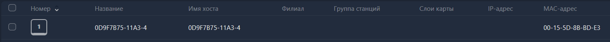{width=1447px height=101px}

-  Поочерёдно откройте каждый пк и задайте его номер в системе, выберите **Филиал**, **Группу станций**, к которой он относится (помните, мы создавали их ранее?), и **слой карты** -- выберите схему по умолчанию.

-  Перейдите в раздел <cmd text="Карта"/> на левой панели навигации -- если всё верно, вы наконец увидите игровые места на карте клуба.

Спасибо, что прошли этот путь с нами! Наши поздравления -- ваш клуб уже сейчас готов принимать клиентов, а вы знаете, где что находится. При любых вопросах или проблемах смело обращайтесь в поддержку -- она доступна круглосуточно.

## Что дальше?

Мы прошли все основные этапы настройки, но возможности Gizmo огромны, поэтому уместить их в одном руководстве просто не получится. Вот большие темы, с которыми вам стоит ознакомиться в свободное время, и которые улучшат опыт вашего клуба:

*(todo: собрать и добавить сюда список тем и статей для дальнейшего изучения)*