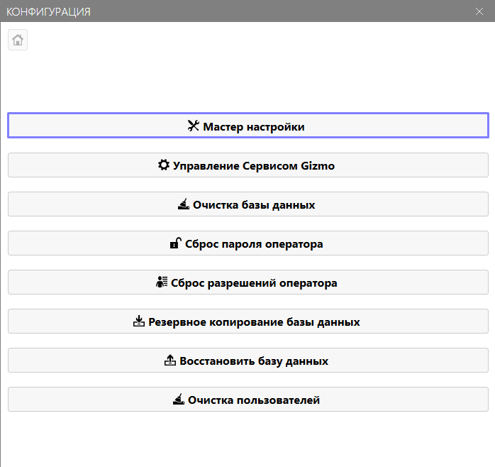
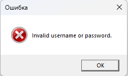
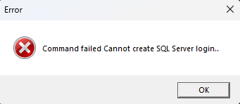
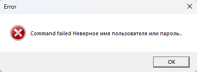

<html>

  

  

    

      <svg xmlns="http://www.w3.org/2000/svg" width="24" height="24" viewBox="0 0 24 24" fill="none" stroke="currentColor" stroke-width="2" stroke-linecap="round" stroke-linejoin="round"><path d="M6 22a2 2 0 0 1-2-2V4a2 2 0 0 1 2-2h8a2.4 2.4 0 0 1 1.704.706l3.588 3.588A2.4 2.4 0 0 1 20 8v12a2 2 0 0 1-2 2z"/><path d="M14 2v5a1 1 0 0 0 1 1h5"/></svg>
      В этом блоке вы узнаете
    

    <h2 class="gx-title">Как пройти мастер настройки Gizmo Server</h2>
    

      5–10 минут
      /
      Низкая сложность
    

  

</html>

Сразу после установки Gizmo Server нужно пройти мастер настройки -- он инициализирует базу данных и связывает сервер с вашим личным кабинетом. Без этого шага сервер не заработает.

## Как открыть мастер настройки

На пк с установленным туда Gizmo Server откройте приложение **ConfigurationTool** через ярлык на рабочем столе, либо по пути `C:\Program Files\NETProjects\Gizmo Server\tools\configuration`.

## Шаги мастера

-  Перейдите в <cmd text="Мастер настройки"/> -> <cmd text="Далее"/> -- откроется страница «Параметры базы данных».

   {width=698px height=658px}

-  Если не уверены, что там менять, лучше не трогать -- по умолчанию всё уже настроено правильно и указывает на локальную базу данных, установленную вместе с сервером.

-  Нажмите <cmd text="Далее"/> ещё раз -- откроется страница с данными вашего аккаунта.

-  Укажите логин и пароль, которые использовали при регистрации личного кабинета на сайте Gizmo, и нажмите <cmd text="Далее"/>.

> [!NOTE]
> 
> Данные личного кабинета нужны здесь для того, чтобы сервер мог активировать лицензию и получать обновления. Если вы ещё не зарегистрировали личный кабинет -- сделайте это в статье [«Личный кабинет»](./../../../personal-account.md) прежде, чем продолжать.

-  Когда мастер завершён, можно включить и запустить саму службу сервера.

{width=699px height=660px}

## Расширенная настройка

Разберем все возможные параметры Мастера настроек.

### Параметры базы данных

**Создать новую базу данных** -- если включить флажок, при подключении будет создана новая База данных. Это не удалит текущую, но чтобы переключиться на нее, потребуется изменить параметры соединения.

**Тип базы данных** -- позволяет выбрать между MSSQL и PostgreSQL. По умолчанию используется MSSQL, и мы рекомендуем использовать этот вариант. Но если вы хотите подключить PostgreSQL, изучите руководство по его настройке.

**Имя узла базы данных** -- адрес, по которому доступна ваша база данных в системе. Это может быть локальный вид, имя пк или даже сетевой адрес. 

**Имя базы данных** -- название базы данных клуба, которую Gizmo создаст в SQL. Можно назвать ее как удобно, но лучше оставить стандартной.

**Тип проверки подлинности** -- как приложение будет проверять сертификат при подключении.

### Настройки подписки

**Имя пользователя** и **Пароль** -- логин или пароль вашей учетной записи на нашем сайте.

### Управление Сервисом Gizmo

**Отображаемое имя, описание и путь к исполняемому файлу** **изменить нельзя** -- это параметры, настраиваемые автоматически.

**Тип запуска** -- определяет то, как служба будет запускаться в Windows.

-  Automatic (рекомендуем) -- отложенный автоматический запуск при запуске системы. Это означает, что сервер загрузится после старта всех остальных компонентов системы, что может занять до 5 минут.

-  Manual -- требует ручного запуска сервера при каждой перезагрузке Windows.

-  Disabled -- служба отключена и не может быть запущена до изменения статуса.

## Проблемы и их решение

### «Invalid username or password» при вводе данных в настройках подписки

Вы ввели неверные учетные данные аккаунта с нашего сайта. Если не помните их, обратитесь в поддержку.

### «Cannot create SQL Server login»

Откройте **Управление сервисом Gizmo** -> Переключите режим в **Расширенный** и укажите логин/пароль, с которыми вы входите в этот аккаунт Windows. Если у вас нет пароля на аккаунте, назначьте его.

### «Неверное имя пользователя или пароль» при включении расширенного режима

Вы указали неверные учетные данные для входа в аккаунт Windows, либо пароля для этого аккаунта нет. Проверьте данные и создайте пароль, если он отсутствует.