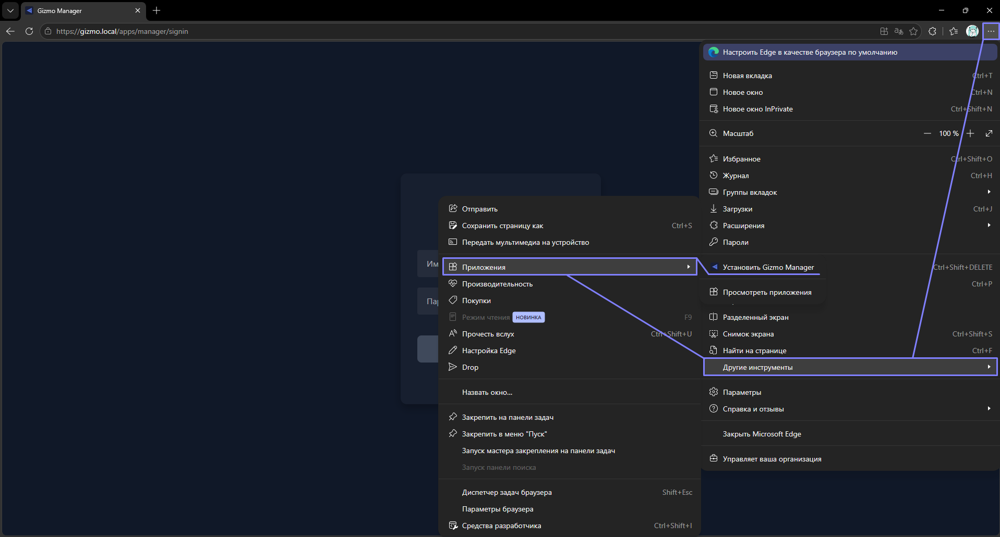
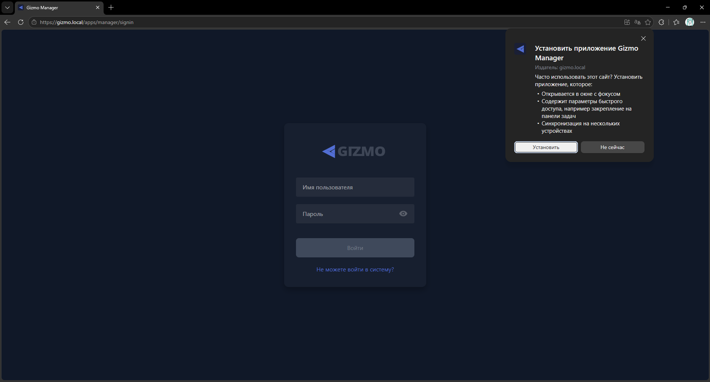
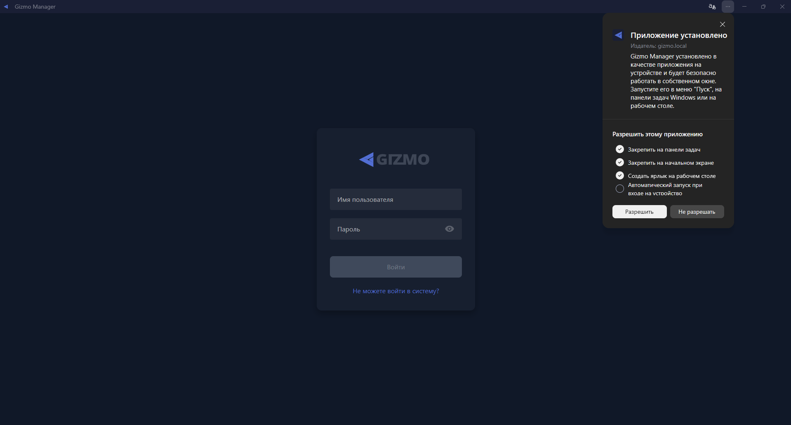
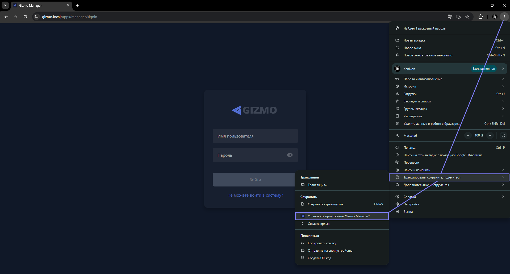
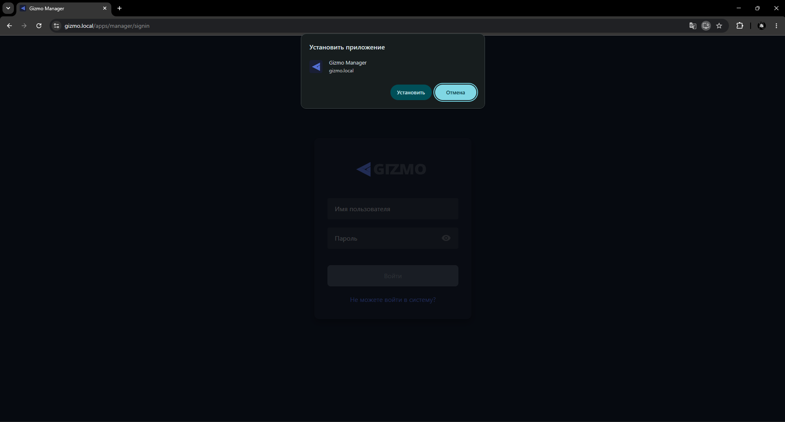

> [!CAUTION]
> 
> **ЭТОТ РАЗДЕЛ НАХОДИТСЯ В ПРОРАБОТКЕ. ИНСТРУКЦИИ В НЕМ МОГУТ БЫТЬ НЕПОЛНЫМИ ИЛИ НЕКОРРЕКТНЫМИ.**

<html>

  

  

    

      <svg xmlns="http://www.w3.org/2000/svg" width="24" height="24" viewBox="0 0 24 24" fill="none" stroke="currentColor" stroke-width="2" stroke-linecap="round" stroke-linejoin="round" class="lucide lucide-file-text-icon lucide-file-text"><path d="M6 22a2 2 0 0 1-2-2V4a2 2 0 0 1 2-2h8a2.4 2.4 0 0 1 1.704.706l3.588 3.588A2.4 2.4 0 0 1 20 8v12a2 2 0 0 1-2 2z"/><path d="M14 2v5a1 1 0 0 0 1 1h5"/><path d="M10 9H8"/><path d="M16 13H8"/><path d="M16 17H8"/></svg>
      В этом блоке вы узнаете
    

    <h2 class="gx-title">
      Как открыть Gizmo Manager отдельным приложением, а не вкладкой браузера
    </h2>
    

      3-5 минут
      /
      Низкая сложность
    

    
Превратим страницу Gizmo Manager в отдельное окно на рабочем столе — с ярлыком, значком в панели задач и без адресной строки браузера.

  

</html>

> [!NOTE]
> 
> Полноценного десктопного приложения для Gizmo V3 не существует -- используется веб-архитектура, которая позволяет управлять клубом с любого устройства, где есть браузер.
>
> Поэтому мы просто установим страницу приложения из браузера -- опыт использования будет максимально близок к нативному приложению.

## Установщик

Скачайте и запустите этот установщик приложения. Он автоматически добавит Gizmo Manager в виде десктопной страницы.

## Ручная установка через браузер

Сначала выберите браузер, из которого будете устанавливать приложение. Мы рекомендуем Edge, но подойдёт любой браузер с поддержкой установки страниц в качестве веб-приложений.

Откройте в выбранном браузере страницу авторизации Gizmo Manager: `https://gizmo.local/apps/manager/signin`.

Ниже -- инструкции для двух самых популярных браузеров:

<tabs>

<tab name="Edge">

-  Нажмите **три точки в правом верхнем углу -> Другие инструменты -> Приложения -> Установить Gizmo Manager**.

{width=1917px height=1031px}

-  Через секунду появится окно с подтверждением -- нажмите **Установить**.

{width=1919px height=1033px}

-  Откроется новое окно -- это и есть приложение, которым можно пользоваться. Рекомендуем сразу включить пункты **Закрепить на панели задач**, **Закрепить на начальном экране** и **Создать ярлык на рабочем столе**.

{width=1918px height=1032px}

</tab>

<tab name="Chrome">

-  Нажмите **три точки в правом верхнем углу -> Транслировать, сохранить, поделиться -> Установить приложение «Gizmo Manager»**.

{width=1918px height=1030px}

-  Через секунду появится окно с подтверждением -- нажмите **Установить**.

{width=1918px height=1033px}

-  Откроется новое окно -- это и есть приложение, которым можно пользоваться.

</tab>

</tabs>