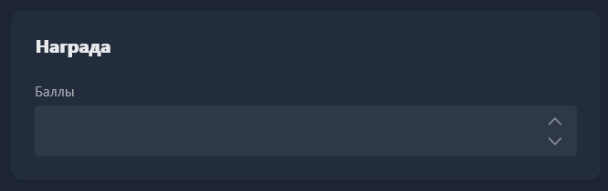

<html>

  

  

    

      <svg xmlns="http://www.w3.org/2000/svg" width="24" height="24" viewBox="0 0 24 24" fill="none" stroke="currentColor" stroke-width="2" stroke-linecap="round" stroke-linejoin="round"><polygon points="12 2 15.09 8.26 22 9.27 17 14.14 18.18 21.02 12 17.77 5.82 21.02 7 14.14 2 9.27 8.91 8.26 12 2"/></svg>
      В этом блоке вы узнаете
    

    <h2 class="gx-title">Как построить простую систему кешбэка на баллах</h2>
    

      15 минут
      /
      Низкая сложность
    

  

</html>

Рано или поздно вы зададите себе вопрос -- как удержать гостя, который уже приходил, и сделать так, чтобы в следующий раз он выбрал именно ваш клуб. Постоянные скидки уменьшают выручку и быстро становятся ожидаемой нормой, а не приятным бонусом. Бонусные баллы работают мягче -- гость получает что-то вроде своей внутренней валюты клуба, копит её, и это тонкая, но рабочая причина возвращаться именно к вам.

В этом руководстве мы разберём настройку системы лояльности через баллы. Чтобы назначать скидки, промокоды и создавать акции -- смотрите статью [«Скидки и акции»](./discounts-and-promotions.md).

## Как это работает

Идея простая -- клиент покупает пакет времени или товар, и одновременно с покупкой ему на счёт начисляются баллы. Копится баланс баллов, который потом можно потратить на следующую покупку. Возможна частичная и полная оплата -- в зависимости от того, как вы настроите систему.

## Где включить начисление

Начисление бывает двух типов -- за товары и пакеты времени, и за почасовую оплату.

#### Товары и пакеты времени

Начисление баллов настраивается прямо в карточке пакета времени или товара, в блоке **Награда** -- там вы указываете, сколько баллов клиент получит за покупку именно этой позиции. Ничего не мешает начислять разное количество баллов за разные пакеты -- например, больше баллов за более дорогие и долгие сессии, чтобы стимулировать гостей брать именно их, или 10% от каждого товара.

{width=666px height=210px}

#### Почасовая оплата

Начисление баллов за почасовую оплату настраивается для отдельных групп пользователей. Откройте <cmd text="Пользователи"/> -> <cmd text="Группы пользователей"/> и выберите группу, для которой хотите настроить кешбэк. В карточке группы дойдите до раздела **Лояльность** и отредактируйте его, нажав на иконку карандаша. Доступны два типа начисления кешбэка:

-  **Деньги** -- баллы начисляются за выбранную сумму баланса, потраченную на почасовую оплату. Обратите внимание -- именно на почасовую оплату, а не на любые другие товары или пакеты.

-  **Время** -- баллы начисляются за отыгранное время.

Для любого способа укажите количество баллов и сумму денег или времени, которые нужно потратить для их получения. Рекомендуем ставить значения как можно меньше -- например, вместо 10 баллов за 100 рублей лучше 1 балл за 10 рублей, потому что если клиент потратит 99 рублей, а не 100, в первом случае он не получит ни одного балла. Также учитывайте, что начисление баллов происходит только в момент выхода клиента из сессии и закрытия его счётов, а не сразу после трат.

## Как тратить баллы

В блоке **Ценообразование** карточки пакета или товара есть возможность указать стоимость в баллах, а также переключить условие их траты:

-  **Стоимость в деньгах «И» стоимость в баллах** -- оплата обязательно происходит и деньгами, и баллами одновременно. То есть если вы поставите цену 100 рублей И 50 баллов, клиенту нужно иметь и 100 рублей, и 50 баллов, чтобы купить товар.

-  **Стоимость в деньгах «ИЛИ» стоимость в баллах** -- клиент сам выбирает, чем платить: обычными деньгами или накопленными баллами. Рекомендуем выбирать этот вариант.